<!-- Copy and paste the converted output. -->

<!-----

You have some errors, warnings, or alerts. If you are using reckless mode, turn it off to see inline alerts.
* ERRORs: 0
* WARNINGs: 0
* ALERTS: 96

Conversion time: 46.083 seconds.

Using this Markdown file:

1. Paste this output into your source file.
2. See the notes and action items below regarding this conversion run.
3. Check the rendered output (headings, lists, code blocks, tables) for proper
   formatting and use a linkchecker before you publish this page.

Conversion notes:

* Docs to Markdown version 1.0β34
* Sun Mar 05 2023 14:04:26 GMT-0800 (PST)
* Source doc: Fallen Rulebook
* Tables are currently converted to HTML tables.
* This document has images: check for >>>>>  gd2md-html alert:  inline image link in generated source and store images to your server. NOTE: Images in exported zip file from Google Docs may not appear in  the same order as they do in your doc. Please check the images!

----->

>>>>>  gd2md-html alert:  ERRORs: 0; WARNINGs: 0; ALERTS: 96.

<ul style="color: red; font-weight: bold"><li>See top comment block for details on ERRORs and WARNINGs. <li>In the converted Markdown or HTML, search for inline alerts that start with >>>>>  gd2md-html alert:  for specific instances that need correction.</ul>

Links to alert messages:
<a href="#gdcalert1">alert1</a>
<a href="#gdcalert2">alert2</a>
<a href="#gdcalert3">alert3</a>
<a href="#gdcalert4">alert4</a>
<a href="#gdcalert5">alert5</a>
<a href="#gdcalert6">alert6</a>
<a href="#gdcalert7">alert7</a>
<a href="#gdcalert8">alert8</a>
<a href="#gdcalert9">alert9</a>
<a href="#gdcalert10">alert10</a>
<a href="#gdcalert11">alert11</a>
<a href="#gdcalert12">alert12</a>
<a href="#gdcalert13">alert13</a>
<a href="#gdcalert14">alert14</a>
<a href="#gdcalert15">alert15</a>
<a href="#gdcalert16">alert16</a>
<a href="#gdcalert17">alert17</a>
<a href="#gdcalert18">alert18</a>
<a href="#gdcalert19">alert19</a>
<a href="#gdcalert20">alert20</a>
<a href="#gdcalert21">alert21</a>
<a href="#gdcalert22">alert22</a>
<a href="#gdcalert23">alert23</a>
<a href="#gdcalert24">alert24</a>
<a href="#gdcalert25">alert25</a>
<a href="#gdcalert26">alert26</a>
<a href="#gdcalert27">alert27</a>
<a href="#gdcalert28">alert28</a>
<a href="#gdcalert29">alert29</a>
<a href="#gdcalert30">alert30</a>
<a href="#gdcalert31">alert31</a>
<a href="#gdcalert32">alert32</a>
<a href="#gdcalert33">alert33</a>
<a href="#gdcalert34">alert34</a>
<a href="#gdcalert35">alert35</a>
<a href="#gdcalert36">alert36</a>
<a href="#gdcalert37">alert37</a>
<a href="#gdcalert38">alert38</a>
<a href="#gdcalert39">alert39</a>
<a href="#gdcalert40">alert40</a>
<a href="#gdcalert41">alert41</a>
<a href="#gdcalert42">alert42</a>
<a href="#gdcalert43">alert43</a>
<a href="#gdcalert44">alert44</a>
<a href="#gdcalert45">alert45</a>
<a href="#gdcalert46">alert46</a>
<a href="#gdcalert47">alert47</a>
<a href="#gdcalert48">alert48</a>
<a href="#gdcalert49">alert49</a>
<a href="#gdcalert50">alert50</a>
<a href="#gdcalert51">alert51</a>
<a href="#gdcalert52">alert52</a>
<a href="#gdcalert53">alert53</a>
<a href="#gdcalert54">alert54</a>
<a href="#gdcalert55">alert55</a>
<a href="#gdcalert56">alert56</a>
<a href="#gdcalert57">alert57</a>
<a href="#gdcalert58">alert58</a>
<a href="#gdcalert59">alert59</a>
<a href="#gdcalert60">alert60</a>
<a href="#gdcalert61">alert61</a>
<a href="#gdcalert62">alert62</a>
<a href="#gdcalert63">alert63</a>
<a href="#gdcalert64">alert64</a>
<a href="#gdcalert65">alert65</a>
<a href="#gdcalert66">alert66</a>
<a href="#gdcalert67">alert67</a>
<a href="#gdcalert68">alert68</a>
<a href="#gdcalert69">alert69</a>
<a href="#gdcalert70">alert70</a>
<a href="#gdcalert71">alert71</a>
<a href="#gdcalert72">alert72</a>
<a href="#gdcalert73">alert73</a>
<a href="#gdcalert74">alert74</a>
<a href="#gdcalert75">alert75</a>
<a href="#gdcalert76">alert76</a>
<a href="#gdcalert77">alert77</a>
<a href="#gdcalert78">alert78</a>
<a href="#gdcalert79">alert79</a>
<a href="#gdcalert80">alert80</a>
<a href="#gdcalert81">alert81</a>
<a href="#gdcalert82">alert82</a>
<a href="#gdcalert83">alert83</a>
<a href="#gdcalert84">alert84</a>
<a href="#gdcalert85">alert85</a>
<a href="#gdcalert86">alert86</a>
<a href="#gdcalert87">alert87</a>
<a href="#gdcalert88">alert88</a>
<a href="#gdcalert89">alert89</a>
<a href="#gdcalert90">alert90</a>
<a href="#gdcalert91">alert91</a>
<a href="#gdcalert92">alert92</a>
<a href="#gdcalert93">alert93</a>
<a href="#gdcalert94">alert94</a>
<a href="#gdcalert95">alert95</a>
<a href="#gdcalert96">alert96</a>

>>>>> PLEASE check and correct alert issues and delete this message and the inline alerts.

 

## 

>>>>>  gd2md-html alert: inline image link here (to images/image1.png). Store image on your image server and adjust path/filename/extension if necessary.  (<a href="#">Back to top</a>)(<a href="#gdcalert2">Next alert</a>) >>>>> 

Map Download: 

1. Rune Slots
2. Fix Spell caster availability
3. Subraces

## Table of Contents

[TOC]

## Preface

Howdy everyone, this is your friendly neighborhood Javk Wick here. Fallen is my attempt at implementing some key mechanics and resources that are present in other popular TTRPGS, but aren’t quite available for Cogent Roleplay yet. This is not a flaw of Cogent Roleplay, as it is designed to be as adaptable as possible so that people like us can make what we want with it. :) \
 \
This Fallen Rulebook provides the following mechanics for you to pick and choose for your game: 

* An easy to use character sheet with tons of quality of life improvements. 
* A massive compendium of traditional fantasy items to use in your game that are formatted to be easily copy and pasted onto the above character sheet. 
* Magic/Unique Item template. 
* 3 Prebuilt Magic systems (Fellcraft, Runecraft, and Miracles) covering traditional Sorcery, Wizardry, and Cleric Stuff. Traditional DnD spells that can scale the user's skill.
* Magic system template that could be ported to any game. Including Cantrips, AOE, Cones, Mutliattack, Single Shot, resource consumption, various ranges, armor penetration scaling.
* A redux of Strength skills that are more realistic and fun imo.
* A redux of Intelligence skills that are more realistic and fun imo.
* Battle map rules for combat
* Evasion Roll rules, ranged physical attacks vs evading
* Fortitude Roll, mental attacks vs mental fortitude
* Ranged Multi attack scaling
* New/modified combat maneuvers for use on a battle map.
* Cover mechanics.
* Healing tier mechanics.
* Damage types, Weakness, and Resistances mechanics.
* (Unfinished) Status effect mechanics.
* Weapon tiers and durability mechanics.
* Effective Range mechanics for different weapon/spells classes that scales with the dice roll.
* Item rarity mechanics
* Hardcore Weapon Modifiers Redux
* Armor Durability mechanics
* Armor Tier Mechanics
* Carry Weight Mechanics
* Miracles/Fellcraft (Magic Systems that should be ported to whatever setting you’d like)
* Runecraft (Traditional Wizard mechanics, will include rules for magic item creation)
* Out of Game Downtime Bartering Rules (No more wasting playing time buying no story significant stuff)

In addition, if you do intend to use "Fallen" as a whole, here is what I hope to provide.

* An interesting world to ground your story in.
* A badass but balanced magic system that encourages creative roleplay (Fellcraft, Miracles, Runecraft). 
* Interesting races with the option for players to invent their own races!
* Weapon stats and durability that are intuitive and not just numbers.

I have done my best to maintain the philosophy of K.I.S.S (Keep It Simple Stupid) throughout this document. No complexity for complexities sake. 

**Special Thanks \
**I'd like to thank Shad, Dave, Jazza, and anyone else behind the scenes for their work on Cogent Roleplay. I believe that it is the best TTRP system I've ever used. It allowed me to finally bring my own world "Fallen" to life and share it with my friends and audience. I'm super thankful and I'm excited to see where it goes.

**Links**

Here is a link to the official Cogent Roleplay Rules: [https://cogentroleplay.com/rules/](https://cogentroleplay.com/rules/)

Here is a link to my Youtube Channel where I upload our home game: 

[Javk Wick - YouTube](https://www.youtube.com/channel/UCIozVe_NJI66urdnVfMkCJg/videos)

## World Lore

### **The Awakening**

On dead world, at the end of time, life begins once again…

This world is called Terra, which orbits a dying star. 

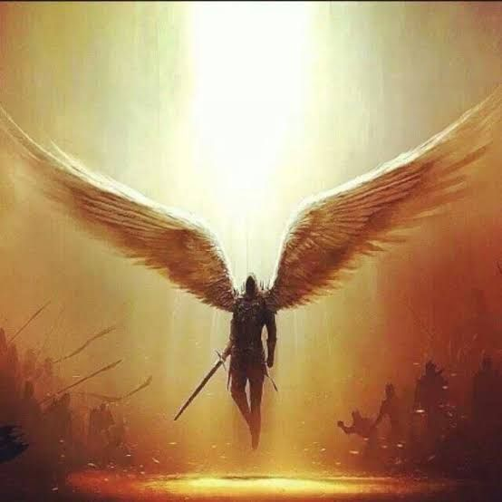

This fallen, raptured world is roamed only by monsters and demons. Orbiting a darkened and fading star, it drifted endlessly through the never ending void and darkness of space. That is, until an entity known as “the Bright Lord” fell to Terra, bringing with him other entities known as brights or gods as some cultures would call them later. After observing the mindless monsters of the world, the Bright Lord took pity upon the dead planet. He blessed those monsters that bowed to him with the gift of consciousness and they assumed the humanoid form of the Bright Lord. This event would be known as “The Awakening”.

The Brights each imparted an aspect of themselves unto Fellkind to help them survive and thrive in the harsh new world they would find themselves in.

**The Tenets of Life**

* **_The Beautiful One: “Thou has been given the passion of flesh to spread across the land.”_**
* **_The Ravenous One: “Thou shall indulge and consume of the world of which I have granted.”_**
* **_The Bargainer: “Thou shall seek prosperity in the wealth and secrets of the land.”_**
* **_The Bound One: “Thou shall go without care for the opinions of the world.”_**
* **_The Faithful One: “Thou shall take up arms and seek righteous vengeance upon those that have betrayed and wronged you.”_**
* **_The Twisting One: “Thou shall recognize the success of one's neighbor, and labor to obtain greatness oneself.”_**
* **_The Bright Lord: “Thou are created in the image of greatness, and shall seek strength, knowledge, and greatness to be closer to I, but shall recognize thine greatness is from within thine own labors.”_**

These beings were the first of Fellkind or Fellkin, as they were of a fallen world. Via the Awakening, various races came into being such as Dhampires, Lycans, Sirens, Wraithkin, etc... While they assumed a humanoid form, Fellkind was still able to access the genetic traits of their monstrous origins. Fellkind learned to harness ichor, the potential energy held in the blood of monsters and Fellkind alike. The gifted and disciplined were able to hone these abilities into what is now known as Fellcraft.

### **The First of Brightkind**

The Bright Lord blessed upon the first and most devoted daughters of Fellkind his children. These were the first demi-brights or Brightkind. The Bright Lord declared Terra and dominion over Fellkind their right, though they would have to seize it for themselves. Brightkind shared none of the monstrous traits of Fellkind. Brightkin were capable of performing Miracles like the Bright Lord himself. While Fellcraft must obey the natural laws of the world,** **Miracles seem to take them as mere suggestions, leaving scholars puzzled to this day. Brightkin, like the Bright Lord, were immortal and though they could be harmed, were nearly impossible to permanently kill.

### **Brightinism**

Upon Fellkind and Brightkind the Bright Lord built his teachings, known as Brightinism. Brightinism warned of the Dead God, an entity responsible for the abandonment and rapture of the last world. Worship of the Dead God was forbidden under the weight of death, as it was  foretold to bring the entity back to this world and rapture would follow once again. He bestowed upon his Brightinist followers visions guiding them.

### **The Faithful One**

The Bright Lord placed his most loyal companions, the bright Amon, the Faithful One,  the bearer of the Mark of the Undying, in charge of protecting the people of Terra from the monsters and demons that still roamed the planet. Amon grew to love Fellkind as he taught them to defend themselves and lived amongst them. When the demons that remained on the planet began preying upon Fellkind, his war against them began. Wielding the Spear of Destiny he rampaged and hunted across the planet, ending the existence of demons on Terra. Unsatisfied with the chance of their return, he traveled to their world.  He ripped and tore across their world. It is said Amon raged in their world for an eternity, all to protect those he loved. The Demons named him "The Demon of the West'', as in time they considered him as one of them. Amon returned, changed. And the demons never returned, for the only thing they feared was him.

### **The Great Betrayal**

It is unclear why Amon, the Faithful One, attempted to overthrow the Bright Lord. Some say that he was corrupted by the Dead God. Brightinist priests will often say that it is simply a byproduct of the Tenets and that it is the Bright Lord's will to challenge him. It is said that their battle was so intense that it split the moon in two. The larger moon became known as "the Mother '' and the smaller named "the Child ''. 

 In the end, Amon was defeated and imprisoned. The Bright Lord decreed from now until the end of time, Amon would only be referred to as “The Great Betrayer”. This event would become known as "The Great Betrayal''. The Bright Lord then bestowed the Tenets of Fear.

**The Tenets of Fear**

* **_Fear the Dead God_**
* **_Fear the Mark/Brand of the Undying_**
* **_Fear the all tyrants, freedom is to be absolute_**

### **The Bright Lord's Ascension**

Devoid of light, the people of Terra suffered immensely to the horrors that live in the darkness of night. And so, after the Great Betrayal, the Bright Lord ascended to the heavens. And there, the Bright Lord tends to the heart of the dying star, giving it new life. There he remains, watchful over his creations…

### **The Dark Age**

Thus began the Dark Age. For 10,000 years Fellkin and Brightkin struggled against the monsters of the planet, slowly craving out civilization with nothing but their own blood and steel. These were dark times, and kingdoms fell and rose to monsters, diseases, and each other. In the end, The Dawn Empire stood atop, their gleaming capital Crossroad sitting in the middle of the continent. From there they exerted their control and forced the kingdoms of Terra to bow to them or face their furious wrath.

### **The Dawn Age**

Thus began the Age of Dawn, a time of relative peace and prosperity. Ruled by Emperor Commudus Lightbringer.

## 

## The Bright Pantheon 

Brights are a group of beings that are most commonly associated with the Bright Lord himself. The term Bright, should not be seen as an indication of the luminosity of the beings, but rather their association with the Bright Lord. In some cultures around Terra, Brights are also referred to as gods.

Each Bright or god in the Pantheon of Brightinism has an associated Tenet of Life.

**The Bright Lord \
**

** \
Aspect: **Light, Intelligence, Dominion \
**Tenet:** _“Thou are created in the image of greatness, and shall seek strength, knowledge, and greatness to be closer to I, but shall recognize thine greatness is from within thine own labors.” \
**Aliases: **_ King of the Brights, The Star of Dawn** \
Relics: **

* Adversary
* The Crown of Thorns

**Lore:**

The Bright Lord is the chief deity of Brightinism. As the creator of Fellkind and Brightkind, he is worshiped widely across Terra.

**The Great Betrayer \
**

** \
Domain:** Vengeance, Fury, Betrayal \
**Tenet:** _“_Thou shall take up arms and seek righteous vengeance upon those that have wronged you.”

**Aliases: **Amon (This name is frowned upon, it is considered heresy and a curse), The Faithful One, Demon of the West, Spear of the Brights \
 \
**Lore:**

The Great Betrayer, or Amon, the Faithful One, as he was known before the Great Betrayal, was the most loyal servant of the Bright Lord. Bestowed by the Bright Lord, Amon faithfully served the Bright Lord until his dramatic and sudden betrayal.

 \
The use of the word “Amon” was seen as a curse, bad omen, and not to be used lightly. More commonly referred to as “The Great Betrayer” on Terra today, worship has been strictly forbidden, though many temples still teach of and house statues of Amon as he is still considered a member of the Bright Pantheon. \
 \
By all accounts, Amon was considered the most dangerous of all the Brights, due to his mysterious ability to scale to the threat level of any enemy before him. What further puzzles scholars is the vast amount of ancient records documenting his time living with and protecting the first of Fellkind. Some texts refer to him as similar to Fellkind in stature and strength. Myths of his battles with the Demon Lords of Terra represent him as an unrelenting being of never ending strength.

Amon’s Mark, “the Mark/Brand of the Undying” is referenced in many ancient texts. While the exact nature of the mark is unknown, it appears to render Amon virtually unkillable and great power. \
 \
Amon's love of weaponry and equipment is obvious, as many of the weapons we use today were taught to our ancestors by Amon. Artifacts of Amon are closely guarded deep within the Dawn Empire's capital of Crossroads. Though whispers tell tales of artifacts lost to the ages… \
 \
**Relics:**

* 

**The Twisting One \
**

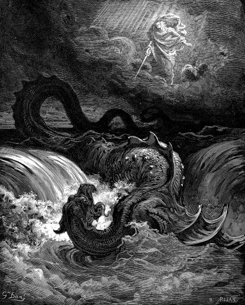

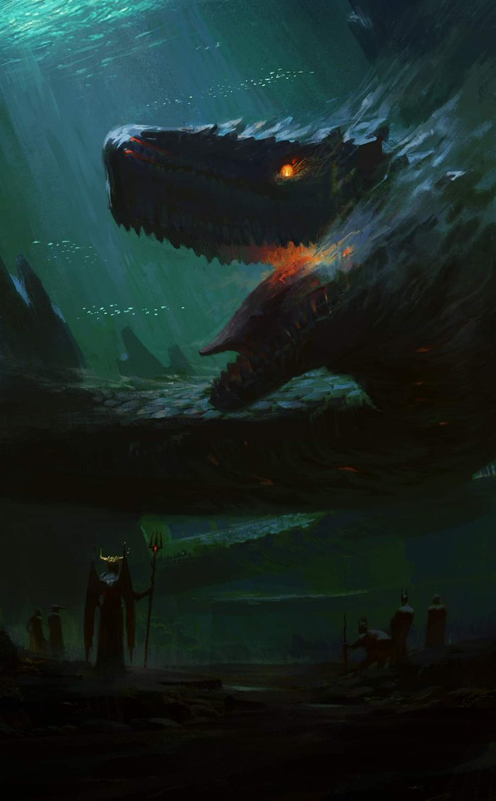
** \
Aspect:** Want, Growth, Change \
**Tenet:** _“_Thou shall recognize the success of one's neighbor, and labor to obtain success thineself._” \
**Aliases: **_Leviathan, The Great Circle, Lord of the Deep, Rahab, Progenitor of Dragons, Ouroboros, The Primeval Sea Serpent, The World Serpent, Bright of Chaos, The Shielded One,  The Sea Dragon, Serpent of the Abyss \
 \
**Lore:**  \
The “World Serpent” from the Isles of Crest, The Ouroboros in Leodelphia, and The Leviathan of Redwall all describe the same singular entity. The gargantuan Bright is so large that it is said to encircle the foundations of the world, and is said to have dwelt on Terra even before the arrival of the Bright Lord. Seen to represent want, growth, and change, the Twisting One is worshiped by Seakin, Saliours, and those seeking radical change in their lives.

For its loyalty, the Bright Lord is said to have bestowed wings to certain of its offspring, which appears to have led to the first dragons.  \
 \
Dry storms, the great churnings of water that happens at sea, are said to be the result of the wake of it moving deep beneath the surface of the ocean. It is also theorized that many of the earthquakes and oceanic currents felt across Terra are similarly the result of its movements. Some scholars claim that its movements along the seafloor leave gashes in Terra itself. \
 \
It is said that no physical weapon can pierce its impenetrable scales. A scale of the Twisting one has been found deep within the Earth. This scale is still being painstakingly harvested to this day to forge some of the finest armor and weapons on Terra. These scaled weapons seem to impart long life and health upon the bearer. \
 \
**Description:**  \
Eye witness accounts of The Twisting One’s body, as it is known in the Dawn Empire, are common. Many mistake parts of its body as islands and landmasses.

Dark, gargantuan, and practically indestructible scales cover every inch of the creature's body. While sightings of parts of The Twisting One’s body are quite common, there are very few accounts of those that have witnessed its head, for obvious reasons. Those that lived to tell the tale describe the following as being so large it blocks out the sun. Its eyes glow red like the rays of dawn, smoke pours from its nostrils with snorts throwing flashes of light. Direct eye contact with the creature turns the onlooker to stone and it breathes storms of fire. \

**Relics:**

* The Serpent Staff \

## 

**The Bound One \
**

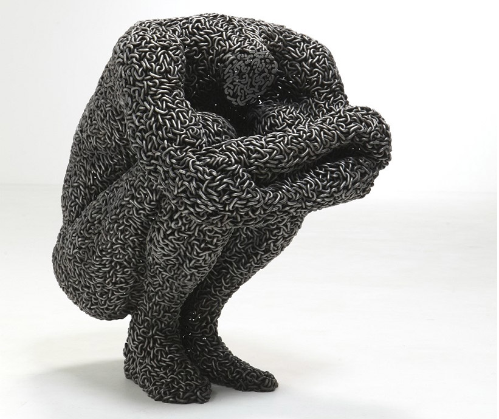

**Domain:** Rest, Binding, Stagnation, Patience \
**Tenet:** _“Thou shall go without care for the opinions of the world.”_ \
**Aliases: **The Shiftless One, The Deep Dreamer, The Still One \
**Lore: \
	_“With no respite from the outside world, the Bound One could only look within. And there it found the gentle embrace of an infinite dream…” \
_ \
**During creation, the Bound One introduces rest, sleep, and relaxation into our world. Those that follow The Bound One seek enlightenment not through the concerns of the physical world, but those of deep relaxation and dreams. These Bound Apostles, laden with heavy robes and chains, sleep endlessly, only awakening to relay secrets and inventions found within the dreams. Many of the runes used throughout Terra today were discovered in this fashion. \
 \
	** \
Desc: \
**There are zero personal accounts of the Bound One. The Bound One is often depicted in Cathedral statues as a chained, headless form with no discernible features. Often depicted as slumped forward or lying on the ground.

**Relics:**

* 

**The Beautiful One**

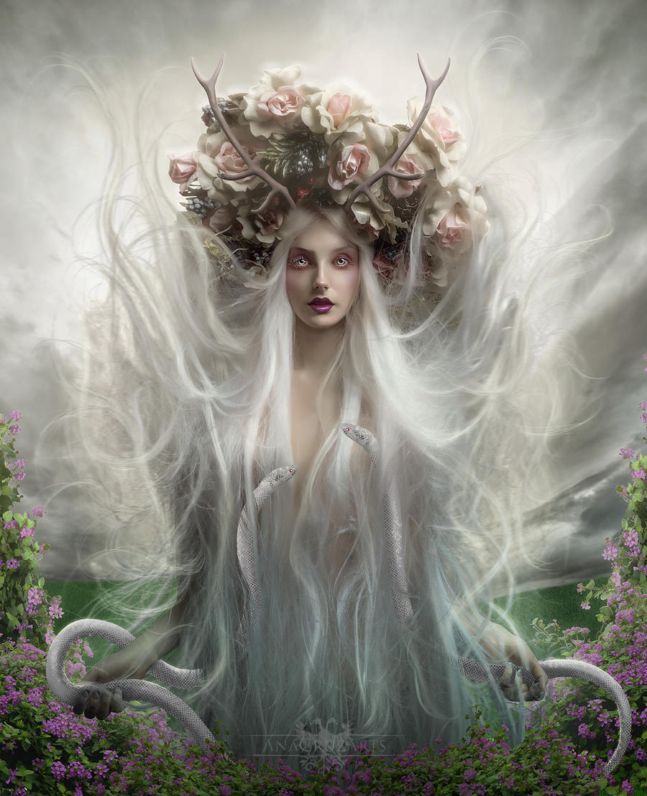

**Aspect:** Passion, Fertility, Beauty \
**Tenet:** _“_Thou has been given the passion of flesh to spread across the land._”_

**Aliases: **The Lady of Night, Bright of Fertility, The Rebellious \
 \
**Lore: **

During creation, The Beautiful One gave unto Fellkind the gift of Passion, Fertility, and Beauty. The Beautiful One seeks to encourage the passion of flesh that they have been given, to cultivate new life.

Whether it be lovers, aspiring mothers, vain queens, or brothel workers, many pray regularly to the Beautiful One.

Priests and priestesses of The Beautiful One can be easily picked out by their extremely fine and provocative clothing. They are known for their immense promiscuity, exchanging their passion for the favor and support of powerful lords and wealthy merchants.

** \
Relics:**

* 

**The Bargainer \
**

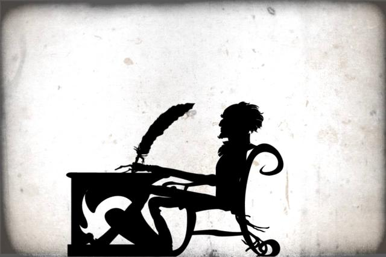

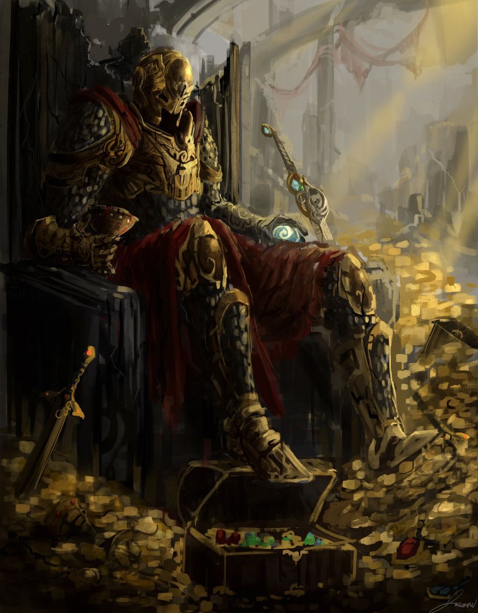
** \
Aspect:** Prosperity, Secrets, Knowledge \
**Tenet:** _“Thou shall seek prosperity in the wealth and knowledge of the world.” \
**Aliases: **_The Clever One, The Keeper of Secrets, Bright of Trickery, Cleverous

**Lore: **

“Everything has a price…” -The Bargainer

During creation, The Bargainer gave unto Fellkind the desire for prosperity and the knowledge for secrets of the world. The Bargainer wishes for the people of Terra to amass knowledge and wealth.

Often depicted as a figure sitting at a desk or throne surrounded by secret knowledge or wealth. Those that commonly worship The Bargainer include merchants, scholars, rogues, mercenaries, and spies.

Priests and priestesses of the Bargainer make up the highest echelons of merchants, scholars, and spies, etc… Any that pursues wealth and secret knowledge are capable of gaining entry into the priesthood, which behaves much closer to a secret society of the most wealthy, powerful, and influential.

** \
Relics:**

* 

**The Ravenous One** \

 \
**Domain:** Survival, Hunger, Decay \
**Tenet:** _“Thou shall indulge and consume the world that has been created.”_ \
**Aliases: **The Voracious One, The Hungry One \
**Lore:**

During creation, The Ravenous One gave unto Fellkind the insatiable hunger of life, lest they wither away. The Ravenous one wishes for the people of Terra to indulge and consume the world, lest it consume them…

Depicted in various cultures across Terra, often as an enormous maw of teeth or mandibles. Common worshipers of the Ravenous One include Chitinkin, hunters, farmers, chefs, starving peasants, and indulgent lords and ladies.

Priest and priestesses of the Ravenous One are generally very plump and travel the world teaching hunting, farming, land clearing, and cooking. Wherever they travel, abundance tends to follow.

**Relics:**

* 

## Other Deities

### **The Moon Presence**

Many around Tera worship the moon presence as a primal force that existed even before the arrival of the Bright Lord. It is said that the Moon Presence used to be whole, but during the Great Betrayal, the battle between Amon and the Bright Lord Split the Moon in two.

#### The Old One

The Larger of the two moons of Terra. Enraged by the separation from its other half, it is said to harbor animosity against the Bright Lord. 

#### The Younger

The smaller of the two moons of Terra. Said to be the gentler aspect of the moon presence, bringing gentle tides, sailors back to their families, and protecting pregnant mothers. 

## Terra

### **The Sun**

The Sun of Terra fluctuates in its color. Starting its cycle from a warm yellowish to orangish to reddish  glow. As the Sun progresses in its cycle, it slowly becomes larger in the sky. At the end of its cycle, a brilliant burst of light pulls the star back together, resetting to its warm yellow hue. This cycle varies, though tends to happen every 3-5 months.

### **The Continent**

## 

The Continent spans most of Terra, owing to its enormous size. It is said that in their conquest of Terra, the Brights tamed the great magma dragons and wyrms that live deep in the tectonic plates of Terra, forcing them to unify the landmasses of Terra.

## 

## Countries of Terra

### **The Dawn Empire**

The Dawn Empire, ruled by the Lightbringer Imperial family, is the most powerful superpower on the continent.

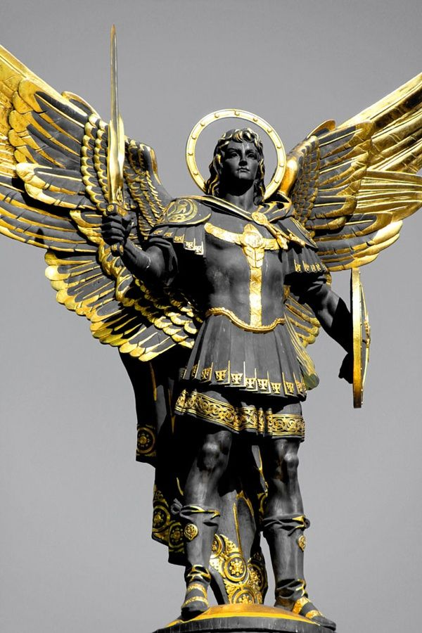

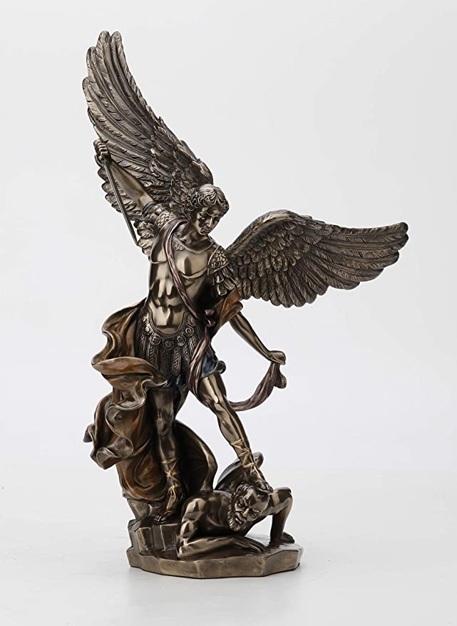

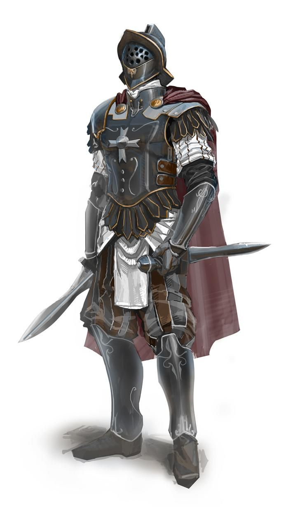

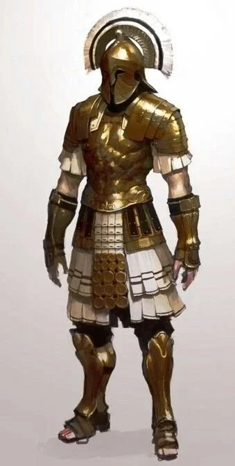

#### The City of Crossroads

The capital of the Dawn Empire. The Tower of the Bright Lord, which the city is built around, is under constant construction, endlessly reaching into the heavens.

### **Reddland**

Reign of the Witch Queen Allana.

#### The Reddingtons

**Flint Reddington**

A previously known as Captain Flint Storm, the Laughing Storm, a bastard of a noble vampire house, from Crossroads, the Daywalkers. A pirate who fell in love with Victoria Reddington after capturing her boat, he let her go with all of her cargo, and surrendered himself to the then Lady Reddington. For his crimes he was made Warden of the Sea's, where he hunted the pirates he once served with. He and Victoria Redgaurd grew very close, and Victoria gave up her rightful claim to the throne to marry her true love. But tragedy struck Victoria's younger brother, as he was proclaimed a heretic to the Bright Lord for Moon worship, and was executed publicly in Crossroads on a diplomatic journey. A small war between the Dawn Empire and Reddington insured. Redgaurd fought bravely, but the might of Angland was too great. It was decided that peace would be made, and Lady Reddington bent the knee to Emperor Jerrick Lightbringer.  

 

A new law was passed that other religious worship was permitted, besides the worship of the Dead God as a concession to the execution of Matthew Redgaurd. Angland who had the power in the negotiations, and would only agree to peace if the Heirs of Redgaurd and Angland wed to unite the two Kingdoms. This occurred in 10887, and was called the Sparring of Nations. These two Heirs would eventually be Vexhillia Redgaurd and Lucifer Lightbringer.  

 

Flint is an Edge Binder, a school of magic similar to a spell sword. They Focus magic into their weapon for devastating strikes.  

 

Like all Dhampires, he hates Vampire with a passion.

Ronald Reddington, the great Builder, built the great Redwall 

Maxwell Reddinton, Veronicas older brother, burned at the stake for his heresy and worship of the Moon Presence 

#### Redwall

Castle Tearstone

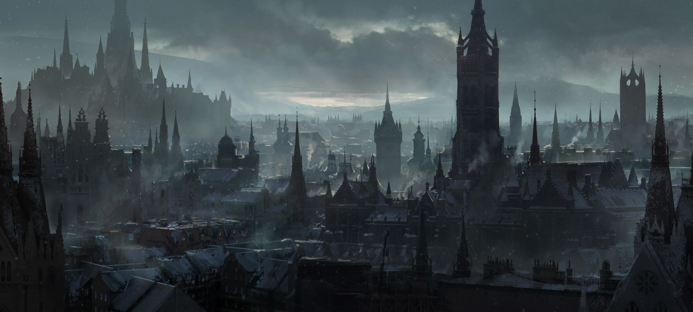

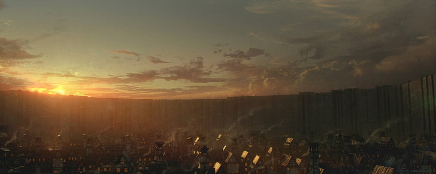

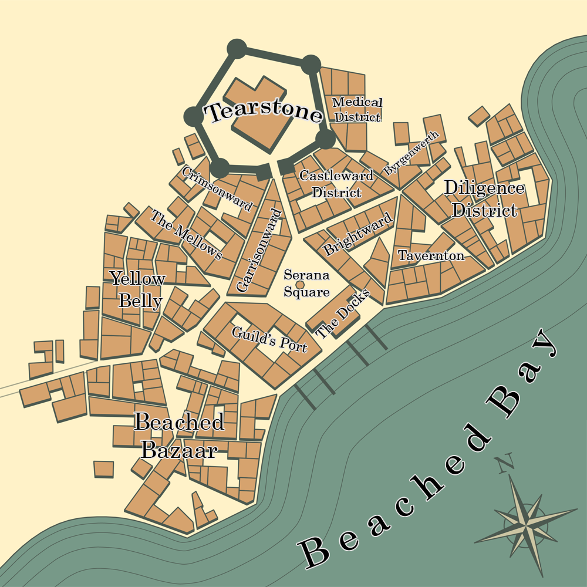

#### The Tragedy of Killroy the Fool

The folktale of Killroy the fool is famous throughout Reddland. It summarizes the War of the Witch Queen, and one small fool's role in it. Due to the story, the name Killroy has fallen out of use, many seeing it as a bad omen.

“Long ago, in what is now Reddland, the Siren Witch Queen Alana ruled these lands with brutal magic that seeped into and controlled the minds of her subjects.

 

In those days, the Siren’s worship of the Moon Presence was seen as blasphemy by Brightinist worshipers across Terra. A young Dhampir  Centurion of the Dawn Empire Legion named Serana Reddington, a fervent woman of faith, boldly went to the Emperor seeking his blessing in the conquest of the Witch Queen Alana’s lands. She received his blessing, though he would give her now forces for her conquest, for if the people oppressed by the Witch Queen Alana would not stand up for themselves, then they did not deserve their freedom.

### 

Serana returned to the Crimson Foothills, where her Dhampir kin lived under constant attack and threat of the Witch Queen and Siren’s wrath. Serana was a born leader and when she spoke out against the oppression of the Witch Queen, the Dhampires of the Crimson foothill rallied to her. They named themselves “The Redd Legion”, honoring their new general.

Fueled by the eons of conflict between the Dhampires and their Siren oppressors, the prospect of war was inevitable. Amongst the recruits of the Redd Legion was a young Dhampir peasant named Killroy. Through his low upbringing, Killroy was known for his wit, good looks, fighting prowess, and remarkable aptitude with Fellcraft. Killroy’s dream was to have his name be known for generations to come, to become a legend, and this war would be his chance to achieve glory.

During a great feast held in General Serana Reddington's name, Killroy challenged to a duel. If he won, he would instead lead the Redd Legion to war. If he lost, she could execute him on the spot. In Killroy’s mind, she was just another spoiled noble, which he had bested many times and this time would be no different. Serana was quite amused and accepted. And thus, blades were drawn, Fellcrafts flew, and blood was spilled. In the end, Serana was the victor Killroy, defeated, closed his eyes accepting his fate. But, instead of a swoosh of a sword, he heard only laughter. Gathering himself from the ground, he looked around at the laughing crowd. Serana, through her laughs, informed him what she had just announced to the crowd. \
 \
“That was a brave but foolish plan, however, I have seemed to misplace my court fool, so instead of death, my fool you shall be.”

And thus Killroy’s torment began as Serana’s fool. Dressed ridiculously and never far behind Serana whether it be in camp or on the battlefield. The night before the legendary “Battle of the Wet Dress'', Killroy had a sarcastic comment about Serana’s feast dress. And thus, clad in Serana’s bright red dress, Killroy led the charge across the shallow Lunar River. It is said the opposing general dropped his telescope in the mud when he saw Killroy charging, and was quite certain that he had lost his mind, relieving himself of his command. Throughout the war, Killroy distinguished himself, in many cases acting as Serana’s second in command and personal body guard on the battlefield as Serana always would fight where the battle was thickest. The two became inseparable on and off the battlefield.

The war was hard and brutal, but Serana’s leadership proved to be the deciding factor. The Redd Legion was able to push deep into enemy territory and lay siege to the Witch Queen’s Capital. While under siege, Serana, Killroy, and a small group of their elite forces infiltrated the capital to eliminate the Witch Queen, cutting the head off the snake once and for all.

Unbeknownst to them, the Witch Queen Alana, a master of forbidden Runecrafts, had been constructing a ring to end the war and all wars. Into her ring, she poured her cruelty, her malice, and her will to dominate all life. This small blue ring, “The Singing Ring” faintly echoed a Siren Lullaby. With it, the Witch Queen Mindcraft was unstoppable. The elite soldiers, turned cowards,  abandoned their mission, leaving only Killroy and Serana. Little is known how the battle ensued, but when the Redd Legion finally conquered the castle, they found the Witch Queen Alana headless. Serana was found clutching the cold body of Killroy the Fool, the one man who had stood with his Queen till the end, Serana’s sword driven through his chest. When asked what had happened Serana said nothing and stayed with his body alone in the throne room all night. In the morning, grasping the head of the blasphemous Witch Queen, Serana declared victory in what is now known as Serana Square in Reddwall today.

Word from the Emperor in Crossroad’s was quickly received, legitimizing Serana’s and her descendant’s right to rule their new land, as a member of the empire of course. And thus, Reddland was born.

Serana was never quite the same after her battle with the Witch Queen, her youthful energy replaced by a temperament of someone twice her age. Serana’s first act was implementing laws that outlawed the use of  mind control via mindcraft. She also outlawed the drinking of unwilling Fellin blood. She offered peace to the remaining Siren population, promising an end to the bloodshed.

The position of Fool became a title of great honor in Reddland, a given post mortem for those who laid down their lives in great acts of valor to protect their comrades. Reddland prospered, peace was achieved. And Killroy became what he had set out to become, a legend.

The End.”

#### Tentcity

Castle Pitch Tent 

### **Isles of Crest**

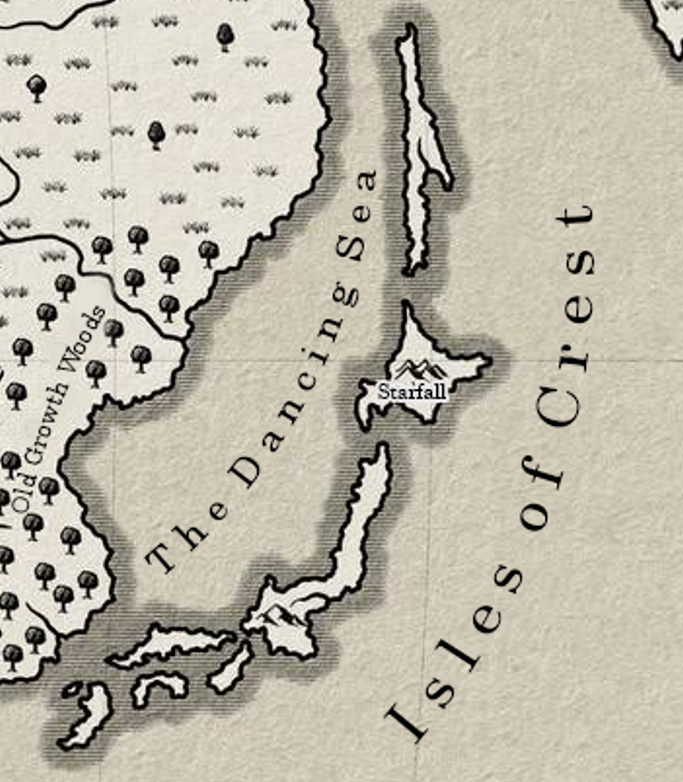

#### Starfall

#### Cambria

A year and a half ago, Cambrai was one of the worst shard epidemics in recorded history. An organized group of sentient monsters descended upon Cambrai in the twilight. Only two of the 585 residents were killed, the rest were to suffer a fate far worse than death. All the residents of the town had been infected with shards, leading to the Inquisition of the Dawn Empire. The town was kept under surveillance, and all of the residents were given hearthstone, a simple enchantment that alerts the authority upon death.  

 

All of the residents expect a brother and sister to die within the first year. Felix and his sister were the last alive. His sister and him had a strange resistance to the diseases spreading, growing much more slowly. Felix's sister's condition worsened very quickly as she fell sick which aggravated her condition. Felix was the last to survive. He had told the guards that he hadn't been infected and now they finally believed him. He no longer required Hearthstone, and traveled to Reddington to prevent a tragedy like this from happening again.

### **Uskal**

Far to the south lie the cold and inhospitable Colonies of Uskal. The Uskal Colonies came about during the Dark age, when the demand for Silver was great for their fight against the Monsters of the wilds. It was discovered that under its frigid surface, were ample amounts of silver and other precious resources. \
 \
The Dawn Empire, needing silver for their war effort on the monsters of Terra and a place to rid themselves of undesirables,  began offering mudbloods, criminals, and prisoners a chance to pay off their debt to society rather than execution. Many took their offer and were shipped off to the Uskal Colonies to begin the mining and extraction of silver and other precious resources.

The first lord of Uskal was Leopold Harkon, the cousin of the founder of Redwall, Serana Redguard. While his position was supposed to be temporary, as a 6th born son in his family, his prospects of any land was close to none. Leopold saw Uskal, frigid and inhospitable as it was, as his only option in gaining land, wealth, and status. After running the colony successfully for 100s of years, Leopold made his move and declared Uskal to be his kin’s birthright. With the backing of Reddland and the Dawn Empires indifference as long as their flow of resources was constant, House Harkon became the new Wardens of the Uskalian colonies.

In modern times, much is the same, its frigid climate and endless supplies of monsters leaking in from the Frozen Tundra never changing. As of TIME, the young Lord Albert Harkon is the current Warden of the Uskalian Colonies after a fatal mining cave-in crushed his father and older siblings. Whereas his father ruled the Usklian Colonies with an iron fist, Lord Albert is a much gentler and distant ruler, modeling his laws and government his kinsman of Reddland, which are far more progressive towards Mudbloods. Under his rule, the weight and taxes on the people of Uskal have lessened. Though, the reality of generations of oppression are not so easily forgotten by some…

### **The Spore**

The spore is a parasitic fungus that assumes control over the brainstem of its victims. The spore is a bright luminous whitish blue fungus that produces spores that stay airborne. Breathing in a small amount of the spores will lead to death in 1-3 months, where a large amount of spore exposure results in death in the next day to 5 min. Once dead, after a 36 hour hibernation period, the dead will wake up and seek new victims. After a prolonged period, the fungus will emerge from the host. At some point the creature will stop moving and find a tall place in order to spread more fungus. 

 

Carriers are the name of the form when they go dormant to spread the spore. 

## Races of Terra

### **Brightkin** \

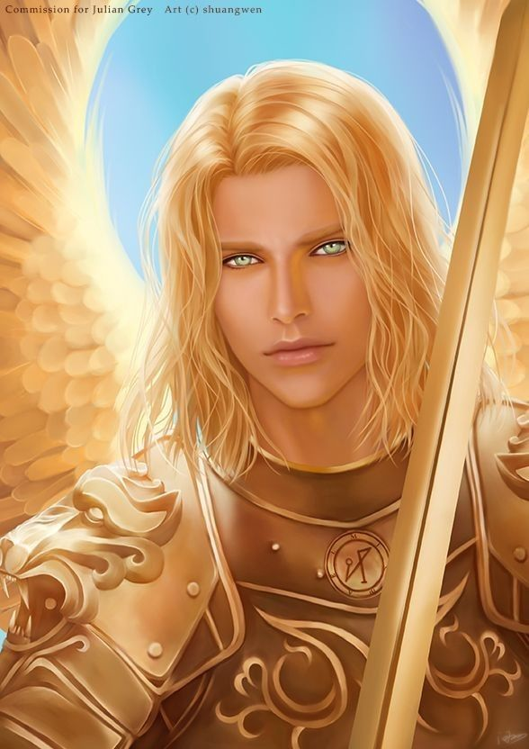

When the Bright Lord gave onto the first loyal women of Fellkind his children, the resulting offspring were the first Brightkin (or Demi-Brights) of Terra. Brightkin, regardless of their mate will always produce a Brightkin. Brightkin children are rare as infertility is common amongst their people, with most couples taking many hundreds of years to produce an offspring. \
 \
Brightkin are a beautiful/handsome people, as ugly Brightkin are unheard of. \

Brightkins have the ability to use the power of the Brighlord, known as Miracles. Miracles consider the laws of nature a suggestion. To perform a Miracle, Light is channeled through specific strong emotion or memories to receive a desired effect. Miracles require training and practice to use, harnessing one's emotions. Most Brightkin don't devote themselves to mastering Miracles, though they enjoy the benefits of near immortality. After being killed, as long as the Brightkin has stored internal  light or the body is exposed to Sunlight, a Brightkin’s body will begin to resurrect in a beautiful glow of light. All injuries will be healed to peak health.

 \
The Empire of Angland is ruled by the Imperial family. Their capital city Crossroads stands in the middle of the continent and from there they exert dominion over the rest of the continent. While the Legions of Angland are a force to be reckoned with, a specialized branch known as “The Inquisition'' acts as the fist of the Empire. Known for their intellect, Brightkin produces some of the finest lore masters and scholars on Terra. \
 \
They are fervent worshippers of the Bright Lord and his pantheon. Many young Brightkin take pilgrimage across Terra to spread the message of the Bright Lord. \
 \
**Miracles:** Radiance, Blessings \
**Life Span:** Indefinite \
**Language:** Bright-speak, Babelish \

### **Dhampires \
**

Dhampires trace their monstrous ancestry from the Vampires that bowed to the Bright Lord. Sunlight is deadly to Vampires, meaning those that stood in front of the Bright Lord surely should have perished… \
 \
 While Vampires have a powerful aversion to sunlight, Dhampires are unaffected. Also referred to as “Day Walkers”, their distinctive physical attributes include pointy ears, elongated canines, and their distinctive faintly glowing eyes. \
 \
Redland is the largest Dhampire kingdom on the eastern edge of Terra. Reddlanians are a fiercely proud people, ruled by house Reddington. Their standing military, “The Red Legion'' is one of the finest armies on Terra and the recent discovery of Blood Healing has made Redland a key player in global politics. \
 \
Redland has become a powerful political player as during the Spore pandemic that ravaged the continent, it was their healing bloods that cured the fungal plague that ravaged the continent.  \
 \
**Fellcrafts: **Polycraft, Shadowcraft, Mindcraft, Hemacraft, Sonocraft \
**Life Span:** 3000 - 5000 years

**Language:** Pirish, Babelish \

### **Seakin \
**

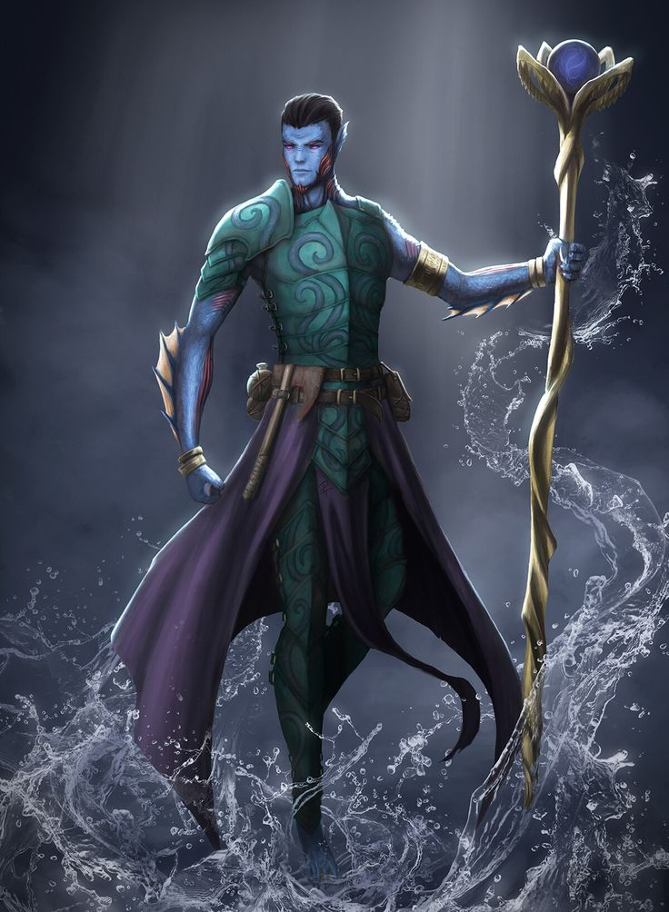

Seakin or Sirens trace their monstrous ancestry from the sea monsters that bowed to the Bright lord. These monsters were grafted consciousness and the form of the Bright Lord. \
 \
Distinctive features of Sirens include their fin-like ears, blue or green skin (though other colors exist), and often distinctive natural markings. \
 \
Much of Siren culture exists beneath the water, owing to their inherent abilities to breath the water. Siren culture used to dominate much of the eastern part of Terra under the Witch Queen Alana. After her defeat, Siren culture retreated for the most part back to the seas. The largest land-based settlement, Tentcity, lies in the south of what is now modern day Redland, ruled by House Roseblood.  \
 \
Sirens worship different gods than the pantheon of the Brights, though they share a god in the Twisting One which they refer to as “The Leviathan”. A prominent deity worshiped is the Moon Presences, the Parent and the Child. \
 \
**Fellcrafts: **Polycraft, Hydrocraft, Mindcraft, Sonocraft, Electrocraft \
**Life Span:** 150 - 200 years

**Language:** Deep-speak, Babelish

### **Beastkin \
**

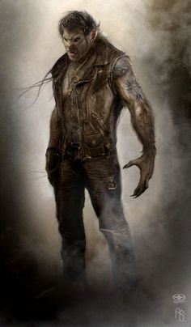

Beastkin or Lycans trace their monstrous ancestry from Werewolves and other Beastial monsters that bowed to the Bright Lord. \
 \
Since Beastkin are highly varied and shapeshifters, their appearances can vary wildly. Beastkin that live on the Isles of Crest live day to day with their beastail traits showing such as fur, claws, and beastial facial features. While in Redland, where showing these features openly is considered a social taboo, Beastkin simply have animalistic eyes and slightly larger canines. The extent to which their Beastial feature shows is completely subconscious and has usually formed by early adolescence.

Beastkin exists in many countries across Terra. Leodelphia and The Isles of Crest have a majority Beastkin population.  \
 \
Leodelphia is mostly inhabited by feline beastkin centered around the capital of Oasis which is weaved into an  ancient jungle.  \
 \
The Isles of Crest are mainly inhabited by canine beastkin. They are a tribal people and weary of outsiders. The largest city named Starfall is centered around where a falling star crashed in the far past. \
 \
**Fellcrafts: **Polycraft \
**Life Span:** 150 - 200 years

**Language:** Primal, Babelish

**Chitinkin \
**

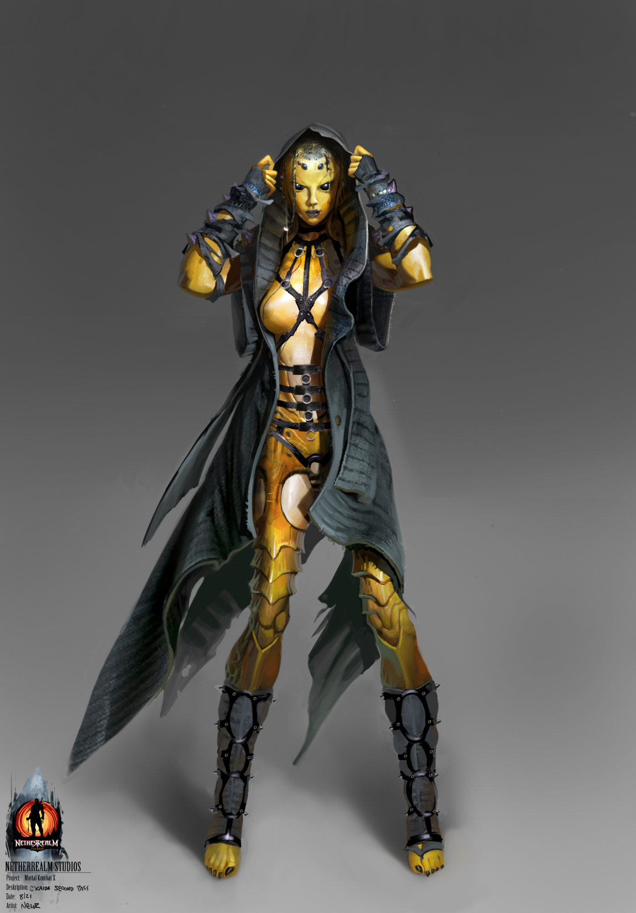

Chitinkin (or Kiki as they call themselves) trace their ancestry from the ancient insectoid monsters that bowed to the Bright lord. These monsters were granted consciousness and the form of the Bright Lord. \
 \
Distinctive features of Chitinkin are their exoskin exteriors and insectoid-like traits. \
 \
Most Chitinkin dwell deep within the earth in massive colonies that span the massive underground caverns under the surface of Terra. Their societies are heavily influenced by their biology, with their purpose and job dictated by the needs of the collective.  \
 \
In each Chitinkin city dwells a queen who has powerful Mindcraft that allows her to influence the wills of the non-royal population.  The majority of the Chitinkin are workers that harvest the vast underground mushroom farms and expand the colony. Those that are born into the royal cast are resistant to the queen's influence. They serve as generals, advisors, dukes, and other jobs that require creativity and  self-will. \
 \
The largest of these Colonies in the Hive is located in Caurus. The Chitinkin that live on the outskirts of the colonies devoid of the queen’s influence live hard nomadic lives. They stay far away from the colonies as venturing to close might tempt their minds. \
 \
**Fellcrafts: **Polycraft, Webcraft, Mindcraft, Sonocraft, Toxincraft, Terracraft \
**Life Span:** 30 - 50  years (Workers), 300 - 500 (Royals)

**Language:** Kikish, Babelish

### **Dragonkin \
**

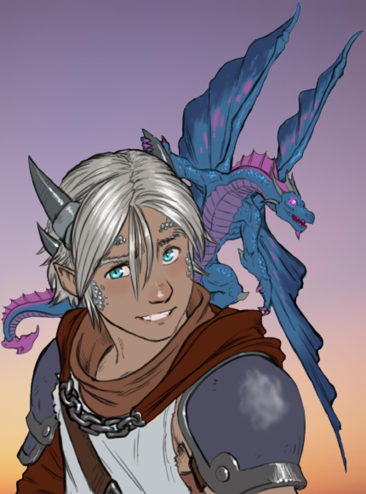

Dragonkin trace their monstrous ancestry from the ancient dragons that bowed to the Bright lord. These monsters were grafted consciousness and the form of the Bright Lord. \
 \
Distinctive features of Dragonkin include horns, certain scaly sections of their skins, and pointed ears. \
 \
Dragonkin are one of the rarest races on Terra, as very few of the ancient dragons bowed to the Bright Lord during the** **Awakening. Dragons are a proud species and dragonkin seemed to have inherited this trait from their monstrous ancestors. Due to their low population, there is no dragonkin majority country. Instead, they occupy positions of authority in many countries across Terra. They make fine advisors and scholars as their long lives permit the ability to learn thousands of years worth of information.  \
 \
Dragonkin, much like Brightkin,  appear to have an indefinite lifespan. This appears to be related to the scales across their bodies as upon their removal they begin to age and eventually perish.  \
 \
Mainy Dragonkin worship the Great Leviathan, as it is said that all dragons came from it. For in a time before the creation of Terra, the Great Leviathan aided the Bright Lord. And thus the Bright Lord bestows wings upon all his descendants. \
 \
**Fellcrafts (Dependent on dragon ancestor type): **Blazecraft, Toxincraft, Hydrocraft, Soulcraft, Galecraft, Terracraft, Mindcraft, Sonocraft, Electrocraft, Shadowcraft, Ferracraft, Naturecraft \
**Fellcrafts: **Sonocraft, Polycraft \
**Life Span:** Indefinite (Unless scales are removed)

**Language:** Dragonic, Babelish

**Crossbreeds \
**

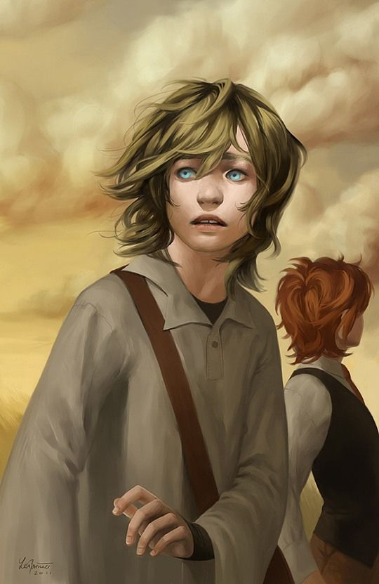

Crossbreeds trace their monstrous ancestry from the ancient monsters that bowed to the Bright lord. These monsters were grafted consciousness and the form of the Bright Lord. However, due to the dilution and mixing of their ancestral bloodlines, the genetic gifts are lost to them. They are often referred to as mudbloods due to their impure bloodlines. \
 \
Some bloodlines become impure in a single generation while others take many generations. \
 \
Mudbloods make up a large percentage of the population of Terra. Due to their impure bloodline, they are often of a lower class as many of the aristocratic societies across Terra hold deep seeded prejudice against them. While some rise above the prejudice and obtain wealth, status and fame, most live as mundane farmers and peasants. The only Crossbreeds of aristocratic status were great houses where their bloodlines slowly became impure. \
 \
**Fellcrafts: **None \
**Life Span:** 50 - 100 years

**Language:** Babelish

**More Race Ideas**

* Griffinkin
* 

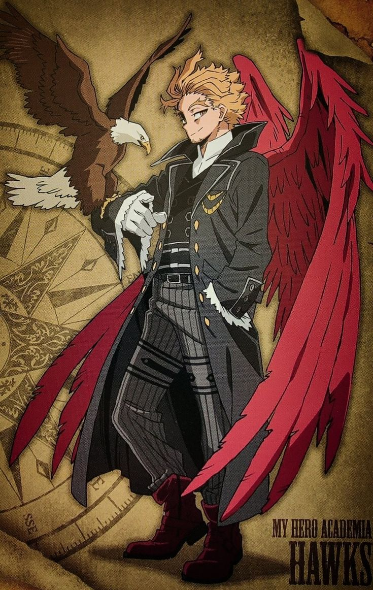

* Serpentskin
* 

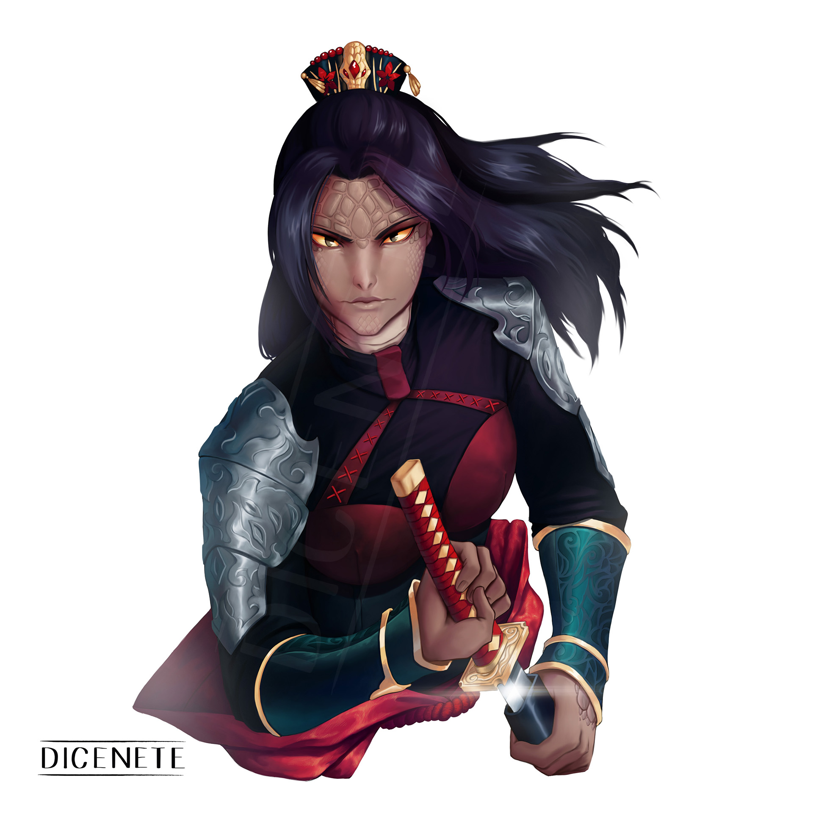

* Griffinkin
* 

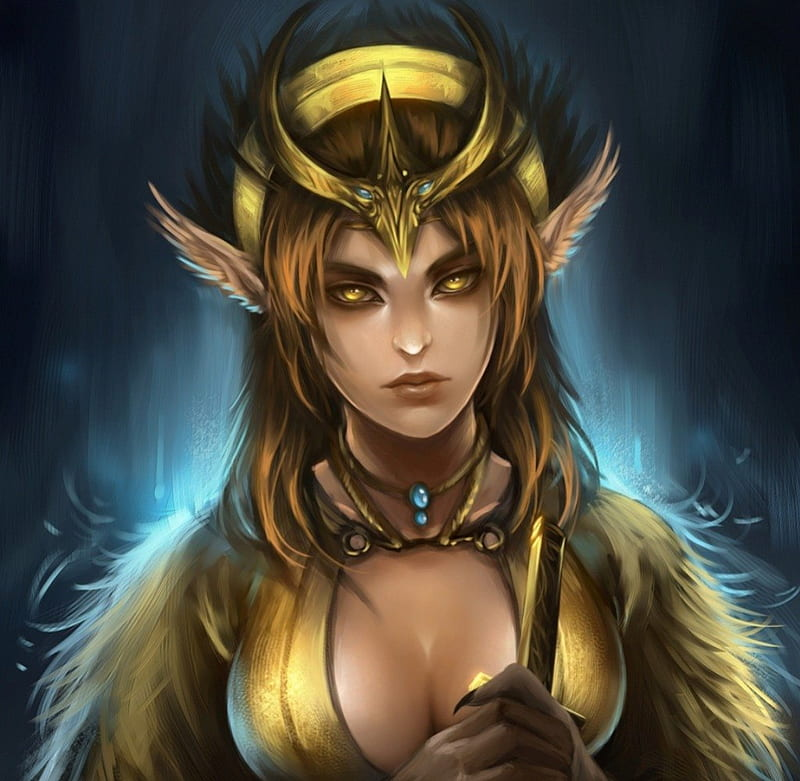

* Wraithkin

**Languages of Terra** \
**Babelish**

A gift from the Bright Lord to Fellkind after their creation. Seen as the common tongue across most of Terra. Simple and practical, it is used extensively by the common folk.

**Bright-speak**

Said to be the language of the Bright Lord and his Brights. A beautiful language that almost sounds like singing. This language is spoken exclusively in the higher echelons of Brightkin society and at the Imperial senate. 

**Pirish**

A sophisticated language spoken by Dhampires and in upper class society across Redland. It originates from the Vampires that roamed Terra from before the Bright Lord arrived.

**Deep-speak**

Spoken by Sea-folk, sailors, and anyone that does business on or near water. A flowing language, which underwater is much more pleasant to the ear

**Primal**

Spoken by Lycans across the Isles of Crest and Leodelphia. A sequence of grunt, snarls, and growls. Words don't really exist in it, as it conveys intention more than specific words. Can be used to roughly communicate with wildlife, though poorly.  No written script.

**Kikishi**

Spoken by the Chitinkin (Kiki) and across the Underworld (the giant caverns that stretch beneath the surface of Terra). A series of clicks form the basis of the language.

**Draconic**

A very rare and ancient language that has existed since before creation. Since Dragonkin are rare, this language is only used amongst themselves. An almost serpentine like language in sound.

**Demonic**

Said to be spoken by demons, no record exists of it, only myths.

## Base Mechanics

### **Victory Levels**

* Victory levels from physical attacks can be reduced equal to the amount of STR a character has per combat. If STR is negative, the level of physical injury is increased by 1.
* Victory levels from non-physical attacks can be reduced equal to the amount of INT a character has per combat. If INT is negative, the level of mental/spiritual injury is increased by 1.
* Injuries can be reduced by physical/mental/spiritual defense.
* A character is rendered Incapacitated once they’ve taken a summed 5 or above injury dice.
* Any lower victory level outcome can be achieved.

#### Level 1 victory

* **Minor Injury: **–1d6 to all physical based dice checks but will naturally heal over the next few days, or faster if treated actively. 
* **Stagger:** opponent is staggered. This could be sand thrown in a character face, being shoulder checked, or losing their footing. Movement speed is halved while staggered. The opponent can not benefit from the Defensive modifier while staggered.
* **Close Combat: **Enter/exit close combat. The initiator of close combat can release the grapple at any time.  Not available to ranged combat rolls.
* **Move:** Must be in close combat with the opponent. Move an enemy in a desired direction. Base 10 feet of moving. Each point in STR gains 10 feet. Each point in Lift gains 1.25 feet. If the opponent is small in size the distance is doubled. If the opponent is large in size, half the distance.

#### Level 2 victory

* **Medium injury: **-2d6 to all physical based dice checks and must be treated relatively soon, otherwise further penalties may apply such as infection.
* **Disarm: **opponent loses their weapon.
* **Shove: **Shove an enemy in a desired direction. Base 5 feet of shoving. Each point in STR gains 2.5 feet. Each point in Lift gains 1.25 feet. If the opponent is small in size the distance is doubled. If the opponent is large in size, half the distance.

#### Level 3 victory

* **Serious injury:** – 3d6 to all physical based dice checks and the character will die in time if the wound is untreated.
* **Trip:** Opponent is rendered prone.  -4d6 for one round or until footing is regained. Opponents can not benefit from the Defensive modifier.

#### Level 4 Victory

* **Fatal injury:** – 4d6 to all physical based dice checks, incapacitated, and will die very soon if untreated. 
* **Dismember: **remove an arm or leg, which also gives a Serious Injury to the opponent. Not available to ranged combat rolls unless magic or explosive projectiles are involved.
* **Render Unconscious: **Opponent is rendered unconscious by head trauma, blood chokes, etc. Opponent receives a Medium Injury.

#### Level 5 victory and higher

* **Death blow:** An instant kill.

### 

### **Challenge Levels**

<table>
  <tr>
   <td><strong>Task Difficulty</strong>
   </td>
   <td><strong>Challenge Level</strong>
   </td>
  </tr>
  <tr>
   <td>Common Task
   </td>
   <td>CL 1
   </td>
  </tr>
  <tr>
   <td>Uncommon Task
   </td>
   <td>CL 2
   </td>
  </tr>
  <tr>
   <td>Specialized Task
   </td>
   <td>CL 3
   </td>
  </tr>
  <tr>
   <td>Difficult Task
   </td>
   <td>CL 4
   </td>
  </tr>
  <tr>
   <td>Extremely Difficult Task
   </td>
   <td>CL 5
   </td>
  </tr>
  <tr>
   <td>Unrealistic Task
   </td>
   <td>CL 6
   </td>
  </tr>
  <tr>
   <td>Virtually Impossible Task
   </td>
   <td>CL 7
   </td>
  </tr>
  <tr>
   <td>Inconceivable Task
   </td>
   <td>CL 8
   </td>
  </tr>
</table>

### **Battlemap Rules**

#### Movement

* Each grid of the battle map represents a 5x5 ft square.

<table>
  <tr>
   <td>
<strong>Description</strong>
   </td>
   <td><strong>Effect</strong>
   </td>
   <td><strong>Source</strong>
   </td>
  </tr>
  <tr>
   <td>Humanoid Combat Movement Speed
   </td>
   <td>? ft
   </td>
   <td>30 ft (Base), 

+10 ft (per RFX),

+5 ft (per Athletics)
   </td>
  </tr>
  <tr>
   <td>Flight Combat Speed
   </td>
   <td>? ft
   </td>
   <td>70 ft (Base), 

+20 ft (per RFX),

+10 ft (per Athletics)
   </td>
  </tr>
</table>

* If a creature has a negative in RFX then 10 ft is deducted from their total movement movement.
* If a creature has a negative in the Athletics skill then 5 ft is deducted from their total movement movement.

#### Size

If there is a difference in size between two creatures who have contested checks where size would be an advantage or disadvantage, the narrator should adapt accordingly.

<table>
  <tr>
   <td><strong>Description</strong>
   </td>
   <td><strong>Effect</strong>
   </td>
   <td><strong>Source</strong>
   </td>
  </tr>
  <tr>
   <td>Tiny Size
   </td>
   <td>2.5x2.5 ft on battle map. 
   </td>
   <td>-
   </td>
  </tr>
  <tr>
   <td>Small Size
   </td>
   <td>5x5 ft on battle map.
   </td>
   <td>-
   </td>
  </tr>
  <tr>
   <td>Medium Size
   </td>
   <td>5x5 ft on battle map.
   </td>
   <td>-
   </td>
  </tr>
  <tr>
   <td>Large Size
   </td>
   <td>10x10 ft on battle map.
   </td>
   <td>-
   </td>
  </tr>
  <tr>
   <td>Huge Size
   </td>
   <td>15x15 ft on battle map.
   </td>
   <td>-
   </td>
  </tr>
  <tr>
   <td>Gargantuan Size
   </td>
   <td>20x20 ft on battle map.
   </td>
   <td>-
   </td>
  </tr>
</table>

#### Difficult Terrain

Steep mountains, ice-covered ground, swamps, etc. are difficult terrain. It takes twice the movement to move through these terrains (10 feet instead of 5 feet).

### **Destiny Point Rules**

#### Player vs Player (Optional)

If two players are competing against one another in a dice roll, then destiny points can only be used preemptively. This is to ensure players don't waste all their destiny points fighting each other.

### ** **

### **Core Skills Rules**

#### Strength Skills Redux

* **Lift** would be represented by strong men or powerlifters. Covers physical activity related to raw strength, most used in moving or holding heavy objects. Examples include shouldering a door open, carrying or throwing heavy weights, or crushing something in your hands.
* **Athletics** would be represented by sprinters, high-jumpers, and basketball players. Covers physical activity related to raw speed and jump height. It covers throwing light objects and catching them. Examples include chasing someone, jumping over a pit, throwing a baseball, or dunking a basketball.
* **Climb** would archetypically be represented by rock climbers. Covers all climbing related activities. Examples include climbing a rock face, descending a rope, holding on for dear life, or swinging between tree branches.
* **Swim** would be represented by olympic swimmers. Swim covers all situations where characters are attempting to move in liquids. It is also applicable to science fiction settings in Zero gravity environments. Swimming may be more difficult if a character is wearing heavy clothing or resisting conflicts at the same time, at the narrators discretion. If skill points are assigned, narrative failure applies as normal, with your character making no headway, treading water or otherwise. However, if you have not assigned any points into swim, your character slips underwater and begins drowning.
* **Endurance** would be represented by ultra marathon runners. Endurance is the physical trait that represents your body’s ability to process toxins and resist disease. Resisting food poisoning, hot and cold weather and pushing on past exhaustion are all the domain of endurance. Endurance also makes wearing and fighting in heavy armor easier.

#### Intelligence Skills Redux

* **Willpower** would be represented by the mental aspects of Navy Seals. Measures a character's mental control, exerted to do something or restrain impulses. This could be to do something gross but necessary, resist being verbally or mentally manipulated/attacked, resist being seduced, hold your cool in a scary situation, etc...
* **Communication** would be represented by politicians or con men. It is a measure of your verbal and non-verbal social skills. While anyone can try persuading, deceiving, bartering, or seducing, it is the manner in which you communicate that will ultimately entail success or failure. It's not what you say, but how you say it.
* **Spiritual** skill would be represented by a shaman, psychics, or priests. It is your character's profound intuition about supernatural matters such as souls, life, death, good and evil. It is the gut feeling you get when you enter a decrepit building and feel something terrible has happened there. It also represents the strength of your soul's connection to your physical body and determines your soul's ability to resist spiritual harm.
* **General Knowledge**  would be represented by a historian or bookworm. General Knowledge is the art of listening to rumors, recalling information and applying it where it is needed most. It aids in many tasks while being very specifically only usable on non-specialized tasks. A general knowledge check could never allow you to know how to disarm a bomb, but it might be able to tell you that to disarm a bomb you need to cut a specific wire. Which wire? You have no idea, perhaps if you had a Vocational Skill related to explosives you might know more.
* **Survival** would be represented by a survivalist or street smarts. It is the skill associated with staying alive in all environments. It covers scavenging for food, basic first aid as well as finding safe places to rest and lighting fires. In the city, survival keeps you from going too close to dangerous gang territory, it lets you know who to avoid, and where to avoid. In the wilderness, it tells you which berries will make you sick, which meat is spoiled and more.

### 

### **Skill Specialty**

Once a dice pool for a given skill check is equal to or greater than 8 you are considered a specialist in that skill. If you are a specialist for a skill, when asked to make a check for that skill with a Challenge Level of 3 or less, you automatically pass if all of the following are true.

* You are not under duress (No time pressure, no outside influences or aggression such as combat.)
* The check is not a contested check.
* The check is not a reflexive action.

### **Evasion Roll**

When an attack is made against a character who is not returning fire or attacking back, the defender can make an Evasion Roll vs the attacker's Combat Roll. Any levels over the defender's Evasion wins count as victories for the attacker. The Evasion Roll counts for the entire round. A Combat Roll and Evasion Roll can both be made in a round. If the character takes the Defensive combat modifier, then it is also applied.

* **Evasion Roll** = Base dice + RFX + Acrobatics Skill + Defensive modifier (if declared)

### **Hardcore Carry Weight**

Carry weight represents a character's ability to haul weight while still being able to move semi-normal depending on weight class.

<table>
  <tr>
   <td><strong>Description</strong>
   </td>
   <td><strong>Effect</strong>
   </td>
   <td><strong>Source</strong>
   </td>
  </tr>
  <tr>
   <td>Carry Weight
   </td>
   <td>0/100 lb
   </td>
   <td>100 lb (Base), 

+100 lb (per STR),

+20 lb (per Lift)
   </td>
  </tr>
  <tr>
   <td>Light Inventory Weight
   </td>
   <td>None
   </td>
   <td>0% - 25% of Max lb
   </td>
  </tr>
  <tr>
   <td>Med. Inventory Weight
   </td>
   <td>-1d6 to physical skills (RFX/STR),

-1d6 to Combat (RFX/STR),

-5 ft of Combat Movement
   </td>
   <td>25.1% - 50% of Max lb
   </td>
  </tr>
  <tr>
   <td>Heavy Inventory Weight
   </td>
   <td>-2d6 to physical skills (RFX/STR),

-2d6 to Combat (RFX/STR),

-15 ft of Combat Movement
   </td>
   <td>50.1% - 100% of Max lb
   </td>
  </tr>
</table>

### 

### **Combat Modifiers**

#### Dash (2x Movement Speed)

Instead of engaging in a combat roll, a player can choose to focus purely on their movement  in combat, doubling their movement speed. They can make an Evasion Roll. They may not take the Defensive modifier during a dash. While dashing, any attack against you gains the** **Flank combat modifier, as you are purely focused on movement. (2x Movement Speed)

#### Charge (+1d6)

If there is 15 ft between the character and opponent, they may add their momentum to their attack. This must be in a straight line, and once a charge is initiated as a portion of movement, your directions must remain constant the entire round.

#### Focused (+1d6)

While making a ranged attack, remain still and  focus on a single shot. Your **Engageable Opponents** is reduced to 1 for the turn**.** You can not move while making a focused shot.

#### Brace (+2 wins versus charge)

A brace is a move purely to counter a charge. No movement can be used while bracing. Bracing uses the opponent’s momentum against them, enabling a prepared defender to more easily stagger, trip or injure the charging opponent.

#### High ground (+2d6)

Bonus received through achieving a height advantage against an opponent, IE standing on a table, riding on a mount etc.

#### Flank (+2d6)

Bonus received when attacking an opponent actively engaged in something else, IE exhausting an opponent **'s Engagable Opponents** within a single round, picking a lock, dashing away, etc.

#### Staggered (-2d6)

Penalty received if the opponent selects to stagger through a victory level, or if the Narrator applies it. This could be sand thrown in a character face, being shoulder checked, or they lose their footing. Movement speed is halved while staggered. The opponent can not benefit from the Defensive modifier while staggered.

#### Close Combat

The fight is so close in physical proximity that the character’s bodies are pressed up against each other in a grapple or wrestle. A character using a medium (or larger) weapon is considered unarmed. Injury reduction from armor is not applicable while in close combat. Medium weapons can be used in close combat against reach weapons.

#### Defensive (+2d6) (no victory levels)

This is when a character purely focuses on defending themselves. No victory levels can be achieved for the round by the defender. Applies both to Combat Rolls, and Evasion Rolls if declared. Can not be applied while a player can not fully focus on defending themselves (Staggered, Prone, Flanked, etc.)

#### Prone (-4d6)

Penalty lasts for one round or until the character readies themselves. In combat, the penalty counts as taking place during the action of getting up while fighting. The opponent can not benefit from the Defensive modifier if they are trying to regain their footing durning the round.

#### Effective Range Exceeded (-3d6)

If a ranged shot is being made within it's max range but exceeding it's effective range. The **-3d6** penalty is the base penalty, but the narrator is free to adjust this given the context of the shot trying to be made.

#### Off guard (CL in lieu of defense roll)

CL determined by Narrator IE, attacking a soldier from behind may require a successful Stealth check, then the attack (which they cannot defend against) will be a CL assigned by the Narrator, which the player will roll against with a normal combat roll (without a flanking bonus). Any wins achieved over the CL counts towards the level of victory. Failing the CL commences the next round of combat, where the opponent is then engaged.

#### Incapacitated

If a character is incapacitated, they are held in place, tied up, or unconscious and therefore cannot fight back or defend themselves. Armor levels are disregarded if the attackers can narratively get around the armor easily. The CL a character must exceed to obtain ANY victory level against them is CL1.

#### Cover

Walls, trees, creatures, and other obstacles can provide cover during combat, making a target more difficult to harm. A target can benefit from cover only when an attack or other effect originates on the opposite side of the cover.

There are three degrees of cover. If a target is behind multiple sources of cover, only the most protective degree of cover applies; the degrees aren't added together. For example, if a target is behind a creature that gives half cover and a tree trunk that gives three-quarters cover, the target has three-quarters cover.

##### Half Cover: +2 Defense

A target has half cover if an obstacle blocks at least half of its body. The obstacle might be a low wall, a large piece of furniture, a narrow tree trunk, or a creature, whether that creature is an enemy or a friend.

##### **Three-quarters Cover: +3 Defense**

A target has three-quarters cover if about three-quarters of it is covered by an obstacle. The obstacle might be a portcullis, an arrow slit, or a thick tree trunk.

##### **Full Cover: Can't be engaged or engage in ranged combat**

A target with total cover can't be targeted directly by an attack, although some spells can reach such a target by including it in an area of effect. A target has total cover if it is completely concealed by an obstacle.

### 

### **Healing**

#### Minor Healing Factor

* Minor injuries heal in one day.
* All other injuries heal over the next few days. Once healed they are downgraded to the injury level below.

#### Minor Heal

* Removes a minor or lesser injury.
* For a higher tier injury, reduce the dice penalty of the  injury by 1. Injury remains at its current tier. Further minor heals have no effect. The higher tier injury requires the appropriate heal tier to completely remove it.

#### Medium Heal

* Removes a medium or lesser injury.
* For a higher tier injury, reduce the dice penalty of the  injury by 2. Injury remains at its current tier. Further medium healing  has no effect. The higher tier injury requires the appropriate heal tier to completely remove it.

#### Serious Heal

* Removes a serious or lesser injury.
* For a higher tier injury, reduce the dice penalty of the  injury by 3. Injury remains at its current tier. Further serious healing has no effect. The higher tier injury requires the appropriate heal tier to completely remove it.
* Can be used to reattach limbs as long as the limb is not completely destroyed.

#### Superior Heal

* Removes a Fatal  or lesser injury.
* Can be used to regrow limbs and body parts.

#### Revival Heal

* Return a dead character to life with a serious injury. Can only be performed within minutes of death.
* For living characters, it completely heals all injuries, returning the body to peak performance.

### 

### **Mounts in combat**

* When a mounted character or their mount takes an injury in combat, a Ride/Pilot check equivalent to the injury level must be succeeded to stay on horseback, else they are knocked off.
* Depending on the character's Ride/Pilot, they get to use a portion of the mount's movement speed instead of their own while mounted, dictated by the table below.

<table>
  <tr>
   <td>
<strong>Ride/Pilot Level</strong>
   </td>
   <td><strong>Combat Movement Speed</strong>
   </td>
  </tr>
  <tr>
   <td>0 skill
   </td>
   <td>Mount Speed -25 ft
   </td>
  </tr>
  <tr>
   <td>1 skill
   </td>
   <td>Mount Speed -15 ft
   </td>
  </tr>
  <tr>
   <td>2 skill
   </td>
   <td>Mount Speed -10 ft
   </td>
  </tr>
  <tr>
   <td>3 skill
   </td>
   <td>Mount Speed -5 ft
   </td>
  </tr>
  <tr>
   <td>4 skill
   </td>
   <td>Mount Speed -0 ft
   </td>
  </tr>
</table>

### **Damage Types**

#### Physical Damage Types

### Kinetic

**Hew**

Damage caused by the pressing of a bladed edge to produce the force necessary to shear.

**Slash**

Damage caused by pushing or drawing a bladed edge to produce the force necessary to slice.

**Pierce**

Damage caused by pointed objects.

**Bludgeon**

Damage caused by blunt force.

**Shockwave**

Damage caused by shock waves and sound.

### **Elemental**

**Fire**

Damage caused by intense heat or combustion.

**Water**

Damage caused by coming into physical contact with water or being covered in water such as drowning.

**Electric**

Damage caused by lighting or other sources of electricity.

**Cold**

Damage caused by extreme low temperatures.

**Radiant**

Damage caused specifically by Miracles or sunlight.

### Other

**Silver**

Damage caused by a Silvered weapon. Cause Silverburn to monsters and Fellkin. Silver wounds can't be healed via Hemacraft or Polycraft.

**Poison**

Damage caused by poisons or toxins.

**Necrotic**

Damage caused by rot, decay, and undeath.

**Bleed**

Damage caused by the loss of blood. A character loses equivalent ichor to the level of injury dealt. 

#### Non-Physical Damage Types

### Mental

**Psychic**

Damage caused by mental trauma.

### Spiritual

**Spiritual**

Damage caused by an astral plane source.

### **Weaknesses and Resistances**

### **Weaknesses**

Creatures can be susceptible to certain sources of damage.

<table>
  <tr>
   <td><strong>Description</strong>
   </td>
   <td><strong>Effect</strong>
   </td>
   <td><strong>Source</strong>
   </td>
  </tr>
  <tr>
   <td>Minor (damage-type) Weakness
   </td>
   <td>+1 to the level of injury received from (damage type) damage.
   </td>
   <td>?
   </td>
  </tr>
  <tr>
   <td>Med. (damage-type) Weakness
   </td>
   <td>+2 to the level of injury received from (damage type) damage.
   </td>
   <td>?
   </td>
  </tr>
  <tr>
   <td>Major (damage-type) Weakness
   </td>
   <td>+3 to the level of injury received from (damage type) damage.
   </td>
   <td>?
   </td>
  </tr>
  <tr>
   <td>Extreme (damage-type) Weakness
   </td>
   <td>+4 to the level of injury received from (damage type) damage.
   </td>
   <td>?
   </td>
  </tr>
  <tr>
   <td>Mortal (damage-type) Weakness
   </td>
   <td>+5 to the level of injury received from (damage type) damage.
   </td>
   <td>?
   </td>
  </tr>
</table>

### **Resistances**

Creatures can be resistant to certain sources of damage.

<table>
  <tr>
   <td><strong>Description</strong>
   </td>
   <td><strong>Effect</strong>
   </td>
   <td><strong>Source</strong>
   </td>
  </tr>
  <tr>
   <td>Minor (damage-type) Resistance
   </td>
   <td>-1 to victory levels received from (damage type) damage.
   </td>
   <td>?
   </td>
  </tr>
  <tr>
   <td>Med. (damage-type) Resistance
   </td>
   <td>-2 to victory levels received from (damage type) damage.
   </td>
   <td>?
   </td>
  </tr>
  <tr>
   <td>Major (damage-type) Resistance
   </td>
   <td>-3 to victory levels received from (damage type) damage.
   </td>
   <td>?
   </td>
  </tr>
  <tr>
   <td>Extreme (damage-type) Resistance
   </td>
   <td>-4 to victory levels received from (damage type) damage.
   </td>
   <td>?
   </td>
  </tr>
  <tr>
   <td>Complete (damage-type) Resistance
   </td>
   <td>-5 to victory levels received from (damage type) damage.
   </td>
   <td>?
   </td>
  </tr>
</table>

### **Defense**

Depending on the damage type, different types of defense can be used to resist injuries. A character can then reduce a physical injury level by the equivalent amount of defense they have for that damage type. The only way to injure an opponent with a specific defense is to exceed, or bypass it.

### Physical Defense

A measure of a character's resistance to all physical injuries. A character can wear two pieces of armor in the same category, such as wearing a gambeson under chainmail or a breastplate, which was most certainly done in history.

In these circumstances the most efficient ways of defeating a person in armor is grappling them or tripping them and holding them down, just like in real life.

* Physical Defense level = sum of all armor’s defense levels rounded down

### Bodily Defense

A measure of a character's resistance to affliction and status effect injuries. Determines your body's ability to handle resisting poisoning, blood clotting, etc. Wins determined by the roll below act as your defense against injury. The wins achieved by this can be reduced by an attacker's attack penetration.

* Bodily Defense = Endurance Roll

### Mental Defense

Mental defense is a measure of a character's bulwark against all mental injuries and influence. Wins determined by the roll below act as your defense against injury. The wins achieved by this can be reduced by an attacker's attack penetration.

* **Mental Defense** = Willpower Roll

### Spiritual Defense

Spiritual defense is a measure of a character's bulwark against all spiritual injuries and influence.Wins determined by the roll below act as your defense against injury. The wins achieved by this can be reduced by an attacker's attack penetration.

* **Spiritual Defense** = Spiritual Roll

### Armor Durability and Damage

If an injury is fully negated by armor, then the defender can decide which pieces of armor takes **armor damage**. The armor/armors must sum up to the defense level required to prevent the incoming injury and all take the same amount of **armor damage**.

* **Armor damage** = (level of injury delt) + (attack's armor penetration)

If an injury is not fully negated by the defender's armor, then all pieces of armor take **armor damage**.

### Armor Tiers

<table>
  <tr>
   <td><strong>Level</strong>
   </td>
   <td><strong>Rune Slot</strong>
   </td>
   <td><strong>Durability/Tier</strong>
   </td>
  </tr>
  <tr>
   <td>-4
   </td>
   <td>0
   </td>
   <td>0/0 (Broken)
   </td>
  </tr>
  <tr>
   <td>-3
   </td>
   <td>0
   </td>
   <td>3/3 (Compromised)
   </td>
  </tr>
  <tr>
   <td>-2
   </td>
   <td>0
   </td>
   <td>6/6 (Damaged)
   </td>
  </tr>
  <tr>
   <td>-1
   </td>
   <td>0
   </td>
   <td>9/9 (Shoddy)
   </td>
  </tr>
  <tr>
   <td>+0
   </td>
   <td>0
   </td>
   <td>12/12 (Mundane)
   </td>
  </tr>
  <tr>
   <td>+1
   </td>
   <td>1
   </td>
   <td>15/15 (Quality)
   </td>
  </tr>
  <tr>
   <td>+2
   </td>
   <td>2
   </td>
   <td>18/18 (Fine)
   </td>
  </tr>
  <tr>
   <td>+3
   </td>
   <td>3
   </td>
   <td>21/21 (Excellent)
   </td>
  </tr>
  <tr>
   <td>+4
   </td>
   <td>4
   </td>
   <td>24/24 (Superior)
   </td>
  </tr>
  <tr>
   <td>+5
   </td>
   <td>5
   </td>
   <td>27/27 (Exquisite)
   </td>
  </tr>
  <tr>
   <td>+6
   </td>
   <td>6
   </td>
   <td>30/30 (Flawless)
   </td>
  </tr>
  <tr>
   <td>+7
   </td>
   <td>7
   </td>
   <td>33/33 (Mastercraft)
   </td>
  </tr>
  <tr>
   <td>+8
   </td>
   <td>8
   </td>
   <td>36/36 (Epic)
   </td>
  </tr>
  <tr>
   <td>+9
   </td>
   <td>9
   </td>
   <td>39/39 (Bulwark)
   </td>
  </tr>
  <tr>
   <td>+10
   </td>
   <td>10
   </td>
   <td>42/42 (Legendary)
   </td>
  </tr>
  <tr>
   <td>+11
   </td>
   <td>11
   </td>
   <td>45/45 (Mythic)
   </td>
  </tr>
  <tr>
   <td>+12
   </td>
   <td>12
   </td>
   <td>48/48 (Artifact)
   </td>
  </tr>
</table>

### 

### **Status Effects (Optional)**

* Status effect damage can not be mitigated by defense.

<table>
  <tr>
   <td>
<strong>Endurance Check</strong>
   </td>
   <td><strong>When is check made</strong>
   </td>
  </tr>
  <tr>
   <td>CL 4 Endurance check
   </td>
   <td>Check is made 1 round after injury is dealt, at the end of the round.
   </td>
  </tr>
  <tr>
   <td>CL 3  Endurance check
   </td>
   <td>Check is made 1 round after injury is dealt, at the end of the round.
   </td>
  </tr>
  <tr>
   <td>CL 2  Endurance check
   </td>
   <td>Check is made 2 rounds after injury is dealt, at the end of the round.
   </td>
  </tr>
  <tr>
   <td>CL 1  Endurance check
   </td>
   <td>Check is made 2 rounds after injury is dealt, at the end of the round.
   </td>
  </tr>
</table>

### **Hemorrhage**

Whenever a creature takes an injury from **bleed**, **slash**, **pierce**, or **hew** damage, they must make an **endurance check** to see how their body handles the bleeding.

* **Bleed** and **Slash:** CL of the endurance check is equal to the **level of injury dealt**.
* **Hew** and **Pierce**: CL of the endurance check is equal to the **level of injury dealt - 1**.
* See Endurance Check Table for when check is made.
* If the check is failed, a **minor bleed injury** is applied.  Hemorrhage continues to apply until treated successfully via the check or medical attention.

### Poisoned

Whenever a creature takes an injury from poison damage, they must make an **endurance check** to see how their body handles being poisoned.

* CL of the endurance check is equal to the **level of injury dealt**.
* See Endurance Check Table for when check is made.
* If the check is failed, a** minor poison injury** is applied. The poisoned effect continues to apply until treated successfully via the check or medical attention.

### Burn

Whenever a creature takes an injury from Fire damage, they must resist being set on fire.

* CL of the **Acrobatic/Survival** check is equal to the **level of injury dealt**. 
* Succeeding the **Acrobatic** would enable your character to quickly roll out the fire on the ground. Failing the **Acrobatics** check leaves burning and prone.
*  The **Survival** check would enable them to pat themselves out,  douse themselves in water, or cover themselves with a blanket, etc...
* Other characters besides the character on burning can attempt to put out the burning character.
* If the check fails, **Burning** is applied. Starting at the end of the next turn, a **minor fire injury** is dealt at the end of each round.  The **Burn** effect continues to apply until stopped successfully via a check or until you are put out.

### 

### Necrosis

Whenever a creature takes an injury from **Necrotic** damage, they must resist the onset of Necrosis.

* CL of the **Endurance** check is equal to the **level of injury dealt**. 
* Succeeding the **Endurance check** sees your body resisting the Necrosis status effect in combat. Though, the wound is considered infected narratively and should be treated else more severe injuries may occur.
* See Endurance Check table for when check is made.
* If the check is failed, a** minor necrotic injury** is applied. The necrosis effect continues to apply until treated successfully via the check or medical attention. **See Endurance Check table.**

### **Silverburn**

A reaction caused by silver coming into contact with Ichor (Monster and Fellkind blood, not including Mudbloods). Has various effects depending on the monster or Fellkin in question. Monsters/Fellkin will both suffer an extreme allergic reaction, often combusting the Ichor in their blood.

* Fellkin have a** Minor Weakness** to Silver damage. Transformed Fellkin have a **Medium Weakness** to Silver damage.
* Monsters have at least a **Minor Weakness** to silver damage, though many have an even greater weakness.

Silverburn, taken while transformed by Ichor, forces the user to make an **Endurance** check to maintain their form. 

* CL of  Endurance check will be **level of injury dealt + 1**.
*  If the user fails, then they lose all active Fellcraft buffs.
* For monsters this often means reducing their base attributes like STR and RFX.

### Frostbite

Whenever a creature takes an injury from cold damage, they must resist being frostbite.

* With **Cold **damage, the CL of the **endurance** check is equal to the **level of injury dealt**.
* If the check fails, Frostbite is applied. Their movement speed is halved  and they have a** -1 to all skills**. The Frostbite effect continues to apply until treated successfully via the check, warming up, or medical attention.

### [Unfinished] Madness

Whenever a creature takes an injury from **Mental** damage, they must make a **Willpower check** to see how their mind handles being damaged.

* With **Mental **damage, the CL of the Willpower check is equal to the **level of injury dealt.**
* If the check fails, the creature must roll on the madness table.

### [Unfinished] Sleep

Duration, Injury sustained, debuffed stats, check Intervals, Check CL

### 

### **Hardcore Weapon Tiers and Durability**

Weapons are created with various levels of quality. This is reflected in their durability and combat effectiveness.

A weapon's **Durability decreases** by **1** whenever a weapon is used to attempt to inflict an injury level.

**Base Dice** are a reflection of a higher/lower quality weapon's effectiveness in combat. On any dice, 1, 2 and 3 are failures. Anything above is a success (except when a destiny point is used preemptively to turn 3's into successes).

### Weapon Levels

<table>
  <tr>
   <td><strong>Level</strong>
   </td>
   <td><strong>Rune Slot</strong>
   </td>
   <td><strong>Base Dice</strong>
   </td>
   <td><strong>Durability/Tier</strong>
   </td>
  </tr>
  <tr>
   <td>-4
   </td>
   <td>0
   </td>
   <td>-
   </td>
   <td>0/0 (Broken)
   </td>
  </tr>
  <tr>
   <td>-3
   </td>
   <td>0
   </td>
   <td>+3d4
   </td>
   <td>3/3 (Compromised)
   </td>
  </tr>
  <tr>
   <td>-2
   </td>
   <td>0
   </td>
   <td>+1d6, +2d4
   </td>
   <td>6/6 (Damaged)
   </td>
  </tr>
  <tr>
   <td>-1
   </td>
   <td>0
   </td>
   <td>+2d6, +1d4
   </td>
   <td>9/9 (Shoddy)
   </td>
  </tr>
  <tr>
   <td>+0
   </td>
   <td>0
   </td>
   <td>+3d6
   </td>
   <td>12/12 (Mundane)
   </td>
  </tr>
  <tr>
   <td>+1
   </td>
   <td>1
   </td>
   <td>+1d8, +2d6
   </td>
   <td>15/15 (Quality)
   </td>
  </tr>
  <tr>
   <td>+2
   </td>
   <td>2
   </td>
   <td>+2d8, +1d6
   </td>
   <td>18/18 (Fine)
   </td>
  </tr>
  <tr>
   <td>+3
   </td>
   <td>3
   </td>
   <td>+3d8
   </td>
   <td>21/21 (Excellent)
   </td>
  </tr>
  <tr>
   <td>+4
   </td>
   <td>4
   </td>
   <td>+1d10, +2d8
   </td>
   <td>24/24 (Superior)
   </td>
  </tr>
  <tr>
   <td>+5
   </td>
   <td>5
   </td>
   <td>+2d10, +1d8
   </td>
   <td>27/27 (Exquisite)
   </td>
  </tr>
  <tr>
   <td>+6
   </td>
   <td>6
   </td>
   <td>+3d10
   </td>
   <td>30/30 (Flawless)
   </td>
  </tr>
  <tr>
   <td>+7
   </td>
   <td>7
   </td>
   <td>+1d12, +2d10
   </td>
   <td>33/33 (Mastercraft)
   </td>
  </tr>
  <tr>
   <td>+8
   </td>
   <td>8
   </td>
   <td>+2d12, +1d10
   </td>
   <td>36/36 (Epic)
   </td>
  </tr>
  <tr>
   <td>+9
   </td>
   <td>9
   </td>
   <td>+3d12
   </td>
   <td>39/39 (Vorpal)
   </td>
  </tr>
  <tr>
   <td>+10
   </td>
   <td>10
   </td>
   <td>+1d20, +2d12
   </td>
   <td>42/42 (Legendary)
   </td>
  </tr>
  <tr>
   <td>+11
   </td>
   <td>11
   </td>
   <td>+2d20, +1d12
   </td>
   <td>45/45 (Mythic)
   </td>
  </tr>
  <tr>
   <td>+12
   </td>
   <td>12
   </td>
   <td>+3d20
   </td>
   <td>48/48 (Artifact)
   </td>
  </tr>
</table>

### Rarity

<table>
  <tr>
   <td><strong>Rarity</strong>
   </td>
   <td><strong>Weapon/Armor Level</strong>
   </td>
  </tr>
  <tr>
   <td>Common
   </td>
   <td>-3, -2, -1,  +0
   </td>
  </tr>
  <tr>
   <td>Uncommon
   </td>
   <td>+1, +2, +3
   </td>
  </tr>
  <tr>
   <td>Rare
   </td>
   <td>+4, +5, +6
   </td>
  </tr>
  <tr>
   <td>Very Rare
   </td>
   <td>+7, +8, +9
   </td>
  </tr>
  <tr>
   <td>Legendary
   </td>
   <td>+10, +11, +12
   </td>
  </tr>
</table>

### 

### **Effective and Max Range**

The range at which you are accurate with your weapon. Melee and Reach weapons have just an effective range. If exceeded with a ranged attack, apply **Effective Range Exceeded** combat modifier. **Max** **Range** represents the absolute limit of an attack's range.

<table>
  <tr>
   <td><strong>Description</strong>
   </td>
   <td><strong>Eff./Max Range</strong>
   </td>
  </tr>
  <tr>
   <td>Melee
   </td>
   <td>5 ft
   </td>
  </tr>
  <tr>
   <td>Reach
   </td>
   <td>10 ft
   </td>
  </tr>
  <tr>
   <td>Close
   </td>
   <td>(+5 feet per 2 dice rounded down)/30 ft
   </td>
  </tr>
  <tr>
   <td>Short
   </td>
   <td> (+5 feet per 2 dice rounded up)/60 ft
   </td>
  </tr>
  <tr>
   <td>Medium
   </td>
   <td>(+5 feet per dice)/120 ft
   </td>
  </tr>
  <tr>
   <td>Extended
   </td>
   <td>(+10 feet per dice)/320 ft
   </td>
  </tr>
  <tr>
   <td>Long
   </td>
   <td>(+15 feet per dice)/400 ft
   </td>
  </tr>
  <tr>
   <td>Sharpshooter
   </td>
   <td>(+20 feet per dice)/600 ft
   </td>
  </tr>
  <tr>
   <td>Extreme
   </td>
   <td>+25 feet per dice/700 ft
   </td>
  </tr>
</table>

### **Silvered Weapons**

Silvered weapons are highly sought after for their lethality to Monster and by extension Fellkin. Weapons made of purely silver are costly, weighty, and very deformable. Instead, weapons are plated giving the benefit of silver and the strength of the underlying weapon.

Even the most accomplished Fellkin smiths are weary of working with silver and thus experts are usually required. Silversmiths (Monster Hunters and members of the Order of Silver) have mastered the dangerous art of silvering weapons. Part of the way a silversmith pays for their travels to far remote places to hunt their monstrous marks is by lending out their expertise, for a price of course.

Silversmiths generally travel with all the materials needed to plate a weapon in silver. The guild rate is **100 bc** per weapon where they source all the materials required.

Silver Plating, while highly effective, is still soft and is easily tarnished. A weapon's silver plating has **6** durability, after which all of the silver has fully been worn off.

### **Engageable Opponents**

The amount of opponents a character can engage in a round is calculated below.

* **Combat modifiers** can be factored into these equations.
* If a ranged calculation results in a 0, then the character can only fire once per round if the weapon/spell is loaded/prepared and must spend their next round reloading/preparing with no movement.

<table>
  <tr>
   <td>
<strong>Descriptions</strong>
   </td>
   <td><strong>Engageable Opponents Calculations</strong>
   </td>
  </tr>
  <tr>
   <td>Rapid
   </td>
   <td>(Combat Roll)/2 rounded down per round
   </td>
  </tr>
  <tr>
   <td>Quick
   </td>
   <td>(Combat Roll)/3 rounded down per round
   </td>
  </tr>
  <tr>
   <td>Standard
   </td>
   <td>(Combat Roll)/4 rounded down per round
   </td>
  </tr>
  <tr>
   <td>Slow
   </td>
   <td>(Combat Roll)/5 rounded down per round
   </td>
  </tr>
  <tr>
   <td>Loading
   </td>
   <td>(Combat Roll)/6 rounded down per round
   </td>
  </tr>
  <tr>
   <td>Complex Loading
   </td>
   <td> (Combat Roll)/10 rounded down per round
   </td>
  </tr>
  <tr>
   <td>Focused
   </td>
   <td>1
   </td>
  </tr>
</table>

### 

### Weapon Skill Transfer

For melee weapons, weapon reach, footwork, and the biomechanics of swinging a weapon have some overlap between weapon skills. Starting on with the weapon skill your character currently possesses, each horizontal (right and left on the table) or vertical (up and down on the table) jump is **-1** reduction to the skill you’ve moved to. You cannot go below 0 on a skill.

<table>
  <tr>
   <td><strong>Class</strong>

<strong>/Size</strong>
   </td>
   <td><strong>Hafted</strong>
   </td>
   <td><strong>Bladed</strong>
   </td>
   <td><strong>Spear</strong>
   </td>
  </tr>
  <tr>
   <td><strong>Small</strong>
   </td>
   <td>Small Hafted Blunt/Blade/Point
   </td>
   <td>Small blade
   </td>
   <td>
   </td>
  </tr>
  <tr>
   <td><strong>Medium</strong>
   </td>
   <td>Medium hafted blade/point/blunt
   </td>
   <td>Medium swords
   </td>
   <td>
   </td>
  </tr>
  <tr>
   <td><strong>Large</strong>
   </td>
   <td>Large hafted

blade/point/blunt
   </td>
   <td>Large swords
   </td>
   <td>Short Spear
   </td>
  </tr>
  <tr>
   <td><strong>Reach</strong>
   </td>
   <td>Reach hafted blade/point/blunt
   </td>
   <td>Greatswords
   </td>
   <td>Long Spear
   </td>
  </tr>
</table>

For bows and crossbows, having a proper base, judging the distance, leading your targets,  aiming and releasing the projectile smoothly are examples of the overlap. However, bows are significantly harder to use than crossbows. Each right jump (bows to crossbows) or vertical jump (up and down on the table) is **-1** reduction to the skill you’ve moved to. Each left jump (crossbows to bows) is a **-2** reduction to the skill you’ve moved to. You cannot go below 0 on a skill.

<table>
  <tr>
   <td><strong>Class</strong>

<strong>/Size</strong>
   </td>
   <td><strong>Bows</strong>
   </td>
   <td><strong>Crossbows</strong>
   </td>
  </tr>
  <tr>
   <td><strong>Hand</strong>
   </td>
   <td>
   </td>
   <td>Hand crossbow
   </td>
  </tr>
  <tr>
   <td><strong>Light</strong>
   </td>
   <td>Light bow
   </td>
   <td>Light crossbow
   </td>
  </tr>
  <tr>
   <td><strong>Heavy</strong>
   </td>
   <td>Heavy bow
   </td>
   <td>Heavy Crossbow
   </td>
  </tr>
</table>

### Dual wielding

Grants an additional dice bonus depending on the weapons class of the second weapon being used. To duel wield the character must have at least one proficiency point in both of the weapons held. If you are dual wielding, your combat roll is made up using the proficiency and/or weapon bonus of your primary weapon, NOT any proficiencies or weapons bonuses for both weapons.

* Small secondary weapon: **+2d6** to all combat rolls
* Medium secondary weapon: **+1d6** to all combat rolls

### **Hardcore Weapon Modifiers**

#### Ranged Flexed

##### Hand Crossbow

<table>
  <tr>
   <td><strong>Description</strong>
   </td>
   <td><strong>C. Roll</strong>
   </td>
   <td><strong>Base</strong>
   </td>
   <td><strong>Attr.</strong>
   </td>
   <td><strong>Skill</strong>
   </td>
   <td><strong>Item</strong>
   </td>
   <td><strong>Other</strong>
   </td>
   <td><strong>Pen.</strong>
   </td>
   <td><strong>Eff./Max Range</strong>
   </td>
   <td><strong>Damage Type</strong>
   </td>
  </tr>
  <tr>
   <td>Hand Crossbow
   </td>
   <td>d6
   </td>
   <td>+3d6
   </td>
   <td>+d6
   </td>
   <td>+d6
   </td>
   <td>+1d6
   </td>
   <td>+d6
   </td>
   <td>0
   </td>
   <td>(Medium) /120 ft
   </td>
   <td>Pierce
   </td>
  </tr>
  <tr>
   <td>Hand Crossbow (Wood Tipped)
   </td>
   <td>d6, 1d4
   </td>
   <td>+3d6
   </td>
   <td>+d6
   </td>
   <td>+d6
   </td>
   <td>+1d6
   </td>
   <td>+1d4
   </td>
   <td>0
   </td>
   <td>(Medium) /120 ft
   </td>
   <td>Pierce
   </td>
  </tr>
  <tr>
   <td>Hand Crossbow (Broadhead)
   </td>
   <td>d6
   </td>
   <td>+3d6
   </td>
   <td>+d6
   </td>
   <td>+d6
   </td>
   <td>+1d6
   </td>
   <td>+1d6
   </td>
   <td>1
   </td>
   <td>(Medium) /120 ft
   </td>
   <td>Pierce, Slash
   </td>
  </tr>
  <tr>
   <td>Hand Crossbow (Barbed Broadhead)
   </td>
   <td>d6
   </td>
   <td>+3d6
   </td>
   <td>+d6
   </td>
   <td>+d6
   </td>
   <td>+1d6
   </td>
   <td>+1d6
   </td>
   <td>1
   </td>
   <td>(Medium) /120 ft
   </td>
   <td>Pierce, Slash
   </td>
  </tr>
  <tr>
   <td>Hand Crossbow (Bodkin)
   </td>
   <td>d6
   </td>
   <td>+3d6
   </td>
   <td>+d6
   </td>
   <td>+d6
   </td>
   <td>+1d6
   </td>
   <td>+1d6
   </td>
   <td>3
   </td>
   <td>(Medium) /120 ft
   </td>
   <td>Pierce
   </td>
  </tr>
</table>

* **-1d6** in melee combat
* **Engageable Opponents:** Ranged Standard
* **Dual Wield:** The off-handed crossbow can target a separate opponent in a round. Dice are added or subtracted based if main and off hand combat rolls are different, though If both the main hand and offhand attacks are at the same target, gain **+1d6** to the combat roll.

##### Light Crossbow

<table>
  <tr>
   <td><strong>Description</strong>
   </td>
   <td><strong>C. Roll</strong>
   </td>
   <td><strong>Base</strong>
   </td>
   <td><strong>Attr.</strong>
   </td>
   <td><strong>Skill</strong>
   </td>
   <td><strong>Item</strong>
   </td>
   <td><strong>Other</strong>
   </td>
   <td><strong>Pen.</strong>
   </td>
   <td><strong>Eff./Max Range</strong>
   </td>
   <td><strong>Damage Type</strong>
   </td>
  </tr>
  <tr>
   <td>Light Crossbow
   </td>
   <td>d6
   </td>
   <td>+3d6
   </td>
   <td>+d6
   </td>
   <td>+d6
   </td>
   <td>+1d6
   </td>
   <td>+d6
   </td>
   <td>0
   </td>
   <td>(Extended) /320 ft
   </td>
   <td>Pierce
   </td>
  </tr>
  <tr>
   <td>Light Crossbow (Wood Tipped)
   </td>
   <td>d6, 1d4
   </td>
   <td>+3d6
   </td>
   <td>+d6
   </td>
   <td>+d6
   </td>
   <td>+1d6
   </td>
   <td>+1d6
   </td>
   <td>0
   </td>
   <td>(Extended) /320 ft
   </td>
   <td>Pierce
   </td>
  </tr>
  <tr>
   <td>Light Crossbow (Broadhead)
   </td>
   <td>d6
   </td>
   <td>+3d6
   </td>
   <td>+d6
   </td>
   <td>+d6
   </td>
   <td>+2d6
   </td>
   <td>+1d6
   </td>
   <td>1
   </td>
   <td>(Extended) /320 ft
   </td>
   <td>Pierce, Slash
   </td>
  </tr>
  <tr>
   <td>Light Crossbow (Barbed Broadhead)
   </td>
   <td>d6
   </td>
   <td>+3d6
   </td>
   <td>+d6
   </td>
   <td>+d6
   </td>
   <td>+1d6
   </td>
   <td>+1d6
   </td>
   <td>1
   </td>
   <td>(Extended) /320 ft
   </td>
   <td>Pierce, Slash
   </td>
  </tr>
  <tr>
   <td>Light Crossbow  \
(Bodkin)
   </td>
   <td>d6
   </td>
   <td>+3d6
   </td>
   <td>+d6
   </td>
   <td>+d6
   </td>
   <td>+1d6
   </td>
   <td>+1d6
   </td>
   <td>3
   </td>
   <td>(Extended) /320 ft
   </td>
   <td>Pierce
   </td>
  </tr>
</table>

* **-1d6** in melee combat
* **Engageable Opponents:** Ranged Loading

##### Heavy Crossbow

<table>
  <tr>
   <td><strong>Description</strong>
   </td>
   <td><strong>C. Roll</strong>
   </td>
   <td><strong>Base</strong>
   </td>
   <td><strong>Attr.</strong>
   </td>
   <td><strong>Skill</strong>
   </td>
   <td><strong>Item</strong>
   </td>
   <td><strong>Other</strong>
   </td>
   <td><strong>Pen.</strong>
   </td>
   <td><strong>Eff./Max Range</strong>
   </td>
   <td><strong>Damage Type</strong>
   </td>
  </tr>
  <tr>
   <td>Heavy Crossbow
   </td>
   <td>d6
   </td>
   <td>+3d6
   </td>
   <td>+d6
   </td>
   <td>+d6
   </td>
   <td>+2d6
   </td>
   <td>+d6
   </td>
   <td>
   </td>
   <td>(Long) /400 ft
   </td>
   <td>
   </td>
  </tr>
  <tr>
   <td>Heavy Crossbow (Wood Tipped)
   </td>
   <td>d6, 1d4
   </td>
   <td>+3d6
   </td>
   <td>+d6
   </td>
   <td>+d6
   </td>
   <td>+2d6
   </td>
   <td>+0d6
   </td>
   <td>0
   </td>
   <td>(Long) /400 ft
   </td>
   <td>Pierce
   </td>
  </tr>
  <tr>
   <td>Heavy Crossbow (Broadhead)
   </td>
   <td>d6
   </td>
   <td>+3d6
   </td>
   <td>+d6
   </td>
   <td>+d6
   </td>
   <td>+2d6
   </td>
   <td>+1d6
   </td>
   <td>1
   </td>
   <td>(Long) /400 ft
   </td>
   <td>Pierce, Slash
   </td>
  </tr>
  <tr>
   <td>Heavy Crossbow  \
(Barbed Broadhead)
   </td>
   <td>d6
   </td>
   <td>+3d6
   </td>
   <td>+d6
   </td>
   <td>+d6
   </td>
   <td>+2d6
   </td>
   <td>+1d6
   </td>
   <td>1
   </td>
   <td>(Long) /400 ft
   </td>
   <td>Pierce, Slash
   </td>
  </tr>
  <tr>
   <td>Heavy Crossbow (Bodkin)
   </td>
   <td>d6
   </td>
   <td>+3d6
   </td>
   <td>+d6
   </td>
   <td>+d6
   </td>
   <td>+2d6
   </td>
   <td>+1d6
   </td>
   <td>3
   </td>
   <td>(Long) /400 ft
   </td>
   <td>Pierce
   </td>
  </tr>
</table>

* **-2d6** in melee combat
* **Engageable Opponents:** Ranged Complex Loading

##### Light Bow

<table>
  <tr>
   <td><strong>Description</strong>
   </td>
   <td><strong>C. Roll</strong>
   </td>
   <td><strong>Base</strong>
   </td>
   <td><strong>Attr.</strong>
   </td>
   <td><strong>Skill</strong>
   </td>
   <td><strong>Item</strong>
   </td>
   <td><strong>Other</strong>
   </td>
   <td><strong>Pen.</strong>
   </td>
   <td><strong>Eff./Max Range</strong>
   </td>
   <td><strong>Damage Type</strong>
   </td>
  </tr>
  <tr>
   <td>Light Bow
   </td>
   <td>d6
   </td>
   <td>+3d6
   </td>
   <td>+d6
   </td>
   <td>+d6
   </td>
   <td>+1d6
   </td>
   <td>+d6
   </td>
   <td>
   </td>
   <td>(Extended) /320 ft
   </td>
   <td>
   </td>
  </tr>
  <tr>
   <td>Light Bow (Wood Tipped)
   </td>
   <td>d6, 1d4
   </td>
   <td>+3d6
   </td>
   <td>+d6
   </td>
   <td>+d6
   </td>
   <td>+1d6
   </td>
   <td>+0d6
   </td>
   <td>0
   </td>
   <td>(Extended) /320 ft
   </td>
   <td>Pierce
   </td>
  </tr>
  <tr>
   <td>Light Bow (Broadhead)
   </td>
   <td>d6
   </td>
   <td>+3d6
   </td>
   <td>+d6
   </td>
   <td>+d6
   </td>
   <td>+1d6
   </td>
   <td>+1d6
   </td>
   <td>1
   </td>
   <td>(Extended) /320 ft
   </td>
   <td>Pierce
   </td>
  </tr>
  <tr>
   <td>Light Bow \
(Barbed Broadhead)
   </td>
   <td>d6
   </td>
   <td>+3d6
   </td>
   <td>+d6
   </td>
   <td>+d6
   </td>
   <td>+1d6
   </td>
   <td>+1d6
   </td>
   <td>1
   </td>
   <td>(Extended) /320 ft
   </td>
   <td>Pierce
   </td>
  </tr>
  <tr>
   <td>Light Bow (Bodkin)
   </td>
   <td>d6
   </td>
   <td>+3d6
   </td>
   <td>+d6
   </td>
   <td>+d6
   </td>
   <td>+1d6
   </td>
   <td>+1d6
   </td>
   <td>3
   </td>
   <td>(Extended) /320 ft
   </td>
   <td>Pierce
   </td>
  </tr>
</table>

* **-1d6** in melee combat
* **Engageable Opponents:** Ranged Quick

##### Heavy Bow

<table>
  <tr>
   <td><strong>Description</strong>
   </td>
   <td><strong>C. Roll</strong>
   </td>
   <td><strong>Base</strong>
   </td>
   <td><strong>Attr.</strong>
   </td>
   <td><strong>Skill</strong>
   </td>
   <td><strong>Item</strong>
   </td>
   <td><strong>Other</strong>
   </td>
   <td><strong>Pen.</strong>
   </td>
   <td><strong>Eff./Max Range</strong>
   </td>
   <td><strong>Damage Type</strong>
   </td>
  </tr>
  <tr>
   <td>Heavy Bow
   </td>
   <td>d6
   </td>
   <td>+3d6
   </td>
   <td>+d6
   </td>
   <td>+d6
   </td>
   <td>+2d6
   </td>
   <td>+d6
   </td>
   <td>
   </td>
   <td>(Sharp.) /600 ft
   </td>
   <td>
   </td>
  </tr>
  <tr>
   <td>Heavy Bow (Wood Tipped)
   </td>
   <td>d6, 1d4
   </td>
   <td>+3d6
   </td>
   <td>+d6
   </td>
   <td>+2d6
   </td>
   <td>+2d6
   </td>
   <td>+0d6
   </td>
   <td>0
   </td>
   <td>(Sharp.) /600 ft
   </td>
   <td>Pierce
   </td>
  </tr>
  <tr>
   <td>Heavy Bow (Broadhead)
   </td>
   <td>d6
   </td>
   <td>+3d6
   </td>
   <td>+d6
   </td>
   <td>+d6
   </td>
   <td>+3d6
   </td>
   <td>+0d6
   </td>
   <td>1
   </td>
   <td>(Sharp.) /600 ft
   </td>
   <td>Pierce, Slash
   </td>
  </tr>
  <tr>
   <td>Heavy Bow \
(Barbed Broadhead)
   </td>
   <td>d6
   </td>
   <td>+3d6
   </td>
   <td>+d6
   </td>
   <td>+d6
   </td>
   <td>+3d6
   </td>
   <td>+1d6
   </td>
   <td>1
   </td>
   <td>(Sharp.) /600 ft
   </td>
   <td>Pierce, Slash
   </td>
  </tr>
  <tr>
   <td>Heavy Bow (Bodkin)
   </td>
   <td>d6
   </td>
   <td>+3d6
   </td>
   <td>+d6
   </td>
   <td>+d6
   </td>
   <td>+2d6
   </td>
   <td>+1d6
   </td>
   <td>3
   </td>
   <td>(Sharp.) /600 ft
   </td>
   <td>Pierce
   </td>
  </tr>
</table>

* **Required Attribute:** 1 STR
* **-2d6** in melee combat
* **Engageable Opponents:** Ranged Standard

#### 

#### Exotic Ranged Weapons

##### Blowgun

<table>
  <tr>
   <td><strong>Description</strong>
   </td>
   <td><strong>C. Roll</strong>
   </td>
   <td><strong>Base</strong>
   </td>
   <td><strong>Attr.</strong>
   </td>
   <td><strong>Skill</strong>
   </td>
   <td><strong>Item</strong>
   </td>
   <td><strong>Other</strong>
   </td>
   <td><strong>Pen.</strong>
   </td>
   <td><strong>Eff./Max Range</strong>
   </td>
   <td><strong>Damage Type</strong>
   </td>
  </tr>
  <tr>
   <td>Blowgun \
(Mundane) (Ammo)
   </td>
   <td>d6
   </td>
   <td>+3d6
   </td>
   <td>+d6
   </td>
   <td>+d6
   </td>
   <td>+1d6
   </td>
   <td>+d6
   </td>
   <td>
   </td>
   <td>(Short) /60 ft
   </td>
   <td>Pierce
   </td>
  </tr>
</table>

* **+1d6** in melee combat
* Cannot inflict injury, only status effects (see Ammo)

##### Sling

<table>
  <tr>
   <td><strong>Description</strong>
   </td>
   <td><strong>C. Roll</strong>
   </td>
   <td><strong>Base</strong>
   </td>
   <td><strong>Attr.</strong>
   </td>
   <td><strong>Skill</strong>
   </td>
   <td><strong>Item</strong>
   </td>
   <td><strong>Other</strong>
   </td>
   <td><strong>Pen.</strong>
   </td>
   <td><strong>Eff./Max Range</strong>
   </td>
   <td><strong>Damage Type</strong>
   </td>
  </tr>
  <tr>
   <td>Sling  \
(Mundane) (Sling Ammo)
   </td>
   <td>d6
   </td>
   <td>+3d6
   </td>
   <td>+d6
   </td>
   <td>+d6
   </td>
   <td>+1d6
   </td>
   <td>+1d6
   </td>
   <td>1
   </td>
   <td>(Medium) /120 ft
   </td>
   <td>Bludgeon
   </td>
  </tr>
</table>

#### Bolts, Arrow, and Ammunition

##### Bodkin

* **+1d6** in combat roll
* **+3** armor penetration

##### Barbed Broadhead

* **+1d6** in combat roll
* **+1** armor penetration
* Untrained removal adds additional injury level

##### Broadhead

* **+1d6** in combat roll
* **+1** armor penetration

##### Wood Tipped

* **+1d4** in combat roll

##### Sling Ammo

* **+1d6** in combat roll
* **+1** armor penetration

#### 

#### Unarmed

<table>
  <tr>
   <td><strong>Description</strong>
   </td>
   <td><strong>C. Roll</strong>
   </td>
   <td><strong>Base</strong>
   </td>
   <td><strong>Attr.</strong>
   </td>
   <td><strong>Skill</strong>
   </td>
   <td><strong>Item</strong>
   </td>
   <td><strong>Other</strong>
   </td>
   <td><strong>Pen.</strong>
   </td>
   <td><strong>Eff./Max Range</strong>
   </td>
   <td><strong>Damage Type</strong>
   </td>
  </tr>
  <tr>
   <td>Unarmed
   </td>
   <td>d6
   </td>
   <td>+3d6
   </td>
   <td>+d6
   </td>
   <td>+d6
   </td>
   <td>-1d6
   </td>
   <td>+d6
   </td>
   <td>0
   </td>
   <td>5 ft
   </td>
   <td>Bludgeon
   </td>
  </tr>
  <tr>
   <td>Unarmed with hand protection
   </td>
   <td>d6
   </td>
   <td>+3d6
   </td>
   <td>+d6
   </td>
   <td>+d6
   </td>
   <td>+0d6
   </td>
   <td>+d6
   </td>
   <td>0
   </td>
   <td>5 ft
   </td>
   <td>Bludgeon
   </td>
  </tr>
  <tr>
   <td>Unarmed (Disarming)
   </td>
   <td>d6
   </td>
   <td>+3d6
   </td>
   <td>+d6
   </td>
   <td>+d6
   </td>
   <td>-1d6
   </td>
   <td>+4d6
   </td>
   <td>0
   </td>
   <td>5 ft
   </td>
   <td>Bludgeon
   </td>
  </tr>
  <tr>
   <td>Unarmed with hand protection (Disarming)
   </td>
   <td>d6
   </td>
   <td>+3d6
   </td>
   <td>+d6
   </td>
   <td>+d6
   </td>
   <td>+0d6
   </td>
   <td>+4d6
   </td>
   <td>0
   </td>
   <td>5 ft
   </td>
   <td>Bludgeon
   </td>
  </tr>
</table>

**-1d6** unless wearing some type of hand protection such as bracers or gauntlets. In this case there is no change to dice. Can be used in close combat and receives bonus in disarms.

**Disarming**

Once in close combat, if declaring to attempt a disarm before the round begins, the player receives **+4d6** in their attack roll but the roll cannot be used for any victory (this means they cannot delegate their attack to inflict an injury or execute a trip regardless of how high the victory achieved.)

#### Small Weapons

**Can be used in close combat**

##### Small hafted blade/point

(Small axe, pick, kama)

<table>
  <tr>
   <td><strong>Description</strong>
   </td>
   <td><strong>C. Roll</strong>
   </td>
   <td><strong>Base</strong>
   </td>
   <td><strong>Attr.</strong>
   </td>
   <td><strong>Skill</strong>
   </td>
   <td><strong>Item</strong>
   </td>
   <td><strong>Other</strong>
   </td>
   <td><strong>Pen.</strong>
   </td>
   <td><strong>Eff./Max Range</strong>
   </td>
   <td><strong>Damage Type</strong>
   </td>
  </tr>
  <tr>
   <td>Small Hafted Blade
   </td>
   <td>d6
   </td>
   <td>+3d6
   </td>
   <td>+d6
   </td>
   <td>+d6
   </td>
   <td>+1d6
   </td>
   <td>+d6
   </td>
   <td>0
   </td>
   <td>5 ft
   </td>
   <td>Hew
   </td>
  </tr>
  <tr>
   <td>Small Hafted Blade
   </td>
   <td>d6
   </td>
   <td>+3d6
   </td>
   <td>+d6
   </td>
   <td>+d6
   </td>
   <td>+1d6
   </td>
   <td>+d6
   </td>
   <td>0
   </td>
   <td>5 ft
   </td>
   <td>Slash
   </td>
  </tr>
  <tr>
   <td>Small Hafted Point
   </td>
   <td>d6
   </td>
   <td>+3d6
   </td>
   <td>+d6
   </td>
   <td>+d6
   </td>
   <td>+1d6
   </td>
   <td>+d6
   </td>
   <td>0
   </td>
   <td>5 ft
   </td>
   <td>Pierce
   </td>
  </tr>
</table>

##### Small blunt

(small mace, warhammer, crowbar, club)

<table>
  <tr>
   <td><strong>Description</strong>
   </td>
   <td><strong>C. Roll</strong>
   </td>
   <td><strong>Base</strong>
   </td>
   <td><strong>Attr.</strong>
   </td>
   <td><strong>Skill</strong>
   </td>
   <td><strong>Item</strong>
   </td>
   <td><strong>Other</strong>
   </td>
   <td><strong>Pen.</strong>
   </td>
   <td><strong>Eff./Max Range</strong>
   </td>
   <td><strong>Damage Type</strong>
   </td>
  </tr>
  <tr>
   <td>Small Blunt
   </td>
   <td>d6
   </td>
   <td>+3d6
   </td>
   <td>+d6
   </td>
   <td>+d6
   </td>
   <td>+0d6
   </td>
   <td>+d6
   </td>
   <td>2
   </td>
   <td>5 ft
   </td>
   <td>Bludgeon
   </td>
  </tr>
</table>

##### Small bladed

(Dagger, shortsword)

<table>
  <tr>
   <td><strong>Description</strong>
   </td>
   <td><strong>C. Roll</strong>
   </td>
   <td><strong>Base</strong>
   </td>
   <td><strong>Attr.</strong>
   </td>
   <td><strong>Skill</strong>
   </td>
   <td><strong>Item</strong>
   </td>
   <td><strong>Other</strong>
   </td>
   <td><strong>Pen.</strong>
   </td>
   <td><strong>Eff./Max Range</strong>
   </td>
   <td><strong>Damage Type</strong>
   </td>
  </tr>
  <tr>
   <td>Small Bladed
   </td>
   <td>d6
   </td>
   <td>+3d6
   </td>
   <td>+d6
   </td>
   <td>+d6
   </td>
   <td>+0d6
   </td>
   <td>+d6
   </td>
   <td>2
   </td>
   <td>5 ft
   </td>
   <td>Slash, Pierce
   </td>
  </tr>
  <tr>
   <td>Thrown Small Bladed
   </td>
   <td>d6
   </td>
   <td>+3d6
   </td>
   <td>+d6
   </td>
   <td>+d6
   </td>
   <td>+d6
   </td>
   <td>+d6
   </td>
   <td>1
   </td>
   <td>(Short) /100 ft
   </td>
   <td>Pierce
   </td>
  </tr>
</table>

#### 

#### Medium weapons

##### Medium hafted blade/point

(one handed axe, war pick, warhammer’s spike)

<table>
  <tr>
   <td><strong>Description</strong>
   </td>
   <td><strong>C. Roll</strong>
   </td>
   <td><strong>Base</strong>
   </td>
   <td><strong>Attr.</strong>
   </td>
   <td><strong>Skill</strong>
   </td>
   <td><strong>Item</strong>
   </td>
   <td><strong>Other</strong>
   </td>
   <td><strong>Pen.</strong>
   </td>
   <td><strong>Eff./Max Range</strong>
   </td>
   <td><strong>Damage Type</strong>
   </td>
  </tr>
  <tr>
   <td>Medium hafted blade (one-handed)
   </td>
   <td>d6
   </td>
   <td>+3d6
   </td>
   <td>+d6
   </td>
   <td>+d6
   </td>
   <td>+2d6
   </td>
   <td>+d6
   </td>
   <td>1
   </td>
   <td>5 ft
   </td>
   <td>Hew
   </td>
  </tr>
  <tr>
   <td>Medium hafted blade (two-handed)
   </td>
   <td>d6
   </td>
   <td>+3d6
   </td>
   <td>+d6
   </td>
   <td>+d6
   </td>
   <td>+3d6
   </td>
   <td>+d6
   </td>
   <td>1
   </td>
   <td>5 ft
   </td>
   <td>Hew
   </td>
  </tr>
  <tr>
   <td>Medium hafted point (one-handed)
   </td>
   <td>d6
   </td>
   <td>+3d6
   </td>
   <td>+d6
   </td>
   <td>+d6
   </td>
   <td>+2d6
   </td>
   <td>+d6
   </td>
   <td>1
   </td>
   <td>5 ft
   </td>
   <td>Pierce
   </td>
  </tr>
  <tr>
   <td>Medium hafted point (two-handed)
   </td>
   <td>d6
   </td>
   <td>+3d6
   </td>
   <td>+d6
   </td>
   <td>+d6
   </td>
   <td>+3d6
   </td>
   <td>+d6
   </td>
   <td>1
   </td>
   <td>5 ft
   </td>
   <td>Pierce
   </td>
  </tr>
</table>

##### Medium hafted blunt

(One handed mace, morning star, warhammer)

<table>
  <tr>
   <td><strong>Description</strong>
   </td>
   <td><strong>C. Roll</strong>
   </td>
   <td><strong>Base</strong>
   </td>
   <td><strong>Attr.</strong>
   </td>
   <td><strong>Skill</strong>
   </td>
   <td><strong>Item</strong>
   </td>
   <td><strong>Other</strong>
   </td>
   <td><strong>Pen.</strong>
   </td>
   <td><strong>Eff./Max Range</strong>
   </td>
   <td><strong>Damage Type</strong>
   </td>
  </tr>
  <tr>
   <td>Medium Hafted Blunt (one-handed)
   </td>
   <td>d6
   </td>
   <td>+3d6
   </td>
   <td>+d6
   </td>
   <td>+d6
   </td>
   <td>+0d6
   </td>
   <td>+d6
   </td>
   <td>4
   </td>
   <td>5 ft
   </td>
   <td>Bludgeon
   </td>
  </tr>
  <tr>
   <td>Medium Hafted Blunt (two-handed)
   </td>
   <td>d6
   </td>
   <td>+3d6
   </td>
   <td>+d6
   </td>
   <td>+d6
   </td>
   <td>+1d6
   </td>
   <td>+d6
   </td>
   <td>4
   </td>
   <td>5 ft
   </td>
   <td>Bludgeon
   </td>
  </tr>
</table>

##### Medium swords

(Arming-sword, sidesword, broadsword, one-handed falchion, messer, one-handed katana, scimitar, and wakizashi)

<table>
  <tr>
   <td><strong>Description</strong>
   </td>
   <td><strong>C. Roll</strong>
   </td>
   <td><strong>Base</strong>
   </td>
   <td><strong>Attr.</strong>
   </td>
   <td><strong>Skill</strong>
   </td>
   <td><strong>Item</strong>
   </td>
   <td><strong>Other</strong>
   </td>
   <td><strong>Pen.</strong>
   </td>
   <td><strong>Eff./Max Range</strong>
   </td>
   <td><strong>Damage Type</strong>
   </td>
  </tr>
  <tr>
   <td>Medium Sword (one-handed)
   </td>
   <td>d6
   </td>
   <td>+3d6
   </td>
   <td>+d6
   </td>
   <td>+d6
   </td>
   <td>+1d6
   </td>
   <td>+d6
   </td>
   <td>2
   </td>
   <td>5 ft
   </td>
   <td>Slash, Pierce
   </td>
  </tr>
  <tr>
   <td>Medium Sword (two-handed)
   </td>
   <td>d6
   </td>
   <td>+3d6
   </td>
   <td>+d6
   </td>
   <td>+d6
   </td>
   <td>+2d6
   </td>
   <td>+d6
   </td>
   <td>2
   </td>
   <td>5 ft
   </td>
   <td>Slash, Pierce
   </td>
  </tr>
</table>

#### 

#### Large weapons

##### Large hafted blade/point

(two handed axe, Bec de corbin spike, short poleaxe axehead, short halberd)

<table>
  <tr>
   <td><strong>Description</strong>
   </td>
   <td><strong>C. Roll</strong>
   </td>
   <td><strong>Base</strong>
   </td>
   <td><strong>Attr.</strong>
   </td>
   <td><strong>Skill</strong>
   </td>
   <td><strong>Item</strong>
   </td>
   <td><strong>Other</strong>
   </td>
   <td><strong>Pen.</strong>
   </td>
   <td><strong>Eff./Max Range</strong>
   </td>
   <td><strong>Damage Type</strong>
   </td>
  </tr>
  <tr>
   <td>Large Hafted Blade (two-handed)
   </td>
   <td>d6
   </td>
   <td>+3d6
   </td>
   <td>+d6
   </td>
   <td>+d6
   </td>
   <td>+3d6
   </td>
   <td>+d6
   </td>
   <td>2
   </td>
   <td>5 ft
   </td>
   <td>Hew
   </td>
  </tr>
  <tr>
   <td>Large Hafted Blade (one-handed)
   </td>
   <td>d6
   </td>
   <td>+3d6
   </td>
   <td>+d6
   </td>
   <td>+d6
   </td>
   <td>+1d6
   </td>
   <td>+d6
   </td>
   <td>2
   </td>
   <td>5 ft
   </td>
   <td>Hew
   </td>
  </tr>
</table>

##### Large hafted blunt

(two handed mace, warhammer, maul, short poleaxe hammerhead)

<table>
  <tr>
   <td><strong>Description</strong>
   </td>
   <td><strong>C. Roll</strong>
   </td>
   <td><strong>Base</strong>
   </td>
   <td><strong>Attr.</strong>
   </td>
   <td><strong>Skill</strong>
   </td>
   <td><strong>Item</strong>
   </td>
   <td><strong>Other</strong>
   </td>
   <td><strong>Pen.</strong>
   </td>
   <td><strong>Eff./Max Range</strong>
   </td>
   <td><strong>Damage Type</strong>
   </td>
  </tr>
  <tr>
   <td>Large Hafted Blunt (two-handed)
   </td>
   <td>d6
   </td>
   <td>+3d6
   </td>
   <td>+d6
   </td>
   <td>+d6
   </td>
   <td>+1d6
   </td>
   <td>+d6
   </td>
   <td>5
   </td>
   <td>5 ft
   </td>
   <td>Bludgeon
   </td>
  </tr>
  <tr>
   <td>Large Hafted Blunt (one-handed)
   </td>
   <td>d6
   </td>
   <td>+3d6
   </td>
   <td>+d6
   </td>
   <td>+d6
   </td>
   <td>-1d6
   </td>
   <td>+d6
   </td>
   <td>5
   </td>
   <td>5 ft
   </td>
   <td>Bludgeon
   </td>
  </tr>
</table>

##### Large swords

(Two-handed katana, two-handed falchion, two handed scimitar and kriegsmesser):

<table>
  <tr>
   <td><strong>Description</strong>
   </td>
   <td><strong>C. Roll</strong>
   </td>
   <td><strong>Base</strong>
   </td>
   <td><strong>Attr.</strong>
   </td>
   <td><strong>Skill</strong>
   </td>
   <td><strong>Item</strong>
   </td>
   <td><strong>Other</strong>
   </td>
   <td><strong>Pen.</strong>
   </td>
   <td><strong>Eff./Max Range</strong>
   </td>
   <td><strong>Damage Type</strong>
   </td>
  </tr>
  <tr>
   <td>Large Sword (two-handed)
   </td>
   <td>d6
   </td>
   <td>+3d6
   </td>
   <td>+d6
   </td>
   <td>+d6
   </td>
   <td>+2d6
   </td>
   <td>+d6
   </td>
   <td>3
   </td>
   <td>5 ft
   </td>
   <td>Slash, Pierce
   </td>
  </tr>
  <tr>
   <td>Large Sword (one-handed)
   </td>
   <td>d6
   </td>
   <td>+3d6
   </td>
   <td>+d6
   </td>
   <td>+d6
   </td>
   <td>+0d6
   </td>
   <td>+d6
   </td>
   <td>3
   </td>
   <td>5 ft
   </td>
   <td>Slash, Pierce
   </td>
  </tr>
</table>

##### Short spear

<table>
  <tr>
   <td><strong>Description</strong>
   </td>
   <td><strong>C. Roll</strong>
   </td>
   <td><strong>Base</strong>
   </td>
   <td><strong>Attr.</strong>
   </td>
   <td><strong>Skill</strong>
   </td>
   <td><strong>Item</strong>
   </td>
   <td><strong>Other</strong>
   </td>
   <td><strong>Pen.</strong>
   </td>
   <td><strong>Eff./Max Range</strong>
   </td>
   <td><strong>Damage Type</strong>
   </td>
  </tr>
  <tr>
   <td>Short Spear (two-handed) or (one-handed)
   </td>
   <td>d6
   </td>
   <td>+3d6
   </td>
   <td>+d6
   </td>
   <td>+d6
   </td>
   <td>+3d6
   </td>
   <td>+d6
   </td>
   <td>3
   </td>
   <td>5 ft
   </td>
   <td>Pierce
   </td>
  </tr>
  <tr>
   <td>Thrown Short Spear
   </td>
   <td>d6
   </td>
   <td>+3d6
   </td>
   <td>+d6
   </td>
   <td>+d6
   </td>
   <td>+2d6
   </td>
   <td>+d6
   </td>
   <td>3
   </td>
   <td>(short) /100 ft
   </td>
   <td>Pierce
   </td>
  </tr>
</table>

* Cannot achieve combat victories against more that two opponents in a single round

#### 

#### Reach Weapons

**Narrator is free to negate all dice bonuses if they feel the reach weapon wouldn’t work as effectively due to narrow confines such as an alleyway or hallway.**

##### Reach hafted blade/point

(Poleaxe’s axe head, halberd’s axe head, naginata, glaive, bardiche)

<table>
  <tr>
   <td><strong>Description</strong>
   </td>
   <td><strong>C. Roll</strong>
   </td>
   <td><strong>Base</strong>
   </td>
   <td><strong>Attr.</strong>
   </td>
   <td><strong>Skill</strong>
   </td>
   <td><strong>Item</strong>
   </td>
   <td><strong>Other</strong>
   </td>
   <td><strong>Pen.</strong>
   </td>
   <td><strong>Eff./Max Range</strong>
   </td>
   <td><strong>Damage Type</strong>
   </td>
  </tr>
  <tr>
   <td>Reach Hafted Blade
   </td>
   <td>d6
   </td>
   <td>+3d6
   </td>
   <td>+d6
   </td>
   <td>+d6
   </td>
   <td>+4d6
   </td>
   <td>+d6
   </td>
   <td>3
   </td>
   <td>10 ft
   </td>
   <td>Hew
   </td>
  </tr>
  <tr>
   <td>Reach Hafted Blade
   </td>
   <td>d6
   </td>
   <td>+3d6
   </td>
   <td>+d6
   </td>
   <td>+d6
   </td>
   <td>+4d6
   </td>
   <td>+d6
   </td>
   <td>3
   </td>
   <td>10 ft
   </td>
   <td>Slash
   </td>
  </tr>
  <tr>
   <td>Reach Hafted Point
   </td>
   <td>d6
   </td>
   <td>+3d6
   </td>
   <td>+d6
   </td>
   <td>+d6
   </td>
   <td>+3d6
   </td>
   <td>+d6
   </td>
   <td>4
   </td>
   <td>10 ft
   </td>
   <td>Pierce
   </td>
  </tr>
</table>

##### Reach hafted blunt

(Poleaxe’s hammerhead)

<table>
  <tr>
   <td><strong>Description</strong>
   </td>
   <td><strong>C. Roll</strong>
   </td>
   <td><strong>Base</strong>
   </td>
   <td><strong>Attr.</strong>
   </td>
   <td><strong>Skill</strong>
   </td>
   <td><strong>Item</strong>
   </td>
   <td><strong>Other</strong>
   </td>
   <td><strong>Pen.</strong>
   </td>
   <td><strong>Eff./Max Range</strong>
   </td>
   <td><strong>Damage Type</strong>
   </td>
  </tr>
  <tr>
   <td>Reach Hafted Blunt
   </td>
   <td>d6
   </td>
   <td>+3d6
   </td>
   <td>+d6
   </td>
   <td>+d6
   </td>
   <td>+2d6
   </td>
   <td>+d6
   </td>
   <td>5
   </td>
   <td>10 ft
   </td>
   <td>Bludgeon
   </td>
  </tr>
</table>

##### Greatsword

(zweihander)

<table>
  <tr>
   <td><strong>Description</strong>
   </td>
   <td><strong>C. Roll</strong>
   </td>
   <td><strong>Base</strong>
   </td>
   <td><strong>Attr.</strong>
   </td>
   <td><strong>Skill</strong>
   </td>
   <td><strong>Item</strong>
   </td>
   <td><strong>Other</strong>
   </td>
   <td><strong>Pen.</strong>
   </td>
   <td><strong>Eff./Max Range</strong>
   </td>
   <td><strong>Damage Type</strong>
   </td>
  </tr>
  <tr>
   <td>Greatsword
   </td>
   <td>d6
   </td>
   <td>+3d6
   </td>
   <td>+d6
   </td>
   <td>+d6
   </td>
   <td>+3d6
   </td>
   <td>+d6
   </td>
   <td>4
   </td>
   <td>10 ft
   </td>
   <td>Slash, Pierce,

Hew
   </td>
  </tr>
</table>

##### Longspear

(two handed spear, pike, lance)

<table>
  <tr>
   <td><strong>Description</strong>
   </td>
   <td><strong>C. Roll</strong>
   </td>
   <td><strong>Base</strong>
   </td>
   <td><strong>Attr.</strong>
   </td>
   <td><strong>Skill</strong>
   </td>
   <td><strong>Item</strong>
   </td>
   <td><strong>Other</strong>
   </td>
   <td><strong>Pen.</strong>
   </td>
   <td><strong>Eff./Max Range</strong>
   </td>
   <td><strong>Damage Type</strong>
   </td>
  </tr>
  <tr>
   <td>Long Spear
   </td>
   <td>d6
   </td>
   <td>+3d6
   </td>
   <td>+d6
   </td>
   <td>+d6
   </td>
   <td>+4d6
   </td>
   <td>+d6
   </td>
   <td>4
   </td>
   <td>10 ft
   </td>
   <td>Pierce
   </td>
  </tr>
</table>

* Cannot achieve combat victories against more that two opponents in a single round

##### Whip

<table>
  <tr>
   <td><strong>Description</strong>
   </td>
   <td><strong>C. Roll</strong>
   </td>
   <td><strong>Base</strong>
   </td>
   <td><strong>Attr.</strong>
   </td>
   <td><strong>Skill</strong>
   </td>
   <td><strong>Item</strong>
   </td>
   <td><strong>Other</strong>
   </td>
   <td><strong>Pen.</strong>
   </td>
   <td><strong>Eff./Max Range</strong>
   </td>
   <td><strong>Damage Type</strong>
   </td>
  </tr>
  <tr>
   <td>Whip
   </td>
   <td>d6
   </td>
   <td>+3d6
   </td>
   <td>+d6
   </td>
   <td>+d6
   </td>
   <td>+0d6
   </td>
   <td>+d6
   </td>
   <td>0
   </td>
   <td>10 ft
   </td>
   <td>Slash
   </td>
  </tr>
</table>

* Cannot achieve combat victories against more that two opponents in a single round

##### Man catcher

<table>
  <tr>
   <td><strong>Description</strong>
   </td>
   <td><strong>C. Roll</strong>
   </td>
   <td><strong>Base</strong>
   </td>
   <td><strong>Attr.</strong>
   </td>
   <td><strong>Skill</strong>
   </td>
   <td><strong>Item</strong>
   </td>
   <td><strong>Other</strong>
   </td>
   <td><strong>Pen.</strong>
   </td>
   <td><strong>Eff./Max Range</strong>
   </td>
   <td><strong>Damage Type</strong>
   </td>
  </tr>
  <tr>
   <td>Man Catcher
   </td>
   <td>d6
   </td>
   <td>+3d6
   </td>
   <td>+d6
   </td>
   <td>+d6
   </td>
   <td>+1d6
   </td>
   <td>+d6
   </td>
   <td>0
   </td>
   <td>10 ft
   </td>
   <td>Bludgeon
   </td>
  </tr>
</table>

* **Catch:** With a level 1 victory an opponent's leg (or leg sized appendage) can be caught, applying the **stagger** effect until released. With a level 3 victory an opponent's neck can be caught, applying the **prone** effect until released. To move, captives must beat a contested **Lift** check, with each win resulting in 5 feet of movement. Captives can escape via beating a contested **Lift/Acrobatics** check versus the opponents **Lift** check.

#### 

#### Ballistics - NOT IN BASE FALLEN… yet

##### Hand Ballistic

(Handguns, hand SMG)

* **+2d6** weapon bonus at range
* **-3d6** in melee combat
* **+6** armor penetration unless modern Kevlar or equivalent

##### Shoulder stocked Ballistic

(Rifles, shoulder stocked SMGs, fully automatic rifles)

* **+4d6** weapon bonus at medium range
* **-4d6** in melee combat
* **+8** armor penetration unless modern Kevlar or equivalent
* **Rapid Fire:** Can engage 2 targets, -2 armor penetration, uses extra bullet each shot
* **Accurate:** Standard shoulder stocked ballistic

##### Heavy Ballistic

(Bazookas, heavy machine guns, miniguns)

* **+6d6** weapon bonus at medium range
* Cannot be used in melee combat
* **+6** armor penetration unless modern Kevlar or equivalent
* **Explosive (Bazookas):** Damage affects all squares 10 feet from it.
* **Rapid Fire (Heavy machine guns):** Can engage 1 standing, 3 if mounted, uses extra bullet each shot

Sniper range can only be attempted if the weapon has a scope. These CL’s are doubled if one of the following conditions are not met

* You don’t have at least one proficiency in sniper.
* You are not kneeling or lying down.

## Magic

All of Fallen’s 3 magic systems (Fellcraft, Miracles, and Runecraft) are built of the same rule in combat. Instead of listing this out 3 times, it has been consolidated here in one place. Keep in mind the following while reading the pre-made Fallen magic systems listed further below.

* Magic = Fellcraft/Miracles/Runecraft
* Resource = Ichor/Light/Energy
* Cantrip = Trick/Wonder/Sign
* Magic Vocation = Fellkin/Brightkin/Runesmith

### **Magic Roll**

This roll represents your abilities with a specific type of Magic skill. A minimum of one Resource is required to make a non-Cantrip Magic Roll. Resources up to the level in the user’s Magic vocation can be consumed, adding an additional d6 to the Magic Roll for each Resource consumed. 

* **Magic Skill Roll** = 3d6 (base) + Xd6 (Magic Skill) + Xd6 (STR/RFX/INT) + Xd6 (Resource consumed capped by Magic Vocation)

### **Resource**

Resource is what is consumed to use magic. 

* **+3 Resource per Magic Vocation**

### Regaining Resource

Depending on your magic system, maintaining one's physical health can restore **Resource** over time. This can be done by maintaining adequate nutrition, hydration, sleep, and stress levels. For instance a short nap might only regain a single point, whereas a long night's rest with a warm meal could restore full **Resource**. The narrator should give more **Resource** to characters with a higher Magic Vocation level.

### Absorbing Resource

Depending on your magic system, Magic users can absorb and feed on an ample source of primal elements/magic/power to regain **Resource** using a Magic skill. This ability can be used once per day for each Magic Vocation point, resetting on long rests. Magic skill used dictate how much **Resource** is regained. Absorbing or meditating near a large source of the elements/magic/power are acceptable. Flavor and creativity are encouraged.

### **Magic Cantrips**

**Cantrips** are uses of Magic that use an insignificant amount of **Resource**. In general, **Cantrips** should be small and happen close to the user. Igniting your fingertips to light a cigar, or creating a gentle breeze are all examples of Cantrips. Cantrips attacks are considered the weakest form of offense, only used in dire situations or for utility.

* **Unaffected by Magic assists (as no Resource is consumed)**
* **Resource Requirement: 0 (No Resource can be used to increase dice)**

### **Magic in Combat**

### Melee Magic

**Melee Cantrip**

**Requires Level -1 in specific Magic skill**

* **Armor Penetration** = Magic Roll/8 rounded down
* **Effective Range = **Melee
* **Engageable Opponents:** Melee
* **Unaffected by Magic Vocation assists (as no Resource is consumed)**
* **Resource Requirement:** 0

**Melee**

**Requires Level 0 in specific Magic skill**

* **Resource Requirement: **1 minimum
* **Armor Penetration:** Magic Roll/4 rounded down
* **Effective/Max Range:** Melee or Reach
* **Engageable Opponents:** Melee

### Ranged Magic

* **-2d6 in melee combat**

**Ranged Cantrip**

**Requires Level -1 in specific Magic skill**

* **Armor Penetration** = Magic Roll/8 rounded down
* **Effective Range = **Close
* **Engageable Opponents:** Focused
* **Unaffected by Magic Vocation assists (as no Resource is consumed)**
* **Ichor Requirement:** 0

**Ranged**

**Requires Level 0 in specific Magic skill**

* **Resource Requirement: **1 minimum
* **Engageable Opponents:** Ranged Standard
* **Armor Penetration** = Magic Roll/4 rounded down

**Cone**

**Requires Level 0 in specific Magic skill**

Represents a character unleashing an attack over an area represented by a cone. The table below shows default cones, with the width of the cone at any point equal to the distance from the user. However, any cone that doesn’t exceed effective range or the Cone Area for a specified dice roll is acceptable.

* **Resource Requirement: **1 minimum
* **Armor Penetration**: Magic Roll/4 rounded down
* **Effective/Max Range**: Can not exceed effective range
* **Engageable Opponents:** Focused
* **Cone Base/Height**: Magic Roll * 5 feet

<table>
  <tr>
   <td>
<strong>Magic Roll</strong>
   </td>
   <td><strong>Cone Height/Base</strong>
   </td>
   <td><strong>Cone Angle</strong>
   </td>
   <td><strong>Cone Area</strong>
   </td>
  </tr>
  <tr>
   <td>2 dice
   </td>
   <td>10 ft
   </td>
   <td>~53 degrees
   </td>
   <td>50 ft^2
   </td>
  </tr>
  <tr>
   <td>3 dice
   </td>
   <td>15 ft
   </td>
   <td>~53 degrees
   </td>
   <td>112.5 ft^2
   </td>
  </tr>
  <tr>
   <td>4 dice
   </td>
   <td>20 ft
   </td>
   <td>~53 degrees
   </td>
   <td>200 ft^2
   </td>
  </tr>
  <tr>
   <td>5 dice
   </td>
   <td>25 ft
   </td>
   <td>~53 degrees
   </td>
   <td>312.5 ft^2
   </td>
  </tr>
  <tr>
   <td>6 dice
   </td>
   <td>30 ft
   </td>
   <td>~53 degrees
   </td>
   <td>450 ft^2
   </td>
  </tr>
  <tr>
   <td>7 dice
   </td>
   <td>35 ft
   </td>
   <td>~53 degrees
   </td>
   <td>612.5 ft^2
   </td>
  </tr>
  <tr>
   <td>8 dice
   </td>
   <td>40 ft
   </td>
   <td>~53 degrees
   </td>
   <td>800 ft^2
   </td>
  </tr>
  <tr>
   <td>9 dice
   </td>
   <td>45
   </td>
   <td>~53 degrees
   </td>
   <td>1012.5 ft^2
   </td>
  </tr>
  <tr>
   <td>10 dice
   </td>
   <td>50 ft
   </td>
   <td>~53 degrees
   </td>
   <td>1250 ft^2
   </td>
  </tr>
  <tr>
   <td>11 dice
   </td>
   <td>55 ft
   </td>
   <td>~53 degrees
   </td>
   <td>1512.5 ft^2
   </td>
  </tr>
  <tr>
   <td>12 dice
   </td>
   <td>60 ft
   </td>
   <td>~53 degrees
   </td>
   <td>1800 ft^2
   </td>
  </tr>
</table>

Here is a handy equation I made for calculating custom Cones. “A” is area, “D” is distance, and theta is the angle closest to the caster. Simply plug in the Area for your dice roll, and either “D” or theta. Whatever you didn’t plugin will be calculated. If none of this makes sense, brush up on your trigonometry or just use the default cones above! \
[Cone Calculation Link](https://www.symbolab.com/solver/step-by-step/A%20%3D%20D%5E%7B2%7Dtan%5Cleft(%5Cfrac%7B%5Ctheta%7D%7B2%7D%5Cright)?or=input)

**Focused**

**Requires Level 1 in specific Magic skill**

Represent a character carefully aiming and focusing on a single powerful shot.

* **Resource Requirement: **1 minimum
* **+1d6** to Combat Roll
* **Armor Penetration:** Magic Roll/3 rounded down
* **No movement for the round**
* **Engageable Opponents:** Focused

**AOE**

**Requires Level 2 in specific Magic skill**

Represents a character unleashing an attack over an area centered on a point. If the AOE is centered on the user, they are not caught in their AOE emanating from them.

* **Resource Requirement: **2 minimum
* **Armor Penetration**: Magic Roll/4 rounded down
* **Effective/Max Range**: Magic Roll Range - Circle Radius
* **Engageable Opponents:** Focused
* **AOE Radius**: Magic Roll * 2.5 feet

<table>
  <tr>
   <td>
<strong>Magic Roll</strong>
   </td>
   <td><strong>Circle Radius</strong>
   </td>
  </tr>
  <tr>
   <td>1 dice
   </td>
   <td>2.5 ft
   </td>
  </tr>
  <tr>
   <td>2 dice
   </td>
   <td>5 ft
   </td>
  </tr>
  <tr>
   <td>3 dice
   </td>
   <td>7.5 ft
   </td>
  </tr>
  <tr>
   <td>4 dice
   </td>
   <td>10 ft
   </td>
  </tr>
  <tr>
   <td>5 dice
   </td>
   <td>12.5 ft
   </td>
  </tr>
  <tr>
   <td>6 dice
   </td>
   <td>15 ft
   </td>
  </tr>
  <tr>
   <td>7 dice
   </td>
   <td>17.5 ft
   </td>
  </tr>
  <tr>
   <td>8 dice
   </td>
   <td>20 ft
   </td>
  </tr>
  <tr>
   <td>9 dice
   </td>
   <td>22.5 ft
   </td>
  </tr>
  <tr>
   <td>10 dice
   </td>
   <td>25 ft
   </td>
  </tr>
  <tr>
   <td>11 dice
   </td>
   <td>27.5 ft
   </td>
  </tr>
  <tr>
   <td>12 dice
   </td>
   <td>30 ft
   </td>
  </tr>
</table>

**Magic Combat roll template:**

<table>
  <tr>
   <td><strong>Description</strong>
   </td>
   <td><strong>C. Roll</strong>
   </td>
   <td><strong>Base</strong>
   </td>
   <td><strong>Attr.</strong>
   </td>
   <td><strong>Skill</strong>
   </td>
   <td><strong>Item</strong>
   </td>
   <td><strong>Other</strong>
   </td>
   <td><strong>Pen.</strong>
   </td>
   <td><strong>Eff./Max Range</strong>
   </td>
   <td><strong>Damage Type</strong>
   </td>
   <td><strong>EO</strong>
   </td>
  </tr>
  <tr>
   <td>Magic_Skill (M._Trick) (0-Ichor)
   </td>
   <td>d6
   </td>
   <td>+3d6
   </td>
   <td>+d6
   </td>
   <td>+d6
   </td>
   <td>+d6
   </td>
   <td>+0d6
   </td>
   <td>
   </td>
   <td>5 ft
   </td>
   <td>
   </td>
   <td>
   </td>
  </tr>
  <tr>
   <td>Magic_Skill (R._Trick) (0-Ichor)
   </td>
   <td>d6
   </td>
   <td>+3d6
   </td>
   <td>+d6
   </td>
   <td>+d6
   </td>
   <td>+d6
   </td>
   <td>+0d6
   </td>
   <td>
   </td>
   <td>/ ft
   </td>
   <td>
   </td>
   <td>1
   </td>
  </tr>
  <tr>
   <td>Magic_Skill (Melee) (1-Ichor)
   </td>
   <td>d6
   </td>
   <td>+3d6
   </td>
   <td>+d6
   </td>
   <td>+d6
   </td>
   <td>+d6
   </td>
   <td>+1d6
   </td>
   <td>
   </td>
   <td>10 ft
   </td>
   <td>
   </td>
   <td>
   </td>
  </tr>
  <tr>
   <td>Magic_Skill (Ranged) (1-Ichor)
   </td>
   <td>d6
   </td>
   <td>+3d6
   </td>
   <td>+d6
   </td>
   <td>+d6
   </td>
   <td>+d6
   </td>
   <td>+1d6
   </td>
   <td>
   </td>
   <td>/ ft
   </td>
   <td>
   </td>
   <td>
   </td>
  </tr>
  <tr>
   <td>Magic_Skill (Cone) (1-Ichor)
   </td>
   <td>d6
   </td>
   <td>+3d6
   </td>
   <td>+d6
   </td>
   <td>+d6
   </td>
   <td>+d6
   </td>
   <td>+1d6
   </td>
   <td>
   </td>
   <td>/ ft
   </td>
   <td>
   </td>
   <td>1
   </td>
  </tr>
  <tr>
   <td>Magic_Skill (Focused) (1-Ichor)
   </td>
   <td>d6
   </td>
   <td>+3d6
   </td>
   <td>+d6
   </td>
   <td>+d6
   </td>
   <td>+d6
   </td>
   <td>+2d6
   </td>
   <td>
   </td>
   <td>/ ft
   </td>
   <td>
   </td>
   <td>1
   </td>
  </tr>
  <tr>
   <td>Magic_Skill (AOE) (2-Ichor)
   </td>
   <td>d6
   </td>
   <td>+3d6
   </td>
   <td>+d6
   </td>
   <td>+d6
   </td>
   <td>+d6
   </td>
   <td>+2d6
   </td>
   <td>
   </td>
   <td>/ ft
   </td>
   <td>
   </td>
   <td>1
   </td>
  </tr>
</table>

## Miracles

When the Bright Lord gave onto the first loyal women of Fellkind his children, the resulting offspring were the first **Brightkin** of Terra. Brightkin have the ability to use the power of the Brighlord, known as Miracles. Miracles consider the laws of nature a mere suggestion. To perform a Miracle, Light is channeled through specific strong emotion or memories to receive a desired effect.

Miracles require training and practice to use, harnessing one's emotions. Most Brightkin don't devote themselves to mastering Miracles, though they enjoy the benefits of near immortality.

### **Miracle Roll**

This roll represents your abilities with Miracles. A minimum of one Light is required to make a non-Wonder Miracle Roll. Light up to the level in the user’s Brightkin vocation can be consumed, adding an additional d6 to the Miracle Roll for each Light consumed.

* **Miracles Roll** = 3d6 (base) + Xd6 (Miracle Skill) + Xd6 (STR/RFX/INT) + Xd6 (Light consumed capped by Brightkin Vocation)

### **Light**

Light is the catalyst for all Miracles. It is channeled through an emotion or memory to produce a desired effect.

* **+3 Light per Brightkin Vocation**

### **Generate Light**

All Brightkin have an inner light. Maintaining one's physical health restores **Light** gradually over time. This can be done by maintaining adequate nutrition, hydration, sleep, and stress levels. For instance a short nap might only regain a single point, whereas a long night's rest with a warm meal could restore full **Light**. The narrator should take into account the Miracles vocation when granting light from rest.

### **Absorb Light**

Brightkin can absorb Light via ample sources of light (such as the Sun) or by drawing on powerful emotion/memories. The ability can be used once for each Miracles Vocation point, resetting on long rests. The points in the specific Miracle skill used dictates how much **Light** is regained. Flavor and creativity are encouraged.

### **Miracle Wonders**

**Wonders** are uses of Miracles that use an insignificant  amount of **Light**. In general, **Wonders** should be small and happen close to the user. Making your hand a flashlight, making your eyes grow faintly, or making small illusions are examples of **Wonders**. **Wonders** can be used even if the user's **Light** is completely depleted.

* **Unaffected by Brightkin assists (as no Light is consumed)**
* **Light Requirement: 0 Light (No Light can be used to increase dice)**

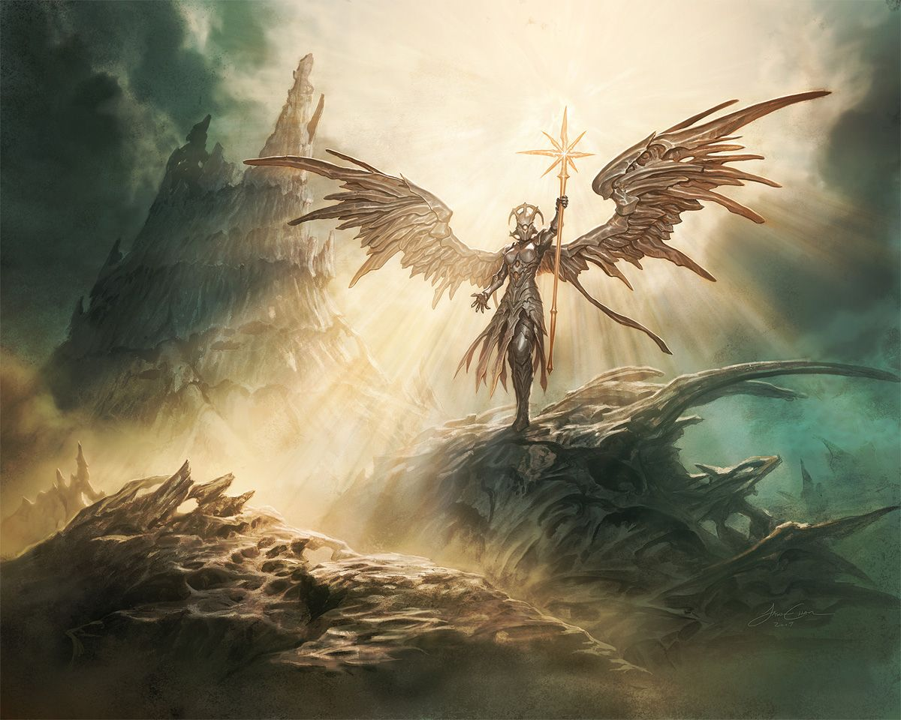

#### Radiance

Radiance users can narratively attempt the following:

* Create light (hard light, illusions, etc...)
* Manipulate light

Users of Radiance focus on the manipulation of light externally. Radiance is extremely versatile and has become a staple of Angland’s way of life.

In warfare, whether it is smiting the enemy from afar, armoring themselves and companions with hard light gear, or creating illusions of calvary charging at the enemies flanks, they are a force to be reckoned with.

### **Specialization: Hard Light**

Hard light is light that has been formed into a tangible physical material.

* Hard light maintains its form for roughly 1 hour. The user can choose to mimic the density of a certain material.
* The larger and heavier the object, the more difficult to create and maintain. The density and size of the light is a property controlled by the user.
* Hard light objects can be damaged, leaking light and dramatically reducing their duration.
* Hard light objects can be made to have a fixed position, though they will expire dramatically faster depending on the density/weight of the object.
* Once created, a user does not need to stay close to the objects for it to maintain its form.

### **Specialization: Illusions**

Illusions are created by bending light to create a false image.

* Illusions maintain their form for roughly 1 hour. Users can extend this, but require a harder check.
* Illusions can move, either under control of the user or set to a loop by the user.
* Illusions can not produce sound.

### **Absorb Light: Sun Light**

Ample sunlight can be used to absorb **Light**.

### **Range**

**No combat modifier dice, excluding focused**

* **Hard Light:** +5 feet per dice (Medium Range)
* **Illusions:** +10 feet per dice (Extended Range)
* **Normal Radiance:** +15 feet per dice (Long Range)

### **Radiant Resistance**

By achieving a **CL 3** check, for the cost of **1 Light** a character may gain resistance to this element equal to the points invested in this Fellcraft. This effect has a duration of 1 hour.

#### Blessing

**Range:** Medium

Users of Blessing can narratively attempt the following:

* Bind light to themselves and others
* Heal themselves and others

While Radiance focuses on the manipulation of external light, Blessing focuses on the manipulation of light within the body. Blessings can be used to enhance or repair physical characteristics.

When the user is under the effect of a Blessing they will begin to glow with wisps of light.

### Offensive

**Ranged attacks:** 

**Effective/Max Range:** 

**Melee attacks:** 

** **

### **Buffs**

When a character attempts a Blessing Buff on themselves or another, they make a Blessing Roll. Depending on the wins achieved, the user gains that benefit and all the benefits below. If the user attempts to perform another Blessing Buff on themselves, they must drop their Blessing Buff.

<table>
  <tr>
   <td><strong>Effect</strong>
   </td>
   <td><strong>Challenge Level</strong>
   </td>
   <td><strong>Duration</strong>
   </td>
  </tr>
  <tr>
   <td>Glow (provides 20 ft radius bright light and 20 ft radius of dim light)
   </td>
   <td>1
   </td>
   <td>24 hr
   </td>
  </tr>
  <tr>
   <td>Minor Healing Factor
   </td>
   <td>2
   </td>
   <td>24 hr
   </td>
  </tr>
  <tr>
   <td>+1 to 1 skill 
   </td>
   <td>3
   </td>
   <td>1 hr
   </td>
  </tr>
  <tr>
   <td>+1 STR or RFX or INT
   </td>
   <td>4
   </td>
   <td>1 hr
   </td>
  </tr>
  <tr>
   <td>Flight (Angelic wings)
   </td>
   <td>5
   </td>
   <td>1 hr
   </td>
  </tr>
  <tr>
   <td>+1 STR or RFX or INT

(cannot take the same attribute from CL 4 effect)
   </td>
   <td>6
   </td>
   <td>1 hr
   </td>
  </tr>
</table>

### **Healing**

When a character attempts a Blessing heal, they make a Blessing roll  (this can be done while a Blessing buff is active). Depending on the wins achieved, the user or target gains one of the following effects.

<table>
  <tr>
   <td><strong>Effect</strong>
   </td>
   <td><strong>Challenge Level</strong>
   </td>
   <td><strong>Duration</strong>
   </td>
  </tr>
  <tr>
   <td>Minor Healing Factor
   </td>
   <td>2
   </td>
   <td>24 hr
   </td>
  </tr>
  <tr>
   <td>Minor Heal
   </td>
   <td>2
   </td>
   <td>Instant
   </td>
  </tr>
  <tr>
   <td>Medium Heal
   </td>
   <td>3
   </td>
   <td>Instant
   </td>
  </tr>
  <tr>
   <td>Serious Heal
   </td>
   <td>4
   </td>
   <td>Instant
   </td>
  </tr>
  <tr>
   <td>Fatal Heal
   </td>
   <td>5
   </td>
   <td>Instant
   </td>
  </tr>
  <tr>
   <td>Revival Heal
   </td>
   <td>6
   </td>
   <td>Instant
   </td>
  </tr>
</table>

### **Specialization: Bright's Heritage**

With sufficient Light, Brightkin can resurrect upon death. The Brightkins body will begin to glow brightly, damaged tissue pulled back together or is  regrown.

* Requires 
* Must succeed a check starting at CL 6, decreasing each round of combat or every 10 seconds outside of combat.
* If the user does not have enough light, they can absorb Light given they are exposed to sunlight.
* Resurrection restores the user to peak health. This includes regrowing limbs.
* Objects lodged in the body will remain, and may lead to injury or death upon resurrection.

Known counters to this ability are driving instruments into the brain of a fallen Brightkin and burying them deep underground where no light can reach them.

### **Absorb Light: Emotion**

Powerful emotions or memories can be meditated on to regain Light. A user must describe the powerful emotion in detail. If the Narrator agrees the emotion or memory is sufficient, then the user's inner light will surge, regaining Light.

## Fellcraft

The monsters of the Terra are known for their terrifying speed, strength, and strange abilities. They have evolved to achieve this by using the potential energy found in their blood, referred to as **Ichor**.

Due to their monstrous ancestry, Fellkind carries **Ichor** in their veins as well. Fellkin are able to express their dormant genes, mimicking the terrifying genetic abilities of their monstrous ancestors. These abilities can often entail rather grotesque restructuring of the user's physiology.

Many of these abilities express themselves in response to extreme stress, which activates dormant genes. 

Fellcraft takes training, practice, and study to master. Most Fellkin never follow the path of mastering Fellcraft.

### **Fellcraft Roll**

This roll represents your abilities with a specific type of Fellcraft. A minimum of one Ichor is required to make a non-Trick Fellcraft Roll. Ichor up to the level in the user’s Fellkin vocation can be consumed, adding an additional d6 to the Fellcraft Roll for each Ichor consumed. 

* **Fellcraft Roll** = 3d6 (base) + Xd6 (Fellcraft Skill) + Xd6 (STR/RFX/INT) + Xd6 (Ichor Consumed capped by Fellkin Vocation)

### **Ichor**

Ichor is the potential energy found in both monster and Fellkind blood. This energy is responsible for all of Fellcraft.

* **+3 Ichor per Fellkin Vocation**

### **Regaining Ichor**

Maintaining one's physical health restores **Ichor** over time. This can be done by maintaining adequate nutrition, hydration, sleep, and stress levels. For instance a short nap might only regain a single point, whereas a long night's rest with a warm meal could restore full **Ichor**. The narrator should take into account the Fellcraft vocation when granting Ichor from rest.

### **Absorbing Ichor**

Fellkind can absorb and feed on an ample source of primal elements to regain Ichor. The ability can be used once for each Fellcraft Vocation point, resetting on long rests. The points in the specific Fellcraft skill used dictate how much **Ichor** is regained. Absorbing or meditating near a large source of the element are acceptable. Flavor and creativity are encouraged.

### **Fellcraft Tricks**

**Tricks** are uses of Fellcraft that use an insignificant amount of **Ichor**. In general, **Tricks** should be small and happen close to the user. Igniting your fingertips to light a cigar with Blazecraft, stirring a cup of tea with Hydrocraft, or creating a gentle breeze with Galecraft are all examples of Tricks. Trick attacks are considered the weakest form of offense, only used in dire situations or for utility.

* **Unaffected by Fellkin assists (as no Ichor is consumed)**
* **Ichor Requirement: 0 Ichor (No Ichor can be used to increase dice)**

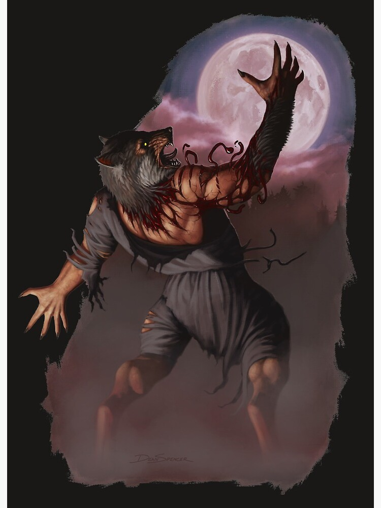

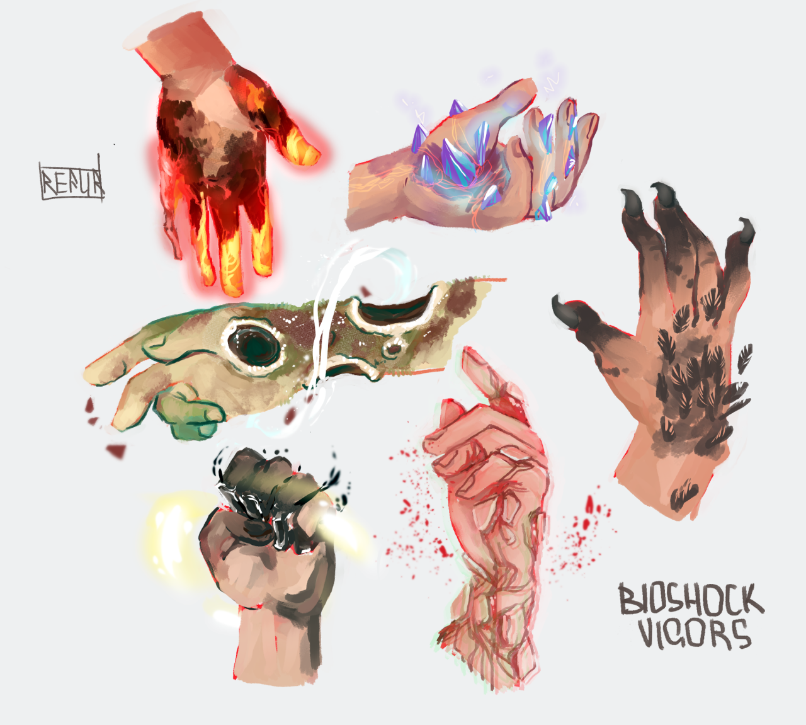

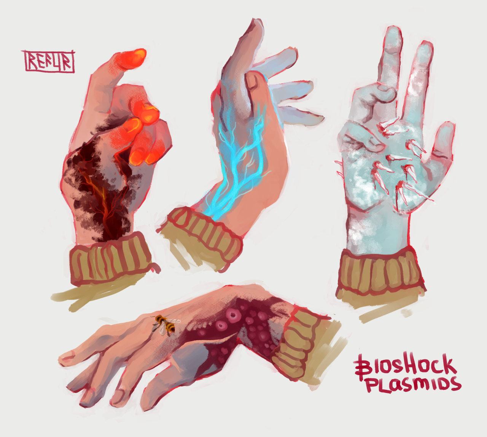

#### Polycraft

Polycraft users can narratively attempt the following:

* Take on physical monstrous traits
* Attack with monstrous traits
* Modify appearance

Polycraft fundamentally is the ability to enhance, heal, and change one's body. The various races have their own variant of this, leading to unique abilities between them.

### Offensive

**Effective/Max Range:** Close

**Melee capable:** True

### Transformation

When a character attempts a Polycraft transformation, they make a Polycraft Roll. Depending on the wins achieved, the user gains that benefit associated with that CL and all the benefits below. If the user attempts to perform another transformation, they must drop their transformed state.

<table>
  <tr>
   <td><strong>Effect</strong>
   </td>
   <td><strong>Challenge Level</strong>
   </td>
   <td><strong>Duration</strong>
   </td>
  </tr>
  <tr>
   <td>Dark Vision
   </td>
   <td>1
   </td>
   <td>24 hr
   </td>
  </tr>
  <tr>
   <td>Minor Healing Factor
   </td>
   <td>2
   </td>
   <td>24 hr
   </td>
  </tr>
  <tr>
   <td>+1 to 1 physical core skill
   </td>
   <td>3
   </td>
   <td>1 hr
   </td>
  </tr>
  <tr>
   <td>+1 STR or RFX
   </td>
   <td>4
   </td>
   <td>1 hr
   </td>
  </tr>
  <tr>
   <td>+1 to 2 physical core skill
   </td>
   <td>5
   </td>
   <td>1 hr
   </td>
  </tr>
  <tr>
   <td>+1 STR or RFX 

(cannot take the same attribute from CL 4 effect)
   </td>
   <td>6
   </td>
   <td>1 hr
   </td>
  </tr>
</table>

### Healing

When a character attempts a Polycraft heal, they make a Polycraft Roll (this can be done while in a transformation). Depending on the wins achieved, the user gains one of the following effects.

<table>
  <tr>
   <td><strong>Effect</strong>
   </td>
   <td><strong>Challenge Level</strong>
   </td>
   <td><strong>Duration</strong>
   </td>
  </tr>
  <tr>
   <td>Minor Healing Factor
   </td>
   <td>2
   </td>
   <td>24 hr
   </td>
  </tr>
  <tr>
   <td>Minor Heal
   </td>
   <td>2
   </td>
   <td>Instant
   </td>
  </tr>
  <tr>
   <td>Medium Heal
   </td>
   <td>3
   </td>
   <td>Instant
   </td>
  </tr>
  <tr>
   <td>Serious Heal
   </td>
   <td>4
   </td>
   <td>Instant
   </td>
  </tr>
  <tr>
   <td>Fatal Heal
   </td>
   <td>5
   </td>
   <td>Instant
   </td>
  </tr>
  <tr>
   <td>Revival Heal
   </td>
   <td>6
   </td>
   <td>Instant
   </td>
  </tr>
</table>

### Specialization: The Beast

The many monsters of the Continent such as werebeasts, vampires, kikimora, etc... are known for their remarkable strength, speed, and durability. Those that follow this specialization seek to emulate these features in their own bodies.

**Absorbing Ichor: Flesh and Blood**

Flesh and blood can be consumed to regain **Ichor**. This generally is done ravenously. An extra point of **Ichor** should be awarded if a Fellkind of Monster is consumed.

### Specialization: The Doppelganger

Doppelgangers are devious shapeshifters that take on the appearance of other humanoids, throwing off pursuit or luring victims to their doom with misdirection and disguise. Common practitioners of this are spies, assassins, thiefs, etc… The narrator may give dice bonuses based on the context of the mimicked persona in relation to the creature the user is trying to influence.

<table>
  <tr>
   <td><strong>Effect</strong>
   </td>
   <td><strong>Challenge Level</strong>
   </td>
   <td><strong>Duration</strong>
   </td>
  </tr>
  <tr>
   <td>Maintain form
   </td>
   <td>1
   </td>
   <td>1 hr
   </td>
  </tr>
  <tr>
   <td>Mimic similar humanoid
   </td>
   <td>2
   </td>
   <td>1 hr
   </td>
  </tr>
  <tr>
   <td>Mimic unsimilar humanoid
   </td>
   <td>3
   </td>
   <td>1 hr
   </td>
  </tr>
  <tr>
   <td>Mimic similar sized species
   </td>
   <td>4
   </td>
   <td>1 hr
   </td>
  </tr>
  <tr>
   <td>Mimic unsimilar sized species
   </td>
   <td>5
   </td>
   <td>1 hr
   </td>
  </tr>
  <tr>
   <td>Set default humanoid form
   </td>
   <td>5
   </td>
   <td>Indefinite
   </td>
  </tr>
  <tr>
   <td>Mimic monster
   </td>
   <td>6
   </td>
   <td>1 hr
   </td>
  </tr>
  <tr>
   <td>Mimic greater monster
   </td>
   <td>7
   </td>
   <td>1 hr
   </td>
  </tr>
</table>

### Slash Resistance

By achieving a **CL 3** check, for the cost of **1 Ichor** a character may gain resistance to these damage types equal to the points invested in this Fellcraft. This effect has a duration of 1 hour.

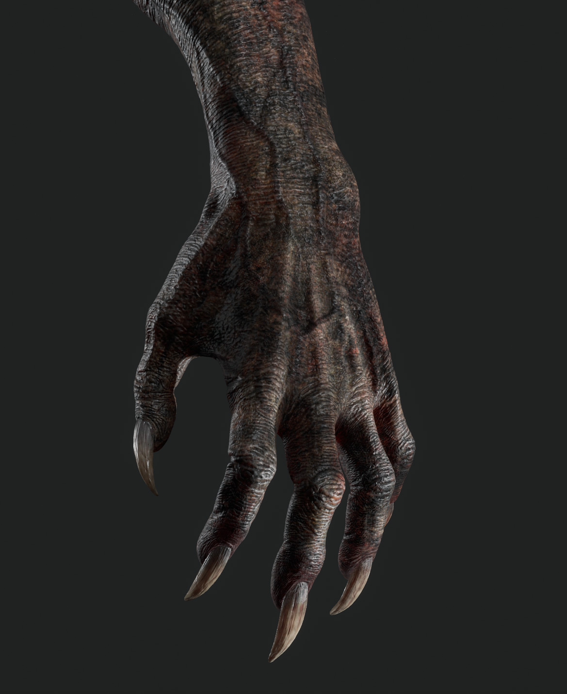

#### Blazecraft

Blazecraft users can narratively attempt the following:

* Create, manipulate, and extinguish fire, smoke, and ash.
* Resist fire and heat.
* Raise core body heat to resist disease and hypothermia.

Blazecraft is one of the most common Fellcraft learned, owing to its utility and combat effectiveness. It allows the user to create and manipulate fire. While all expressions of Blazecraft come from the same root gene, the most widely taught and used is derived from the Phoenix immolation or Dragonfire. 

### Offensive

**Effective/Max Range:** Long

**Melee capable:** True

### **Specialization: The Fire Dragon**

Dragonfire is legendary in its destructive capabilities. Dragons channel their from the elemental scales that cover their bodies.

**Dragonfire**

Allows the user to breathe fire from their mouth. In addition, the fire the user produces has an odd dark coloring to it. This fire has a mind of its own, leaping from fuel to fuel. The raw destructive power is terrifying, as given the right circumstance things can quickly go out of hand. \
**Absorbing Ichor: Fire**

Fire and heat can be used to absorb Ichor. This can be done with large fires, volcanoes, smoldering ash, blazing comets, etc...

### [Unfinished] Specialization: The Phoenix

Phoenix produce fire via the  immolation of one's own flesh as fuel for the fire, a process similar to the Silverburn reaction. Phoenix solved this issue by evolving ways to channel magic into regenerating flesh as fast as they burn it. This produces an immense amount of heat and flame, though it is quite taxing on the user. That being said this isn't a safe process, and can end up backfiring on new users of this Fellcraft.

### **Fire Resistance**

By achieving a **CL 3** check, for the cost of **1 Ichor** a character may gain resistance to this element equal to the points invested in this Fellcraft. This effect has a duration of 1 hour.

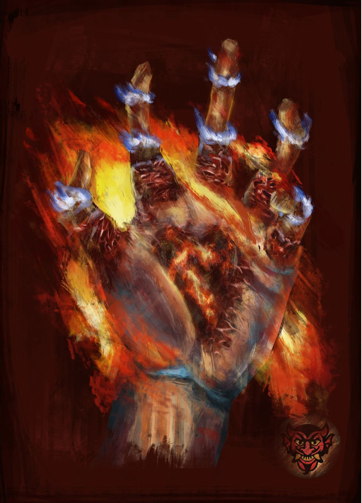

#### Hydrocraft

Hydrocraft users can narratively attempt the following:

* Create water.
* Absorb water into the body.
* Manipulate water (could also affect tea, milk, coffee, etc).
* Resistance water pressure and cold water.
* Water breathing
* Deep Sense (Assist for Perception checks)

### Offensive

**Effective/Max Range:** Extended

**Melee capable:** True

### Specialization: The Kraken

The way of the Kraken involves using a form of jet propulsion, sucking water into squid-like growths on the body and propelling outward. One of the most popular forms of Hydromancy is to create a water tentacle from yourself. These can assist in movement, defense, or offense.

The most common form of Hydrocraft is derived from the Kraken. The way of the Kraken involves using a form of jet propulsion, sucking water into squid-like growths on the body and propelling outward.

### Specialization: The Sea Serpent

Dragons channel their from the elemental scales that cover their bodies.

**Dragontide**

Allows the user to breath dragontide from from their mouth. Dragontide the user produces has an odd dark coloring to it. Dragontide has a mind of its own, leaping from thrashing and drowning anything around it. The raw destructive power is terrifying, as given the right circumstance things can quickly go out of hand. \
 \
**Absorbing Ichor: Water**

Water can be used to absorb **Ichor**. This can be done by submerging oneself in water or meditating near a large body of water.

### Range: Extended

* +10 feet per dice 

### Water Resistance

By achieving a **CL 3** check, for the cost of **1 Ichor** a character may gain resistance to this element equal to the points invested in this Fellcraft. This effect has a duration of 1 hour.

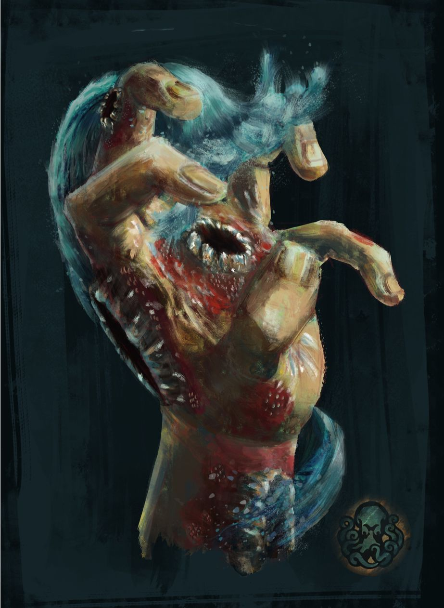

#### Electrocraft

Electrocraft craft users can narratively attempt the following:

* Create and manipulate electricity.
* Resist electric damage.
* Use Electrosense (Assist on Perception)

Practitioners of Electrocraft are actually generating **electrite**, a naturally occuring crystal that has many electrical properties used across Terra in various spellcraft inventions. Naturally occurring **electrite** can be found underground, glowing if it holds a charge. A user's body can use these crystals to convert the **Ichor** in one's blood into an electric charge held within the **electrite** on the user's body. This charge can then be released by the user at will.

A favorite among users of Spellcraft, Electrocraft can aid in constructing Runelcrafts owing to its ability to charge and influence electrite. The most common forms of Electrocraft are derived from Storm Dragons and Thunderbirds. Those of Darkbeast heritage grow specialized hair imbued with **electrite**, though this form has mainly been lost throughout the bloodlines.

### Offensive

**Effective/Max Range:** Long

**Melee capable:** True

### Specialization: The Storm Dragon

Dragonlightning is legendary in its destructive capabilities. Dragons channel their from the elemental scales that cover their bodies.

**Dragonlightning**

Allows the user to breath dragonlightning from from their mouth. In addition, the lightning the user produces has an odd dark coloring to it. This lightning has a mind of its own, leaping on its own volition. The raw destructive power is terrifying, as given the right circumstance things can quickly go out of hand.

**Absorb Ichor: Electricity**

Electricity can be used to absorb **Ichor**. This can be done with lighting storms, electrite containing electricity, etc...

### Electric Resistance

By achieving a **CL 3** check, for the cost of **1 Ichor** a character may gain resistance to this element equal to the points invested in this Fellcraft. This effect has a duration of 1 hour.

>>>>>  gd2md-html alert: inline image link here (to images/image50.png). Store image on your image server and adjust path/filename/extension if necessary.  (<a href="#">Back to top</a>)(<a href="#gdcalert51">Next alert</a>) >>>>> 

#### Terracraft

Terracraft users can narratively attempt the following:

* Create and manipulate earth (earth, sand, etc...)
* Earth Sense (Vibriations) to assist Perception Checks

### Offensive

**Effective/Max Range:** Extended

**Melee capable:** True

### Specialization: The Terra Dragon

Dragonterra is legendary in its destructive capabilities. Dragons channel their from the elemental scales that cover their bodies.

**Dragonterra**

Allows the user to spew dragonterra from their mouth. Dragonterra is a gray substance with the consistency of wet concrete. This substance dries to form a super hard material. The user can use Terracraft to form it and quickly dry it into whatever form they desire. This ability allows Terra Dragons to build elaborate and nearly impenetrable nests.

**Absorb Ichor: Terra**

Terra can be used to absorb Ichor. This can be done near exposed earth, rock, geological marvels, etc...

### Slash, Hew, and Pierce Resistance

By achieving a **CL 3** check, for the cost of **1 Ichor** a character may gain resistance to this element equal to the points invested in this Fellcraft. This effect has a duration of 1 hour.

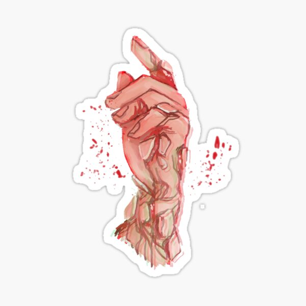

**Galecraft**

Galecraft craft users can narratively attempt the following:

* Create gales and fog.
* Manipulate gales.
* Attempt to high jump
* Attempt to levitate
* Attempt to fly
* Compress air to create shockwaves

Galecraft generally takes on two forms, derived from the great monstrous birds and Gale Dragons. Those that draw their Galecraft from the great birds suchs as Phoenix or Thunderbird will grow feathers that can be used to influence the gales, some of these feathers will detach, still under the user's influence. These feathers can act as extensions of the user’s will far from their bodies.

### Offensive

**Effective/Max Range:** Long

**Melee capable:** True

### Specialization: The Gale Dragon

Dragongale is legendary in its destructive capabilities. Dragons channel their from the elemental scales that cover their bodies.

**Dragongale**

Allows the user to breath dragongale from from their mouth. In addition, the dragongale the user produces has an odd smokey coloring to it. Dragongale has a mind of its own, creating small tornadoes. The raw destructive power is terrifying, as given the right circumstance things can quickly go out of hand.

**Absorb Ichor: Gale**

Gale can be used to absorb **Ichor**. This can be done near storms, tornadoes, places of great height, ect...

### Shockwave Resistance

By achieving a **CL 3** check, for the cost of **1 Ichor** a character may gain resistance to this element equal to the points invested in this Fellcraft. This effect has a duration of 1 hour.

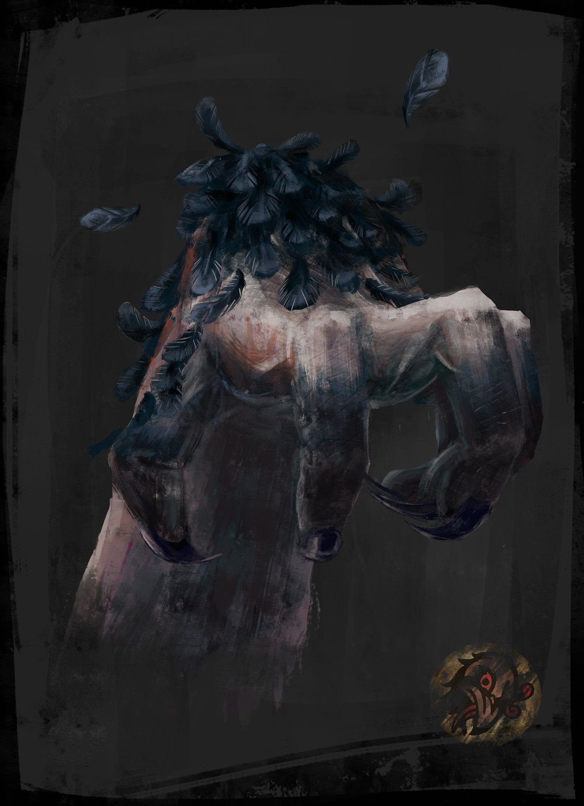

**Cryocraft**

Terracraft users can narratively attempt the following:

* Create cold (ice)
* Manipulate cold

### Offensive

**Effective/Max Range:** Long

**Melee capable:** True

### Specialization: The Dragon

Dragonfire is legendary in its destructive capabilities. Dragons channel their from the elemental scales that cover their bodies.

**Dragonfrost**

Allows the user to dragonfrost from their mouth. In addition, the frost the user produces has an odd dark coloring to it. This frost has a mind of its own, leaching of everything around it through a form of entropy. The raw destructive power is terrifying, as given the right circumstance things can quickly go out of hand.

**Absorb Ichor: Cold**

Cold can be used to absorb **Ichor**. This can be done with blizzards, frigid environments, and large bodies of ice.

### Cold Resistance

By achieving a **CL 3** check, for the cost of **1 Ichor** a character may gain resistance to this element equal to the points invested in this Fellcraft. This effect has a duration of 1 hour.

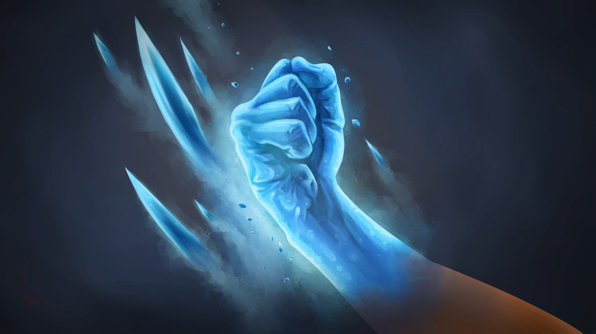

#### Naturecraft

Naturecraft users can narratively attempt the following:

* Create plants
* Manipulate plants
* Plant Sense (Vibriations) to assist Perception Checks

### Offensive

**Effective/Max Range:** Extended

**Melee capable:** True

### Specialization: The Nature Dragon

Dragongrowth is legendary in its destructive capabilities. Dragons channel their power from the elemental scales that cover their bodies.

**Dragongrowth**

Allows the user to dragongrowth from their mouth. In addition, the plant growth the user produces has an odd dark coloring to it. This plant growth has a mind of its own, spreading to everything around it. The raw destructive power is terrifying, as given the right circumstance things can quickly go out of hand.

**Absorb Ichor: Nature**

Large amounts of plant life can be used to absorb **Ichor**. This can be done with forests, crop fields, or large gardens.

### Bludgeon, Pierce, Slash Resistance

By achieving a **CL 3** check, for the cost of **1 Ichor** a character may gain resistance to this element equal to the points invested in this Fellcraft. **For each resistance point gained, gain a weakness level to Fire damage.** This effect has a duration of 1 hour.

#### Toxicraft

Toxicraft users can narratively attempt the following:

* Create toxins, venoms, poisons, acid, antivenoms, etc...
* Manipulate toxins, venoms, poisons, acid, antivenoms, etc...
* (Heartbeats) to assist Perception Checks

### Offensive

**Effective/Max Range:** Medium

**Melee capable:** True

### Specialization: Dragonvenom

Dragon Venom is legendary in its destructive capabilities. Dragons channel from the elemental scales that cover their bodies. Any affected by the powerful neurotoxin are instantly paralyzed.

Dragon venom never degrades or dries out. It is tasteless and odorless, making it a preferred tool of assassins. Common antivenoms have zero effect on it. A person affected with the venom has visible black veins visible through their skin as the necrotic effects kill from within.

**Absorb Ichor: Toxins**

Toxins can be used to absorb **Ichor**. If the toxin is already within the user, they may absorb it.

### Toxin/Poison Resistance

By achieving a **CL 3** check, for the cost of **1 Ichor** a character may gain resistance to this element equal to the points invested in this Fellcraft. This effect has a duration of 1 hour.

#### Soulcraft

Hydrocraft users can narratively attempt the following:

* Forge souls (Non-conscious souls)
* Manipulate/bind souls
* Animate bodies (organic and non-organic)
* Communicate with Lost Souls
* Feed on souls
* Resit spiritual attacks
* Astral projection and interaction
* Astral Sense (Assist for Perception checks)
* Phase though material objects (non-silver or Spellcraft)
* Posses

Users of Soulcraft learn to consciously control and strengthen their own soul. This allows them to communicate, bend, dominate, and even feed the souls of the Lost and the living. Users learn how to cross the barrier of the material plane into the astral plane.

Depending on the morality and spiritual strength of an individual, their personal spiritual projections appearance will change. Soulcraft users can also see the souls of the living. Generally a bright soul means a person is moral/ethical. Whereas, generally someone with a dark soul that pulls in all the light around them means a person is immoral/unethical. It should be noted that this is only based on how the individual perceives their own actions. A tyrant that fully believes in his cause could have a soul as bright as a saint.

### Offensive

**Effective/Max Range:** Medium

**Melee capable:** True

### **The Way of the Wraith**

When an individual dies without descendants, their soul wanders aimlessly on the material plane. These ghosts of Fellkind are preyed upon Wraith, monsters that have learned to interact and feed on the lost souls of the continent. Wraiths tend to lurk in places of death. They will not leave their dwellings to hunt for the living. Though, if an unfortunate soul wanders within, the wraith will of course consume the soul of their victim.

### **Specialization: The Undead Dragon**

Soulfire is legendary in its destructive capabilities. Soul fire produces cold and is fueled by soul/life energy. It has a greenish/purple appearance and flickers much more slowly than regular fire. Undead Dragons channel this from the elemental scales that cover their bodies.

**Soulfire**

Allows the user to breathe soulfire from their mouth. This energy has a mind of its own, leaping from soul to soul. The raw destructive power is terrifying, as given the right circumstance things can quickly go out of hand.

**Absorb Ichor: Souls**

Souls can be absorbed and feed on to regain **Ichor**. Victim can not resist. An extra point of **Ichor** should be awarded if a Fellkin or Anglkin is consumed.

### **Spiritual Resistance**

By achieving a **CL 3** check, for the cost of **1 Ichor** a character may gain resistance to this element equal to the points invested in this Fellcraft. This effect has a duration of 1 hour.

#### Shadowcraft

Shadowcraft users can narratively attempt the following:

* Create and manipulate shadow
* Shadowleap

### Offensive

**Effective/Max Range:** Extended

**Melee capable:** True

**Shadow Leaping**

Shadow Leaping is a form of short range teleportation. The user must have access to a large shadow near them that is not their own shadow. They can use it as a door to a neighboring shadow, rematerializing there.

### **Specialization: The Shadow Dragon**

Dragonumbra is legendary in its destructive capabilities. Dragons channel their from the elemental scales that cover their bodies.

**Dragonumbra**

Allows the user to breath dragonumbra from their mouth. Dragonumbra encroaches on all light sources around it, fading them out. Darksight does not work in dragonumbra. Entities will attack and abduct anyone in the darkness. This dragonumbra has a mind of its own. The raw destructive power is terrifying, as given the right circumstance things can quickly go out of hand.

**Absorb Ichor: Shadow**

Shadow can be used to absorb **Ichor**. This can be done in pitch black environments.

### **Dark Resistance**

By achieving a **CL 3** check, for the cost of **1 Ichor** a character may gain resistance to this element equal to the points invested in this Fellcraft. This effect has a duration of 1 hour.

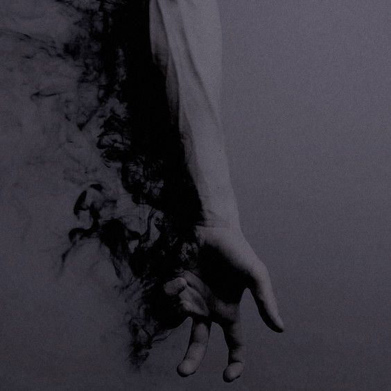

#### Mindcraft

Mindcraft users can narratively attempt the following:

* Telepathy

Common among Dhampires, Mindcraft is the ability to connect to, influence, or dominate others minds. There are multiple expression of this ability. The most eyes flash using use Mindcraft, generally green.

### Offensive

**Effective/Max Range:** Medium

**Melee capable:** False

### Specialization: Dreamcraft

Dreamcraft users can narratively attempt the following:

* Manipulate and invade dreams

The existence of Dreamcraft is debated among academics and has been relegated to the superstition of old wives tales. The rare few on Terra that have learned this craft have the ability to invade the dreams of sleeping individuals. There they can search through and manipulate the subconscious of the individual. This can be extremely dangerous though, even with an individual one would perceive as weak externally might be harboring something truly dangerous within. Many are driven mad, as they become unable to distinguish reality and the dream.

**Absorb Ichor: Thought**

Thoughts can be used to absorb Ichor. The victim must not be resisting. This can be done with Fellkin, Brightkin, animals, monsters, etc... Extra points should be awarded for Fellkin and Brightkin. Extra points should be awarded if used on a victim's dreams.

### Mental Resistance

By achieving a **CL 3** check, for the cost of **1 Ichor** a character may gain resistance to this element equal to the points invested in this Fellcraft. This effect has a duration of 1 hour.

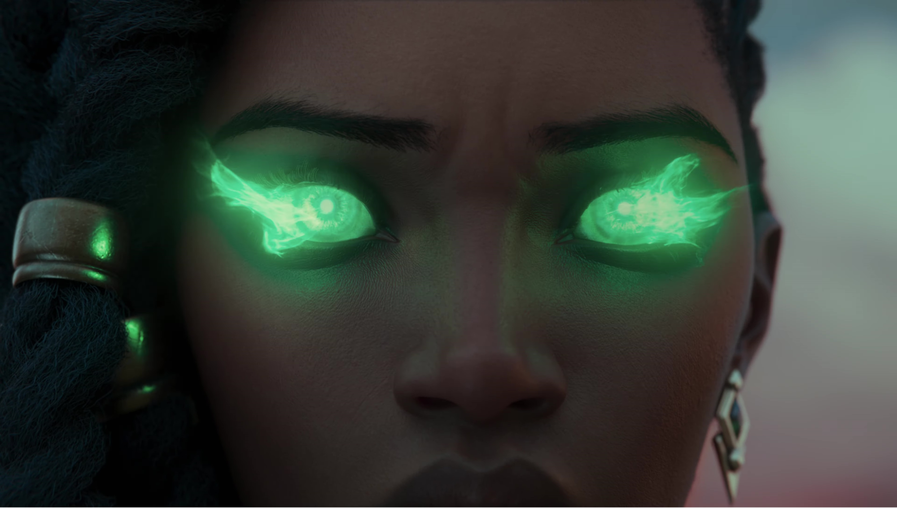

#### Ferracraft

Ferracraft users can narratively attempt the following:

* Create and manipulate metals using magnetic waves
* Metal Sense (Vibriations) to assist Perception Checks

### Offensive

**Effective/Max Range:** Extended

**Melee capable:** True

### **Specialization: The Metal Dragon**

Dragonsteel has legendary properties of strength and durability. Dragons channel their power from the dragonsteel scales that cover their bodies.

**Dragonsteel**

Allows the user to produce dragonsteel from their bodies. In addition, the plant growth the user produces has an odd dark coloring to it. This plant growth has a mind of its own, spreading to everything around it. The raw destructive power is terrifying, as given the right circumstance things can quickly go out of hand.

**Absorb Ichor: Magnetism**

Large amounts of magnetic waves can be used to absorb **Ichor**. This can be done with near sources of large magnetic energy.

### **Physical Resistance**

By achieving a **CL 3** check, for the cost of **1 Ichor** a character may gain resistance to this element equal to the points invested in this Fellcraft. **And for each resistance point gained, gain a weakness level to Electrice damage.** This effect has a duration of 1 hour.

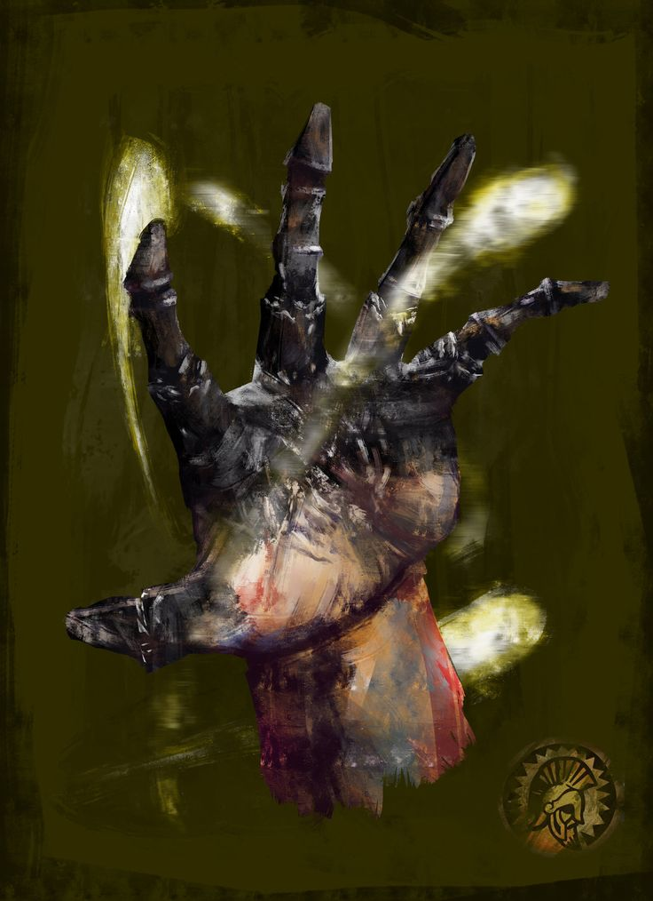

#### Sonocraft

Sonocraft users can narratively attempt the following:

* Emit sound and concussion waves
* Manipulate sound
* Silence sounds
* Mimic voices and observed sounds
* Echolocation to assist Perception Checks

### Offensive

**Effective/Max Range:** Long

**Melee capable:** False

### Specialization: The Dragon

**Absorb Ichor: Sonic Sounds**

Large sonic cracks can be absorbed to regain **Ichor**. This can be done with explosions, objects breaking the sound barrier, etc...

### Shockwave Resistance

By achieving a **CL 3** check, for the cost of **1 Ichor** a character may gain resistance to this element equal to the points invested in this Fellcraft. This effect has a duration of 1 hour.

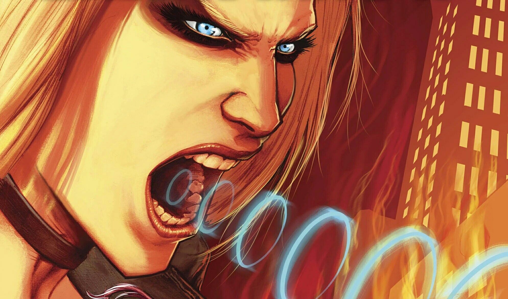

#### Hemacraft

Hemacraft users can narratively attempt the following:

* Create and manipulate blood
* Absorb Ichor from living hosts
* Blood Sense (Heartbeats) to assist Perception Checks

### Offensive

**Effective/Max Range:** Medium

**Melee capable:** True

### Blood Buffing

When a character attempts a Blood Buff, they make a Hemacraft Roll. Depending on the wins achieved, the user gains that benefit associated with that CL and all the benefits below. If the user attempts to perform another transformation, they must drop their transformed state.

<table>
  <tr>
   <td><strong>Effect</strong>
   </td>
   <td><strong>Challenge Level</strong>
   </td>
   <td><strong>Duration</strong>
   </td>
  </tr>
  <tr>
   <td>Dark Vision
   </td>
   <td>1
   </td>
   <td>24 hr
   </td>
  </tr>
  <tr>
   <td>Minor Healing Factor
   </td>
   <td>2
   </td>
   <td>24 hr
   </td>
  </tr>
  <tr>
   <td>+1 to 1 physical core skill
   </td>
   <td>3
   </td>
   <td>1 hr
   </td>
  </tr>
  <tr>
   <td>+1 STR or RFX
   </td>
   <td>4
   </td>
   <td>1 hr
   </td>
  </tr>
  <tr>
   <td>+1 to 2 physical core skill
   </td>
   <td>5
   </td>
   <td>1 hr
   </td>
  </tr>
  <tr>
   <td>+1 STR or RFX 

(cannot take the same attribute from CL 4 effect)
   </td>
   <td>6
   </td>
   <td>1 hr
   </td>
  </tr>
</table>

### Healing

When a character attempts a Hemacraft heal, they make a Polycraft Roll (this can be done while in a transformation). Depending on the wins achieved, the user gains one of the following effects.

<table>
  <tr>
   <td><strong>Effect</strong>
   </td>
   <td><strong>Challenge Level</strong>
   </td>
   <td><strong>Duration</strong>
   </td>
  </tr>
  <tr>
   <td>Minor Healing Factor
   </td>
   <td>2
   </td>
   <td>24 hr
   </td>
  </tr>
  <tr>
   <td>Minor Heal
   </td>
   <td>2
   </td>
   <td>Instant
   </td>
  </tr>
  <tr>
   <td>Medium Heal
   </td>
   <td>3
   </td>
   <td>Instant
   </td>
  </tr>
  <tr>
   <td>Serious Heal
   </td>
   <td>4
   </td>
   <td>Instant
   </td>
  </tr>
  <tr>
   <td>Fatal Heal
   </td>
   <td>5
   </td>
   <td>Instant
   </td>
  </tr>
  <tr>
   <td>Revival Heal
   </td>
   <td>6
   </td>
   <td>Instant
   </td>
  </tr>
</table>

### Pierce, Slash Resistance

By achieving a **CL 3** check, for the cost of **1 Ichor** a character may gain resistance to this element equal to the points invested in this Fellcraft. This effect has a duration of 1 hour. Bleed resistance keeps blood in the body.

### **Specialization: The Healing Blood**

This technique was discovered when Byrgenwerth Scholars found a dark truth deep within the Siren ruins that now lay under Redwall. Protected fervently by House Reddington and the scholars at Byrgenwerth. Healing blood is shelf stable, has antifungal and antibacterial properties.

By performing the following check below, a character may produce enough healing blood for one use of a healing blood vial.

<table>
  <tr>
   <td><strong>Effect</strong>
   </td>
   <td><strong>Challenge Level</strong>
   </td>
   <td><strong>Cast Time</strong>
   </td>
  </tr>
  <tr>
   <td>
   </td>
   <td>1
   </td>
   <td>4 hr
   </td>
  </tr>
  <tr>
   <td>
   </td>
   <td>2
   </td>
   <td>4 hr
   </td>
  </tr>
  <tr>
   <td>
   </td>
   <td>3
   </td>
   <td>4 hr
   </td>
  </tr>
  <tr>
   <td>
   </td>
   <td>4
   </td>
   <td>4 hr
   </td>
  </tr>
  <tr>
   <td>
   </td>
   <td>5
   </td>
   <td>4 hr
   </td>
  </tr>
  <tr>
   <td>
   </td>
   <td>6
   </td>
   <td>8 hr
   </td>
  </tr>
</table>

**Absorb Ichor: Blood**

Blood can be consumed to absorb **Ichor**. Every time a Hemacraft attack is successfully made, you may regain **1 Ichor**.  An extra point of **Ichor** should be awarded if a Fellkind of Monster blood is consumed. The opponent loses **1 Ichor**.

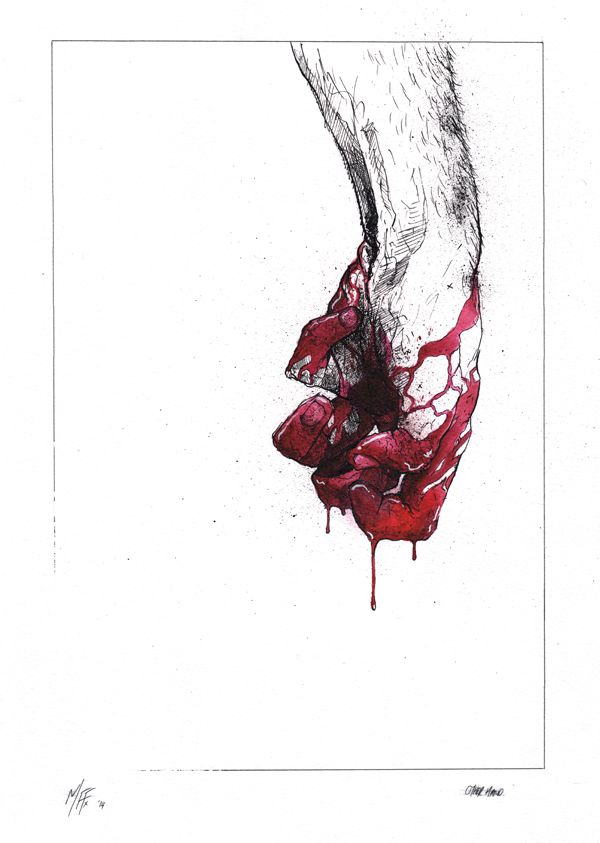

#### Spidercraft

Webcraft users can narratively attempt the following:

* Produce webbing of various strength and adhesiveness
* Manipulate webbing
* Stick to surfaces like a spider (Assist with Spider Craft for Climb Checks)

### Offensive

**Effective/Max Range:** Medium

**Melee capable:** True

Webs cannot inflict damage. Instead follow the table below.

<table>
  <tr>
   <td>Minor Binding

(Lvl 1 Victory)
   </td>
   <td>-1d6 to physical skills (RFX/STR),

-1d6 to Combat (RFX/STR),

-¼ of combat movement
   </td>
  </tr>
  <tr>
   <td>Medium Binding

(Lvl 2 Victory)
   </td>
   <td>-1d6 to physical skills (RFX/STR),

-1d6 to Combat (RFX/STR),

-2/4 of combat movement
   </td>
  </tr>
  <tr>
   <td>Serious Binding

(Lvl 3 Victory)
   </td>
   <td>-1d6 to physical skills (RFX/STR),

-1d6 to Combat (RFX/STR),

-3/4 of combat movement
   </td>
  </tr>
  <tr>
   <td>Supreme Binding

(Lvl 4 Victory)
   </td>
   <td>Target is incapacitated within the binding
   </td>
  </tr>
  <tr>
   <td>Fatal Binding

(Lvl 5 Victory)
   </td>
   <td>Target is incapacitated withing binding and begins to suffocate.
   </td>
  </tr>
</table>

### **Fellcraft Combination: **

This Fellcraft can only be accessed by users with a specialization in **Polycraft **and **Toxincraft**. The lowest dice total of the required Fellcraft will be used for this Fellcraft.

### **Specialization: The Giant Spider**

**Absorb Ichor: Liquify Prey**

Prey can be absorbed to regain **Ichor**. This can be done by mummifying the prey and injecting a digestive toxin. After some time, the digested prey can be drunk from, resulting in an extra +1 **Ichor.** Also gain an additional +1 **Ichor** if the prey is a monster or Fellkin...

### **Spider Climb**

By achieving a **CL 3** check, for the cost of **1 Ichor** a character may gain the ability to stick to walls like a spider. The user gains automatic wins to climb checks equal to their **Spidercraft** skill.  This effect has a duration of 1 hour.

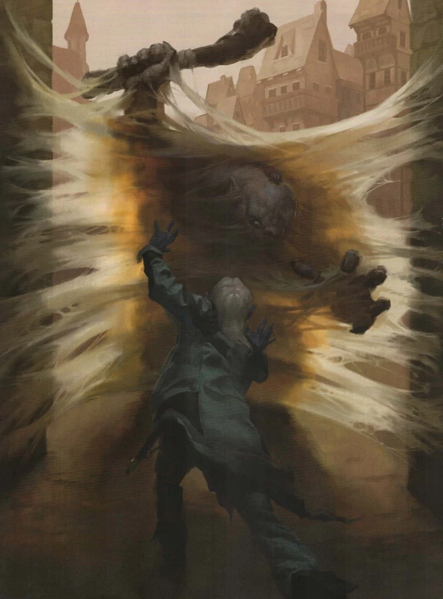

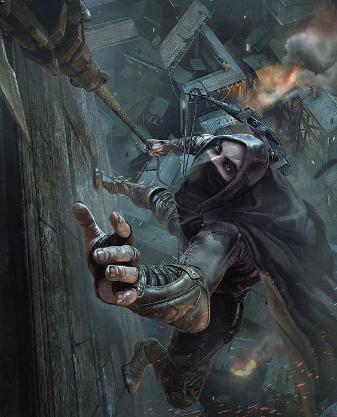

#### Plasmacraft

Plasmacraft users can narratively attempt the following:

* Create and manipulate plasma.
* Cut through objects using plasma.
* Create solar flare-like attacks.
* Emulate properties of solar energy.

Plasmacraft is the domain of true masters of Fellcraft. Plasmacraft is said to emulate the properties of the Sun, though it exhibits none of the Holy properties of Radiance Miracles.

### Offensive

**Effective/Max Range:** Long

**Melee capable:** True

### Fellcraft Combination: 

This Fellcraft can only be accessed by users with a specialization in **Blazecraft** and **Galecraft**. The lowest dice total of the required Fellcraft will be used for this Fellcraft.

### Specialization**: The Ancient Dragon**

Ancient myths tell how when the first dragons were born, they were granted wings. They flew to the Sun and drank it. They breathed light so hot it would cut stone and turn night to day.

 \
**Absorbing Ichor: Solar and Plasma**

Plasma and Sunlight can be used to absorb Ichor. 

#### Stormcraft

Stormcraft users can narratively attempt the following:

* Create storms.
* Manipulate storms.
* Control the weather

### Offensive

**Effective/Max Range:** Long

**Melee capable:** True

### Fellcraft Combination: 

This Fellcraft can only be accessed by users with a specialization in **Galecraft**, **Hydrocraft, **and **Electrocraft**. The lowest dice total of the required Fellcraft will be used for this Fellcraft.

### Specialization: The Storm Dragon

Every storm on Terra is said to be started by a Storm Dragon, who dwells deep in the eye of the Great Storm at the edge of the world, far away from the continent of Terra.

**Control Weather**

Like the Dragons of the Great Storm, Stormcraft users may manipulate the weather to their liking. How large and furious the weather event determines the check required. A check to increase the ferocity of a storm already in progress should be far easier than if the user tried to do the same with a calm day.

Though if the legend is true and the storms do come from the Great Storm, then it would be wise for one to influence the storms wisely. As surely dragons do not tolerate the interferences of mere mortals.

#### Magmacraft

Stormcraft users can narratively attempt the following:

* Create magma.
* Manipulate magma.
* Melt rock.
* Influence tectonic plates

### Offensive

**Effective/Max Range:** Extended

**Melee capable:** True

### **Fellcraft Combination: **

This Fellcraft can only be accessed by users with a specialization in **Blazecraft **and **Terracraft**. The lowest dice total of the required Fellcraft will be used for this Fellcraft.

### **Specialization: The Magma Dragon**

When the horrors of Terra bowed down before the Bright Lord, the Bright Lord conscripted the Great magma dragons of the world who dwell even deeper than the great underground caverns of Terra in infinite seas of lava. The continents that were once separate were brought together, so that Brighkind may rule over all of their new world.

**Influence Tectonic Plates**

The influence of tectonic plates can result in magma geysers and other geological phenomena. If enough masters of Magmacraft were brought together, Terra itself might shift once again…

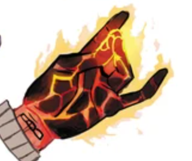

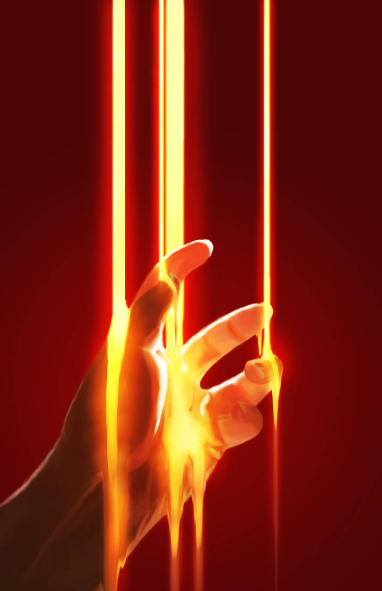

#### Blizzardcraft

Stormcraft users can narratively attempt the following:

* Create blizzards.
* Manipulate blizzards.

### Offensive

**Effective/Max Range:** Long

**Melee capable:** True

### Fellcraft Combination: 

This Fellcraft can only be accessed by users with a specialization in **Galecraft **and **Cryocraft**. The lowest dice total of the required Fellcraft will be used for this Fellcraft.

### Specialization: The Blizzard Dragon

In the frigid places of Terra, Blizzard Dragon will bury entire kingdoms in great blizzards to feast on the frozen corpses of the dead. The great blizzards around them act as camouflage to mask their movements.

**Create Blizzards**

Like the Blizzard Dragon, Blizzardcraft users may manipulate the Blizzards to their liking. How large and furious the blizzard determines the check required. A check to increase the ferocity of a blizzard already in progress should be far easier than if the user tried to do the same with a sunny warm day.

The only way for Fellkin to obtain new Fellcraft is to emulate the genetic links of the Monsters they originate from.

This tree represents the different path to acquire different Fellcrafts. Each solid line represents a monster whose genes bridge between Fellcrafts. For instance, Vampires represent the links between Hemacraft and Mindcraft as well as Mindcraft and Shadowcraft. While Vampires represent this on the Fellcraft Tree, these genes may exist in other monsters. This tree just shows the natural progression a Fellkin could take to acquire new fellcraft.

Squares represent normal Fellcrafts. These can be accessed if you choose this if your race has access or if you have a neighboring Fellcraft square already at level 1 in that Fellcraft skill. Any newly gained Fellcraft starts at level -1.

Circles represent Fellcraft combinations, which require the Fellcrafts that attach to it in order to use. The level of the combo Fellcraft is equal to the lowest dice roll of the Fellcrafts required.

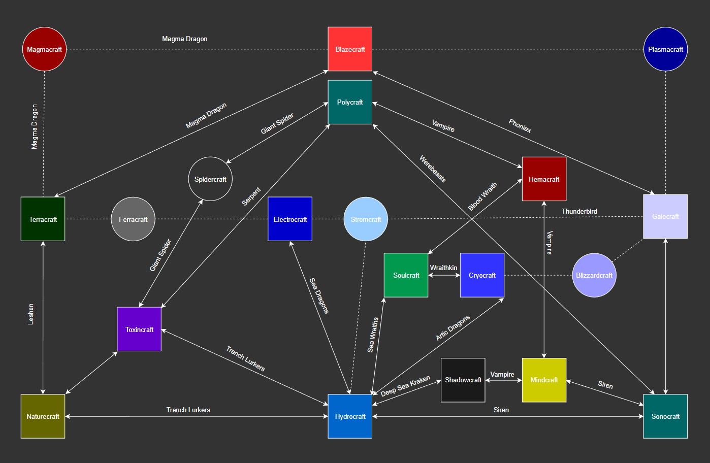

**Runecraft**

Runes are symbols that have been discovered, usually via academic endeavors, dreams, meditation and psychedelic experiences, that represent fundamental laws that govern reality. Runesmiths  use conscious thought to manipulate reality in a favorable direction.

**Pure Runes** are the most basic states of reality and  take raw energy as their inputs. **Compound Runes** are more complex runes constructed using pure runes. It should be noted, that at some point the energy within must be converted back to a physical phenomena, else there is no telling what will happen.

Runes can be used to make all kinds of marvels. Scrolls, Potions, Runeforged items are applications of Runecraft. Scrolls are very common due to their ease of creation and affordability. 

To draw a rune is not enough to have it take effect. First, a conscious being must create the Rune. Secondly, the user must deeply understand the concept they are trying to invoke and be able to take it into conscious thought. Intelligence seems to be the gateway to Runecraft, as minds that are too weak buckle under the weight of the knowledge of the fabric of reality, leading to horrific accidents, madness, and death.

### **Runecraft Roll**

This roll represents your abilities with specific Runecrafts. A minimum of 1 Energy  is required to make a  Runecraft Roll.

 Energy  up to the level in the user’s Runesmith vocation can be consumed, adding an additional d6 to the Runecraft Roll for each Energy consumed.

* **Runecraft Rolls** = 3d6 (base) + Xd6 (Runecraft Skill) + Xd6 (INT) + Xd6 (Energy Consumed capped by Runesmith Vocation)

**Crafting a Rune**

Three things are required to craft a Rune.

* The knowledge of the rune.
* The energy required to create the rune.
* An object to hold the rune.

### **Knowledge of Runes**

In order for Runes to work, the user must consciously  look beyond the symbols into the exposed laws of reality, understand the property they are trying to manifest and bind the phenomena that they are trying to control to a symbol. Common symbols have been agreed upon through the ages as a way for scholars and runesmiths to share they’re work. In many ways, Runes act as safeguards for the user's consciousness, reducing the infinite laws of reality  to a single phenomena. If the user is sufficiently intelligent to understand the complexity of a Rune, they may bind the  desired phenomena within the Rune.

If an insufficiently intelligent  person tried to simply draw the shape of the Rune of Fire, nothing would happen. Though if they truly tried to understand the Rune, the concept of fire itself, their mind could be permanently damaged forever.

### **Energy Examples**

While anything could hypothetically be used for energy, generally runesmiths lean towards more energy dense sources as they are simply easier to carry.

### **Ichor of Monster or Fellkin blood**

Ichor is a plentiful source of energy, common, and very energy dense. It is by far the most commonly used energy for Runecraft.  Requires an Inverse Rune of Blood to output the energy.

### **Charged Electrite**

A charged electrite crystal is commonly used to store the required energy, as it is extremely stable. Requires an Inverse Rune of Electricity to output the energy.

**An object to hold the rune**

Most Runesmith use scrolls for simple one time use runes, as they are affordable and easy to write runes on. Usually, the object the rune is located on physically receives damage up to the activation of the rune, as the energy stored within the object is consumed.  \
Some Runesmith will create staves of other conduits inscribed with runes. These are made in a particular way to resist the toll of the rune, though they will eventually need to be repaired. 

It is known that the body can be a vessel for runes, though the effect often leads to a reduced life span, bad health, or madness. Though due to the immense power that can be gained, many take on the risk.

**Overcharging Runes**

When creating a rune, a runesmith can overload a rune with energy, resulting in an additional +1d6 to the effect. However, since the rune was not made properly (as you are going above your Runesmith Vocation energy cap) the rune will have erratic behavior. Roll a d20 to determine the nature of the malfunction.

<table>
  <tr>
   <td>d20
   </td>
   <td>Runecraft Malfunction table
   </td>
  </tr>
  <tr>
   <td>1
   </td>
   <td>You suddenly realize that you are nothing more than a fictional character in a game played by other creatures in another plane of existence, which causes you to be stunned. This existential crisis lasts until the start of your next turn, after which you shake it off as nonsense.
   </td>
  </tr>
  <tr>
   <td>2
   </td>
   <td>You become petrified for 1d10 rounds.
   </td>
  </tr>
  <tr>
   <td>3
   </td>
   <td>A clone of the caster appears, desperately claiming to be the original.
   </td>
  </tr>
  <tr>
   <td>4
   </td>
   <td>The one who activated the rune fall asleep
   </td>
  </tr>
  <tr>
   <td>5
   </td>
   <td>All doors and windows within 60' of the caster fly open.
   </td>
  </tr>
  <tr>
   <td>6
   </td>
   <td>You permanently lose the ability to smell. This sense can be restored with a spell that removes curses such as remove curse.
   </td>
  </tr>
  <tr>
   <td>7
   </td>
   <td>The spell's target becomes overwhelmed by a desire to eat the caster.
   </td>
  </tr>
  <tr>
   <td>8
   </td>
   <td>The caster and target are flung 10' in opposite directions.
   </td>
  </tr>
  <tr>
   <td>9
   </td>
   <td>The caster and target are both whisked to the Astral Plane for the next minute.
   </td>
  </tr>
  <tr>
   <td>10
   </td>
   <td>A small songbird pops into existence in mid-flight 10 feet above the caster. Roll a d20. On a 1, the bird poops and it lands on the caster. On a 20, the bird poops and it lands on the target of the spell.
   </td>
  </tr>
  <tr>
   <td>11
   </td>
   <td>Rune converts to Fire effect
   </td>
  </tr>
  <tr>
   <td>12
   </td>
   <td>Rune converts to Shockwave effect
   </td>
  </tr>
  <tr>
   <td>13
   </td>
   <td>Rune converts to Water effect
   </td>
  </tr>
  <tr>
   <td>14
   </td>
   <td>Rune converts to Bleed effect
   </td>
  </tr>
  <tr>
   <td>15
   </td>
   <td>Rune converts to Electric effect
   </td>
  </tr>
  <tr>
   <td>16
   </td>
   <td>Rune converts to Cold effect
   </td>
  </tr>
  <tr>
   <td>17
   </td>
   <td>Rune converts to Dark effect
   </td>
  </tr>
  <tr>
   <td>18
   </td>
   <td>Rune converts to Mental effect
   </td>
  </tr>
  <tr>
   <td>19
   </td>
   <td>Rune converts to Spiritual effect
   </td>
  </tr>
  <tr>
   <td>20
   </td>
   <td>The world slows down around the caster. The caster gets to take an additional action.
   </td>
  </tr>
</table>

### **Runecraft in Combat**

Runecraft takes time to do properly, Runesmiths prepare their Runecrafts well ahead of when they would actually need them. Trying to create runes in battle is at best foolish and usually a death sentence.

Simple **Pure Runes** bound to scrolls are an extremely common way of preparing for combat. When the user creates the scroll, they are able to craft a specific rune, and at the time they choose to use it, they will use their specific Runecraft roll from when it was created as its combat roll.

### 

### **Compound Runes**

Compound Runes are constructed with Pure Runes, some of which are famous and named after their creators. Compound Runes and rare Pure runes are controlled by powerful universities and the Royal families that sponsor them. The length to which they will go to protect their intellectual property is staggering.

#### Slow Fall

### **Effect: **

Choose creatures within range. A falling creature’s rate of descent slows to 10 feet per second. If the creature lands before the effect ends, it takes no falling damage and can land on its feet, and the effect for that creature.

### **Challenge Level:**

**CL 1 (Common):** 1 people, 30 sec duration, 30 ft range

**CL 2 (Uncommon):** 3 people, 45 sec duration, 45 ft range

**CL 3 (Specialized):** 5 people, 1 min duration, 60 ft range

**+2 people for every level above, + 15 sec duration, +15 ft of range**

### **Requirement: **

* **INT Level:** 1
* **Energy required: **1 energy minimum

### **Compound Rune: **

Constructed using the **Rune of Air, Rune of Gravity**, and **Rune of Mind**.

### 

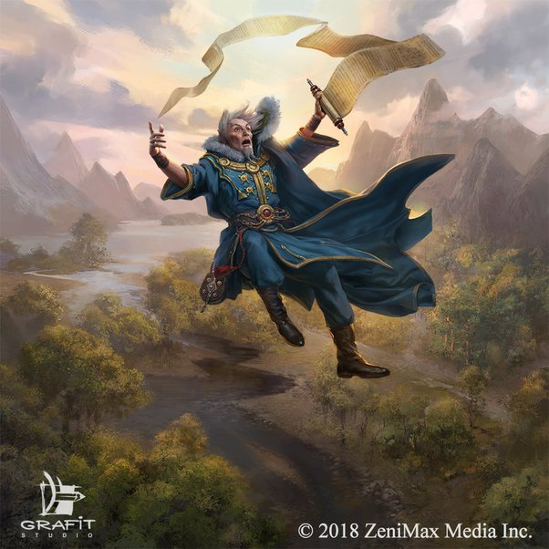

### 

#### Oil Spill

### **Effect: **

Slick greasy oil covers the ground in a circle centered on a point within range and turns it into difficult terrain for the duration.

When the oil appears, each creature standing in its area must succeed on an Acrobatics Check or fall prone. A creature that enters the area or ends its turn there must also succeed on a Acrobatics Check or fall prone.

### **Challenge Level:**

**CL 1 (Common):** 2 ft radius, 30 sec duration, 30 ft range, Challenge Level 3

**CL 2 (Uncommon):** 4 ft radius, 45 sec duration, 45 ft range, Challenge Level 3

**CL 3 (Specialized):** 6 ft radius, 1 min duration, 60 ft range, Challenge Level 3

**+2 ft of radius for every level above, + 15 sec duration, +15 ft of range**

### **Requirement: **

* **INT Level:** 1
* **Energy required: **1 energy minimum

### **Compound Rune: **

Constructed using the **Rune of Earth, **and **Rune of Water**.

#### 

>>>>>  gd2md-html alert: inline image link here (to images/image74.png). Store image on your image server and adjust path/filename/extension if necessary.  (<a href="#">Back to top</a>)(<a href="#gdcalert75">Next alert</a>) >>>>> 

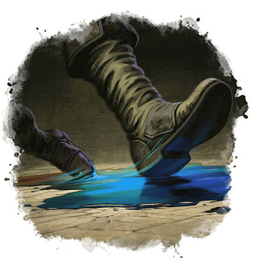

#### 

#### Alert

### **Effect: **

You set an alert against unwanted intrusion. Choose a door, a window, or an area within range that is no larger than a 13-foot radius. Until the spell ends, an alarm alerts you whenever a creature touches or enters the warded area. When you cast the spell, you can designate creatures that won’t set off the alarm. You also choose whether the alarm is mental or audible.

A mental alarm alerts you with a ping in your mind if you are within 1 mile of the warded area. This ping awakens you if you are sleeping. An audible alarm produces the sound of a hand bell for 10 seconds within 60 feet.

### **Challenge Level:**

**CL 1 (Common):** 2 hour duration, 9-foot radius, 10 ft. range

**CL 2 (Uncommon):** 4 hour duration, 11 ft radius, 20 ft. range

**CL 3 (Specialized):** 6 hour duration, 13 ft. radius, 30 ft. range

**+2 hour duration for every level above, +2 ft. radius. +10 ft. of range**

### **Requirement: **

* **INT Level:** 1
* **Energy required: **1 energy minimum

### **Compound Rune: **

Constructed using the **Rune of Sound , Rune of Mind**, and **Rune of Body **.

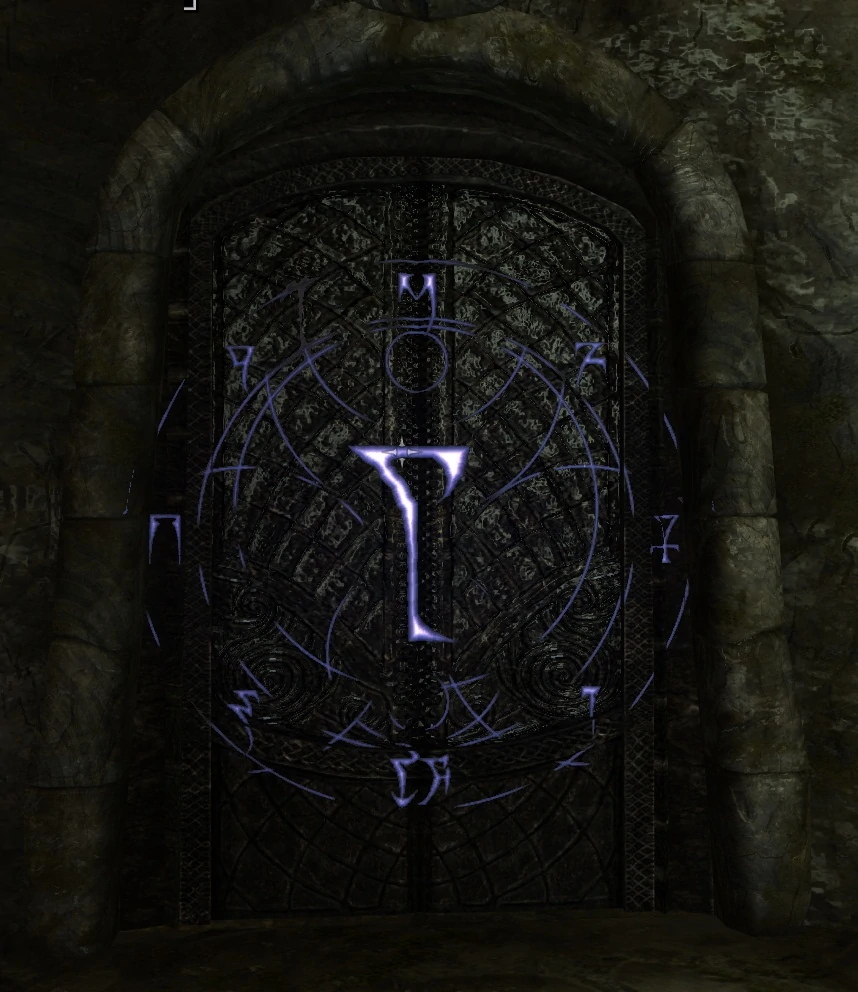

#### Noiseless Picture

### **Effect: **

You make yourself – including your clothing, armor, weapons, and other belongings on your person – look different until the spell ends or until you use your action to dismiss it. You can seem 1 foot shorter or taller and can appear thin, fat, or in between. You can’t change your body type, so you must adopt a form that has the same basic arrangement of limbs. Otherwise, the extent of the illusion is up to you.

The changes wrought by this spell fail to hold up to physical inspection. For example, if you use this spell to add a hat to your outfit, objects pass through the hat, and anyone who touches it would feel nothing or would feel your head and hair. If you use this spell to appear thinner than you are, the hand of someone who reaches out to touch you would bump into you while it was seemingly still in midair. To discern that you are disguised, a creature can use its action to inspect your appearance and must succeed on an Intelligence (Investigation) check against your spell save DC.

### **Challenge Level:**

**CL 1 (Common):** 1 people, 30 sec duration, 30 ft range

**CL 2 (Uncommon):** 3 people, 45 sec duration, 45 ft range

**CL 3 (Specialized):** 5 people, 1 min duration, 60 ft range

**+2 people for every level above, + 15 sec duration, +15 ft of range**

### **Requirement: **

* **INT Level:** 1
* **Energy required: **1 energy minimum

### **Compound Rune: **

Constructed using the **Rune of Mind**.

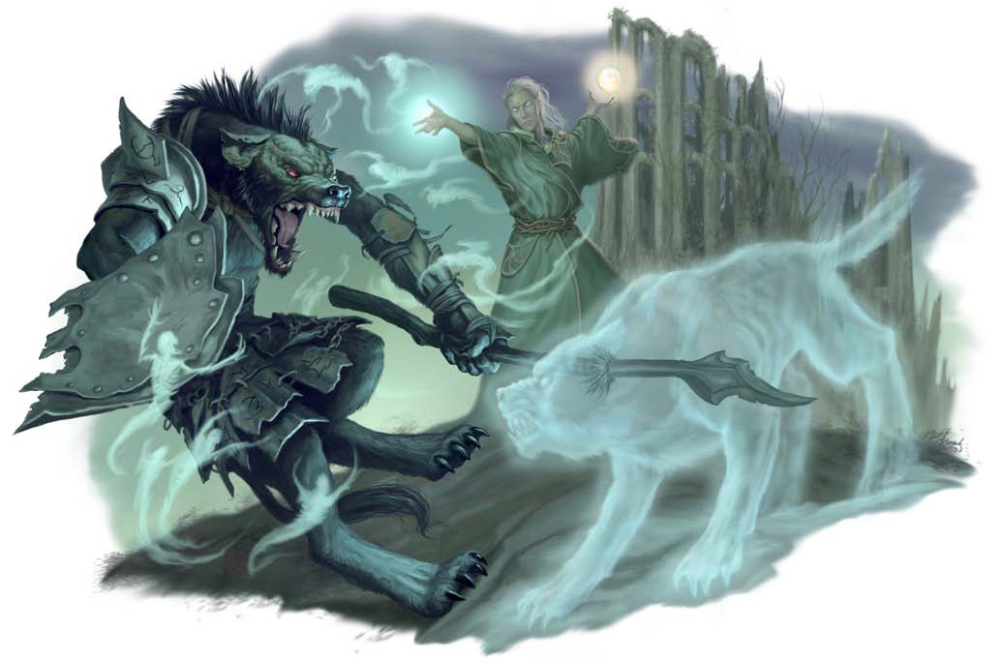

#### Flame Tongued

### **Effect: **

You can  speak this magic sword's command word, causing flames to erupt from the blade. These flames shed bright light in a 40-foot radius and dim light for an additional 40 feet. This sword gains the **Fire** damage type, and loses the **Bleed** damage type. The flames last until you  speak the command word again or until you drop or sheathe the sword.

The blade can only be ignited as long as it is above** 3 durability**. The sword can be submerged in fire to repair the blade.

### **Requirement: **

* **INT Level:** 1
* **Runesmith Vocation:** Level 2
* **Blacksmith Vocation: **Level 1
* **Energy required: **2 energy minimum
* **CL 4 (Difficult)**
* **Rune slots required:** 3

### **Components: **

* Requires an** Excellent (+3)** sword (Greatsword, Longsword, Rapier, Scimitar, Shortsword) or greater.
* Obsidian or lava glass
* Magic word that will ignite/extinguish the sword

### **Compound Rune: **

Constructed using the **Rune of Fire** and **Rune of Sound.**

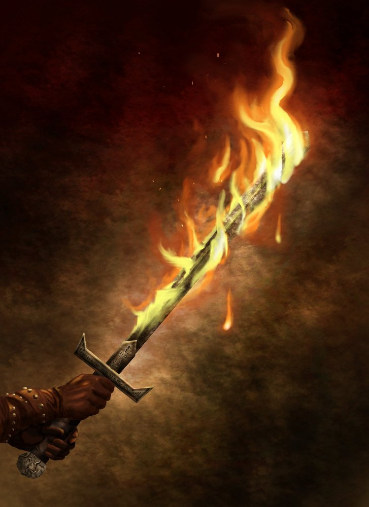

### 

### **Pure Runes**

Compound Runes are constructed with Pure Runes, some of which are famous and named after their creators. Compound Runes and rare Pure runes are controlled by powerful universities and the Royal families that sponsor them. The length to which they will go to protect their intellectual property is staggering, as an arms race between runes and biological magic develops.

#### Rune of Fire

Represents the physical phenomena known as fire.

### **Range: **Long

* +15 feet per dice 

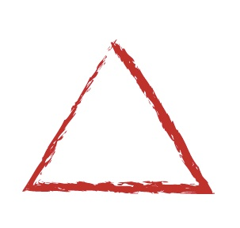

#### Rune of Earth

### **Range: **Extended

* +10 feet per dice (no combat modifier dice, exculding focused)

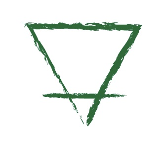

#### Rune of Water

### **Range: **Extended

* +10 feet per dice 

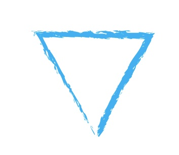

#### Rune of Air

### **Range: **Long

* +15 feet per 

#### Rune of Electricity

### **Range: **Long

* +15 feet per dice 

#### Rune of Cold

### **Range: **Long

* +15 feet per dice 

#### Rune of Toxins

### **Range: Medium**

* +5 feet per dice 

#### Rune of Blood

### **Range: Medium**

* +5 feet per dice 

#### Rune of Light

### **Range: **Long

* +15 feet per dice 

#### Rune of Dark

### **Range: **Extended

* +10 feet per dice 

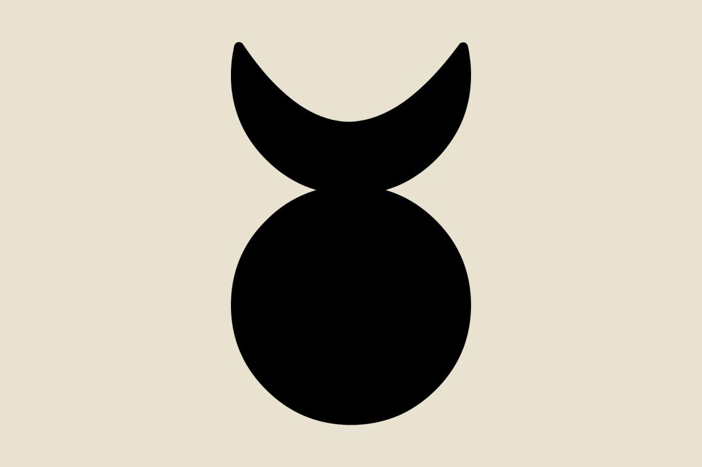

#### Rune of Sound

### **Range: **Long

* +15 feet per dice 

#### Rune of Body

### **Range: Close**

* +5 feet per 2 dice rounded down 

#### Rune of Mind

Some Runes pertaining to consciousness have been discovered such as the Mind Rune. This discovery was groundbreaking, as it not only allowed Runesmith to allow conscious thought to influence Compound Runes, but also validated models that predict hypothetical runes pertaining to higher abstractions of consciousness such as fear, hate, and wrath. The models predict these Forbidden Runes to be so powerful that the Great Runesmiths of Academia search for them relentlessly.

### **Range: Medium**

* +5 feet per dice 

#### Rune of Soul

### **Range: **Extended

* +10 feet per dice 

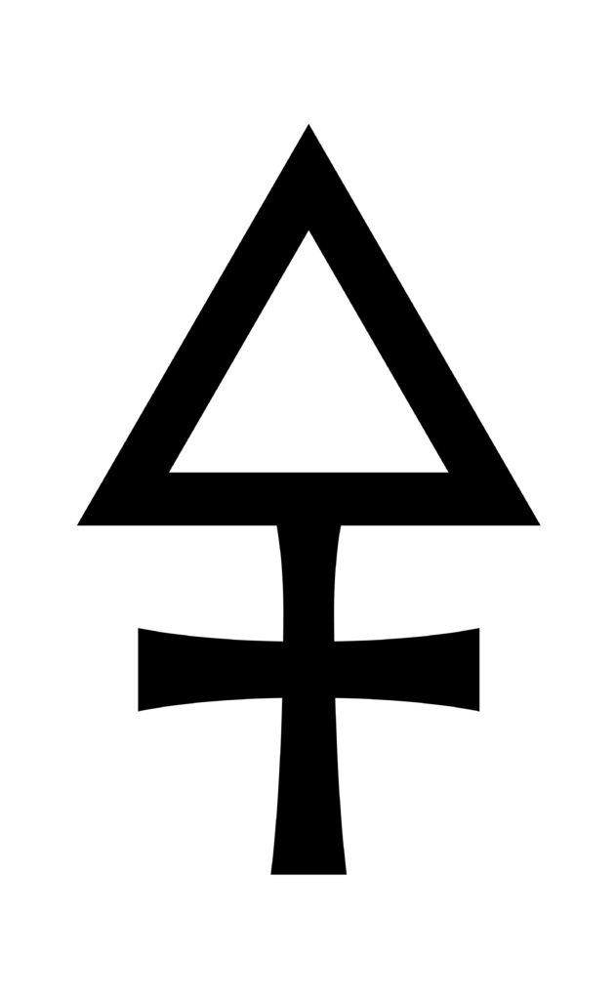

#### Rune of Focus

#### Rune of Unfocus

#### Rune of Time

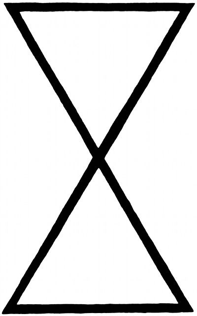

#### Rune of Strength

#### Rune of Gravity or Mass

## 

## Creature List

Below is a list of premade NPC/creatures for use within Fallen!

### **Humanoids**

<table>
  <tr>
   <td colspan="3" ><strong>Template</strong>
   </td>
  </tr>
  <tr>
   <td colspan="3" >
   </td>
  </tr>
  <tr>
   <td colspan="3" ><strong>Guards</strong>
   </td>
  </tr>
  <tr>
   <td>
   </td>
   <td>
   </td>
   <td>
   </td>
  </tr>
  <tr>
   <td>
   </td>
   <td>
   </td>
   <td>
   </td>
  </tr>
  <tr>
   <td colspan="3" ><strong>Enemies</strong>
   </td>
  </tr>
  <tr>
   <td>
   </td>
   <td>
   </td>
   <td>
   </td>
  </tr>
  <tr>
   <td>
   </td>
   <td>
   </td>
   <td>
   </td>
  </tr>
</table>

### **Animals**

<table>
  <tr>
   <td colspan="3" ><strong>Template</strong>
   </td>
  </tr>
  <tr>
   <td colspan="3" >
   </td>
  </tr>
  <tr>
   <td colspan="3" ><strong>Domesticated</strong>
   </td>
  </tr>
  <tr>
   <td>
   </td>
   <td>
   </td>
   <td>
   </td>
  </tr>
  <tr>
   <td>
   </td>
   <td>
   </td>
   <td>
   </td>
  </tr>
  <tr>
   <td colspan="3" ><strong>Wild</strong>
   </td>
  </tr>
  <tr>
   <td>
   </td>
   <td>
   </td>
   <td>
   </td>
  </tr>
  <tr>
   <td>
   </td>
   <td>
   </td>
   <td>
   </td>
  </tr>
</table>

### **Monsters**

<table>
  <tr>
   <td colspan="3" ><strong>Template</strong>
   </td>
  </tr>
  <tr>
   <td colspan="3" >
   </td>
  </tr>
  <tr>
   <td colspan="3" ><strong>Astral Plane Monster</strong>
   </td>
  </tr>
  <tr>
   <td>
   </td>
   <td>
   </td>
   <td>
   </td>
  </tr>
  <tr>
   <td colspan="3" ><strong>Werebeasts</strong>
   </td>
  </tr>
  <tr>
   <td>
   </td>
   <td>
   </td>
   <td>
   </td>
  </tr>
  <tr>
   <td>
   </td>
   <td>
   </td>
   <td>
   </td>
  </tr>
  <tr>
   <td colspan="3" ><strong>Vampires</strong>
   </td>
  </tr>
  <tr>
   <td>
   </td>
   <td>
   </td>
   <td>
   </td>
  </tr>
  <tr>
   <td colspan="3" ><strong>Insectoids</strong>
   </td>
  </tr>
  <tr>
   <td>
   </td>
   <td>
   </td>
   <td>
   </td>
  </tr>
  <tr>
   <td>
   </td>
   <td>
   </td>
   <td>
   </td>
  </tr>
  <tr>
   <td colspan="3" ><strong>Spore</strong>
   </td>
  </tr>
  <tr>
   <td>
   </td>
   <td>
   </td>
   <td>
   </td>
  </tr>
</table>

## Commerce

Fallen uses a handy item catalog formatted the same as your characters inventories to make buying, selling, and looting as easy as copying and pasting. 

### **Currency**

Fallen uses coins of Copper, Bronze, Gold, and the ultra rare platinum as currency. Due to silver being deadly to Fellkind and gold not being as abundant on Terra, the currency has been adapted. For simplicity sake we use the DnD 5e commerce system as a reference for prices of goods in our game.

**Fallen to DnD exchange Rate**

<table>
  <tr>
   <td><strong>Fallen Currency</strong>
   </td>
   <td><strong>DnD 5e Currency</strong>
   </td>
  </tr>
  <tr>
   <td>1 copper coin
   </td>
   <td>1 copper piece
   </td>
  </tr>
  <tr>
   <td>10 copper coins
   </td>
   <td>1 silver piece
   </td>
  </tr>
  <tr>
   <td>100 copper coins
   </td>
   <td>1 gold piece
   </td>
  </tr>
  <tr>
   <td>1 bronze coin
   </td>
   <td>1 gold piece
   </td>
  </tr>
  <tr>
   <td>100 bronze coins
   </td>
   <td>1 platinum piece
   </td>
  </tr>
  <tr>
   <td>1 gold coin
   </td>
   <td>1 platinum piece
   </td>
  </tr>
  <tr>
   <td>1 gold coin
   </td>
   <td>1 platinum piece
   </td>
  </tr>
  <tr>
   <td>1 platinum coin
   </td>
   <td>100 platinum pieces
   </td>
  </tr>
</table>

**Currency Weight**

* 50 coins have one pound of weight.

### 

### **Out of Game Downtime Bartering Rules**

When players arrive in a caravan rest stop, village, or city they may choose to take downtime. The time in the game will pass but the game is not being actively played. During this time player characters may shop at various local businesses.

This system heavily relies on trusting your players to be honest with you about their character's personal finances. If you have players that routinely bend the rules, then these might not be rules you should consider.

### **Shop Tiers**

Terra is a big place, with plenty of small run down villages littering the countryside. While it might be easy to find your character's essential items in large cities, they might not have the same luck out in the wilderness. The following store types describe the various store tiers you will encounter across Terra.

**Limited Stock**

A merchant selling wares out of a cart in a bazaar, someone with no brick-and-mortar shop.

**Rural Locale**

A small brick-and-mortar shop in a small town or village.

**Urban Locale**

A brick-and-mortar shop in an average city.

**Premium Locale**

A top tier shop of very large scale found in capitals and large trade cities.

## Extra Stuff

**Perks**

### **Destiny Resistance**

“**Every villain is a hero of his own story.**” \

Some have wills strong enough to resist the pull of destiny. Destiny points cannot be spent after a roll against creatures that have this perk.

 \
**Destiny Immunity**

“**Our Destiny is not written for us, but by us.**” \

Some have wills so strong they are immune to the pull of destiny. Destiny points cannot be spent against creatures that have this perk.

**Vocational Skills**

### **Infiltration**

“archetypically would be represented by the heist planner, spy, or Cuckoos. For if stealth is the art of going unseen, infiltration is the art of going unnoticed. Hiding in plain sight, blending into a crowd, disguising yourself, forgery, knowing who to contact to gain access to restricted areas, understanding the patrol routes and weak points in enemy defenses are all uses of infiltration. Whereas someone with high stealth may sneak through the front gate, someone with high infiltration would know they can gain access via the sewers without having to deal with any guards.
